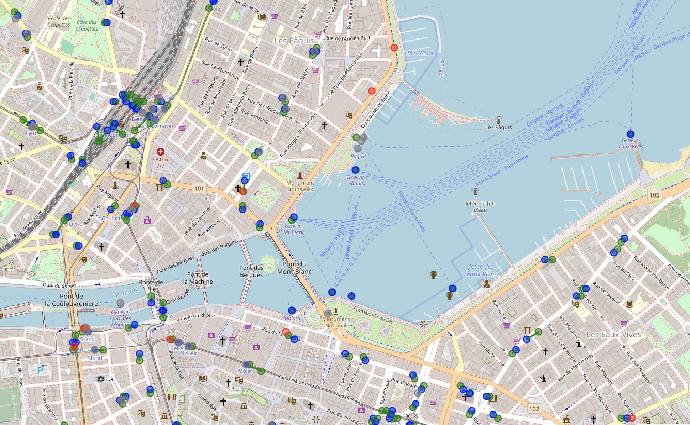
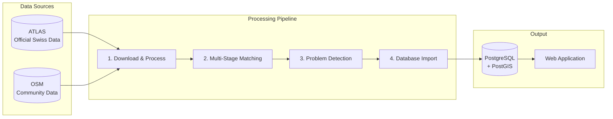

# **OSM & ATLAS Synchronization**

Welcome! This project provides a systematic pipeline to identify, analyze, and resolve discrepancies between public transport stop data from **ATLAS** (Swiss official data) and **OpenStreetMap (OSM)**.

It automates data download and processing (ATLAS, OSM, GTFS), performs exact/distance-based/route-based matching, and serves an interactive web app for inspecting matches, problems, and manual fixes.



---

## Table of Contents

- [Prerequisites](#prerequisites)
- [Installation & Setup (with Docker)](#installation--setup-with-docker)
- [Pipeline](#pipeline)
- [Background Scheduler & Microservices](#background-scheduler--microservices)
- [Running the Web Application](#running-the-web-application)
- [Environment & Secrets](#environment--secrets)
- [Admin Management CLI](#admin-management-cli)
- [Authentication](#authentication)
- [CI & Tests](#ci--tests)
- [Contributing and Project Status](#contributing-and-project-status)

---

## Prerequisites

- **Docker Desktop** with Compose v2 (required)
- Internet connection to download datasets (ATLAS, OSM, GTFS)


## Installation & Setup (with Docker)

**Just want to run it?** Here's the fastest path:

1.  **Clone the repository**
    ```bash
    git clone https://github.com/openTdataCH/stop_sync_osm_atlas.git
    cd stop_sync_osm_atlas
    ```

2.  **Configure environment** (optional):
    - Copy `env.example` to `.env` and adjust values (DB users/passwords, URIs, flags)

3.  **Build and Run with Docker Compose** (no .env required for local):
    ```bash
    docker compose up --build
    ```
    
    **On the first run**, Docker will automatically:
    - Build the application image
    - Download and start Postgres (PostGIS) database
    - Start the web app container
    - Start the scheduler container (daily pipeline at 2:00 Europe/Zurich)
    - Download ATLAS data from OpenTransportData.swiss
    - Download GTFS data for route matching
    - Download OSM data via the Overpass API
    - Process and match all data
    - Import everything into the database
    - Start the Flask web application

    Data and database state are cached across runs (`./data` directory and the `postgres_data` volume).
    The full pipeline now runs in the dedicated scheduler service, not during web app startup.


4.  **Access the application**:
    - Web app: [http://localhost:5001](http://localhost:5001)
    - Postgres database: `localhost:5432` (user: `stops_user`, password: `1234`)

5.  **To stop the services**:
    ```bash
    docker compose down
    ```
    To remove all data: `docker compose down -v`

## Pipeline

> [!NOTE] 
> For the best experience viewing the documentation diagrams, we recommend reading the documentation within the running web application. GitHub's Mermaid renderer may fail to render complex diagrams.


```mermaid
flowchart LR
    subgraph Sources["Data Sources"]
        A[("ATLAS<br/>Official Swiss Data")]
        O[("OSM<br/>Community Data")]
    end
    
    subgraph Pipeline["Processing Pipeline"]
        direction TB
        D["1. Download & Process"]
        M["2. Multi-Stage Matching"]
        P["3. Problem Detection"]
        I["4. Database Import"]
        D --> M --> P --> I
    end
    
    subgraph Output["Output"]
        DB[("PostgreSQL<br/>+ PostGIS")]
        W["Web Application"]
        DB --> W
    end
    
    A --> D
    O --> D
    I --> DB
```

When the daily scheduled job runs (or when manually triggered), the pipeline executes:

- `matching_and_import_db/downloader/get_atlas_data.py`: downloads ATLAS data and GTFS, builds optimized route/stop artifacts
- `matching_and_import_db/downloader/get_osm_data.py`: fetches OSM data via Overpass and processes it
- `matching_and_import_db/orchestrator.py`: runs the matching pipeline
- `matching_and_import_db/database/importer.py`: imports refreshed data into the import database

Downloads are cached under `data/raw/` and processed artifacts under `data/processed/` — see [1. Download and process data](documentation/1.%20Download%20and%20process%20data.md) for details.


### Data Import

After acquisition, `matching_and_import_db/database/importer.py` populates the Postgres databases (e.g., `stops`, `problems`, `persistent_data`, `atlas_stops`, `osm_nodes`, `routes_and_directions`).

During import, the UI shows a global maintenance popup. Downloading and matching stages run in the background without blocking normal browsing.

## Background Scheduler & Microservices

Docker Compose now runs four services:

- `app`: Flask web app and API.
- `scheduler`: Dedicated background worker that runs the daily pipeline at 2:00 (`PIPELINE_TIMEZONE`, default `Europe/Zurich`).
- `db`: Postgres + PostGIS import database.
- `redis`: Shared cache/rate-limit and pipeline status/lock storage.

Scheduler behavior:

- Uses APScheduler cron trigger (`PIPELINE_SCHEDULE_HOUR`, `PIPELINE_SCHEDULE_MINUTE`).
- Publishes run status to `/api/system/pipeline_status`.
- Sets maintenance mode only for the import phase so the UI can show "Data update in progress" with elapsed/ETA.
- Uses a distributed lock to prevent concurrent runs.

Optional one-shot startup run:

- Set `RUN_STARTUP_PIPELINE=true` to run one full pipeline before Flask starts.

### Manual Import & Testing (VS Code Tasks)

If you have VS Code installed, we have provided built-in tasks to quickly run commands inside the running database container without constantly restarting Docker:
1. Open the VS Code Command Palette (`Cmd+Shift+P` on Mac).
2. Select **`Tasks: Run Task`**.
3. Choose one of the predefined tasks:
   - **`Docker: Run All Tests`**: Executes the `pytest` suite.
    - **`Docker: Run Matching & Import (Existing Data)`**: Runs matching + import on already downloaded files through the scheduler runner.
    - **`Docker: Run Full Data Pipeline (Download & Match & Import)`**: Runs full download + matching + import through the scheduler runner.
    - **`Docker: Trigger Scheduled Pipeline Now`**: Fires a full manual run equivalent to the scheduled daily run.

You can do this while the `app` container is running in the background.

## Running the Web Application

The Flask server is started automatically by Docker Compose.

Access it at [http://localhost:5001/](http://localhost:5001/).

### Usage

- **Map View**: Browse stops by type (`matched`, `unmatched`, `osm`) and match method.
- **Filters & Search**: Filter by ATLAS SLOID, OSM Node ID, UIC reference, or route.
- **Problems**: On the problems page you can solve the problems. See [3. Problems](documentation/3.%20Problems.md).
- **Manage Data**: See [4.2 Persistent Data](documentation/4.2%20Persistent%20Data.md).
- **Generating Reports:** The web app can generate CSV and PDF reports. See [5.3 Generate Reports](documentation/5.3%20Generate%20Reports.md).


## CI & Tests

This repository uses **GitHub Actions** for continuous integration.

- Workflow: [tests.yml](.github/workflows/tests.yml)
- CI documentation: [CI and Tests](documentation/7.%20GITHUB_ACTIONS_AND_TESTS.md)


## Contributing and project Status

This project is a **work in progress**. Feedback and improvements are welcome!
Feel free to submit issues and pull requests. Thank you for your interest! 🚀

---

