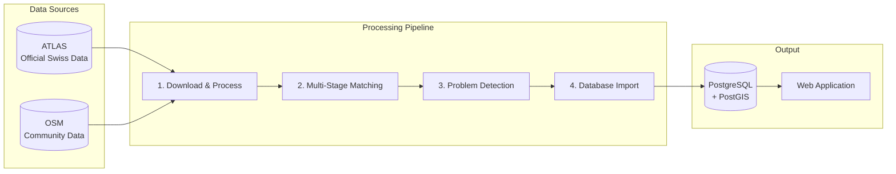

# **OSM & ATLAS Synchronization**

Welcome! This project provides a systematic pipeline to identify, analyze, and resolve discrepancies between public transport stop data from **ATLAS** (Swiss official data) and **OpenStreetMap (OSM)**.

It automates data download and processing (ATLAS, OSM, GTFS, HRDF), performs exact/distance-based/route-based matching, and serves an interactive web app for inspecting matches, problems, and manual fixes.


---

## Table of Contents

- [Prerequisites](#prerequisites)
- [Installation & Setup (with Docker)](#installation--setup-with-docker)
- [Pipeline](#pipeline)
- [Running the Web Application](#running-the-web-application)
- [Environment & Secrets](#environment--secrets)
- [Admin Management CLI](#admin-management-cli)
- [Authentication](#authentication)
- [CI & Tests](#ci--tests)
- [Contributing and Project Status](#contributing-and-project-status)

---

## Prerequisites

- **Docker Desktop** with Compose v2 (required)
- Internet connection to download datasets (ATLAS, OSM, GTFS, HRDF)


## Installation & Setup (with Docker)

**Just want to run it?** Here's the fastest path:

1.  **Clone the repository**
    ```bash
    git clone https://github.com/openTdataCH/stop_sync_osm_atlas.git
    cd stop_sync_osm_atlas
    ```

2.  **Configure environment** (optional):
    - Copy `env.example` to `.env` and adjust values (DB users/passwords, URIs, flags)

3.  **Build and Run with Docker Compose** (no .env required for local):
    ```bash
    docker compose up --build
    ```
    
    **On the first run**, Docker will automatically:
    - Build the application image
    - Download and start Postgres (PostGIS) database
    - Download ATLAS data from OpenTransportData.swiss
    - Download GTFS and HRDF data for route matching
    - Download OSM data via the Overpass API
    - Process and match all data
    - Import everything into the database
    - Start the Flask web application

    This typically takes 20 minutes. Data and database state are cached across runs (`./data` directory and the `postgres_data` volume).

    **Match-Only Mode (Skip Data Downloads):**
    ```bash
    MATCH_ONLY=true docker compose up --build
    ```
    Use this when you want to re-run only the matching and database import using previously downloaded data. This is much faster than the full pipeline.

    **Development Mode (Skip Data Processing Entirely):**
    ```bash
    docker compose up app-dev
    ```
    Use this when the database is already populated and you want to iterate on the web application without re-running any data pipeline.

4.  **Access the application**:
    - Web app: [http://localhost:5001](http://localhost:5001)
    - Postgres database: `localhost:5432` (user: `stops_user`, password: `1234`)

5.  **To stop the services**:
    ```bash
    docker compose down
    ```
    To remove all data: `docker compose down -v`

## Pipeline

> [!NOTE] 
> For the best experience viewing the documentation diagrams, we recommend reading the documentation within the running web application. GitHub's Mermaid renderer may fail to render complex diagrams.


```mermaid
flowchart LR
    subgraph Sources["Data Sources"]
        A[("ATLAS<br/>Official Swiss Data")]
        O[("OSM<br/>Community Data")]
    end
    
    subgraph Pipeline["Processing Pipeline"]
        direction TB
        D["1. Download & Process"]
        M["2. Multi-Stage Matching"]
        P["3. Problem Detection"]
        I["4. Database Import"]
        D --> M --> P --> I
    end
    
    subgraph Output["Output"]
        DB[("PostgreSQL<br/>+ PostGIS")]
        W["Web Application"]
        DB --> W
    end
    
    A --> D
    O --> D
    I --> DB
```

When the `app` container starts (and data import is not skipped), the entrypoint runs:

- `Download_and_process_data/get_atlas_data.py`: downloads ATLAS data and GTFS, builds optimized route/stop artifacts
- `Download_and_process_data/get_osm_data.py`: fetches OSM data via Overpass and processes it

Downloads are cached under `data/raw/` and processed artifacts under `data/processed/` — see [1. Download and process data](documentation/1.%20Download%20and%20process%20data.md) for details.


### Data Import

After acquisition, `import_data_db.py` populates the Postgres databases (e.g., `stops`, `problems`, `persistent_data`, `atlas_stops`, `osm_nodes`, `routes_and_directions`).

Set `SKIP_DATA_IMPORT=true` (the `app-dev` service already does this) to bypass acquisition/import when you only want to run the web app against an existing database.

## Running the Web Application

The Flask server is started automatically by Docker Compose.

Access it at [http://localhost:5001/](http://localhost:5001/).

### Usage

- **Map View**: Browse stops by type (`matched`, `unmatched`, `osm`) and match method.
- **Filters & Search**: Filter by ATLAS SLOID, OSM Node ID, UIC reference, or route.
- **Problems**: On the problems page you can solve the problems. See [3. Problems](documentation/3.%20Problems.md).
- **Manage Data**: See [4.2 Persistent Data](documentation/4.2%20Persistent%20Data.md).
- **Generating Reports:** The web app can generate CSV and PDF reports. See [5.3 Generate Reports](documentation/5.3%20Generate%20Reports.md).


## CI & Tests

This repository uses **GitHub Actions** for continuous integration.

- Workflow: [tests.yml](.github/workflows/tests.yml)
- CI documentation: [CI and Tests](documentation/7.%20GITHUB_ACTIONS_AND_TESTS.md)


## Contributing and project Status

This project is a **work in progress**. Feedback and improvements are welcome!
Feel free to submit issues and pull requests. Thank you for your interest! 🚀

---

