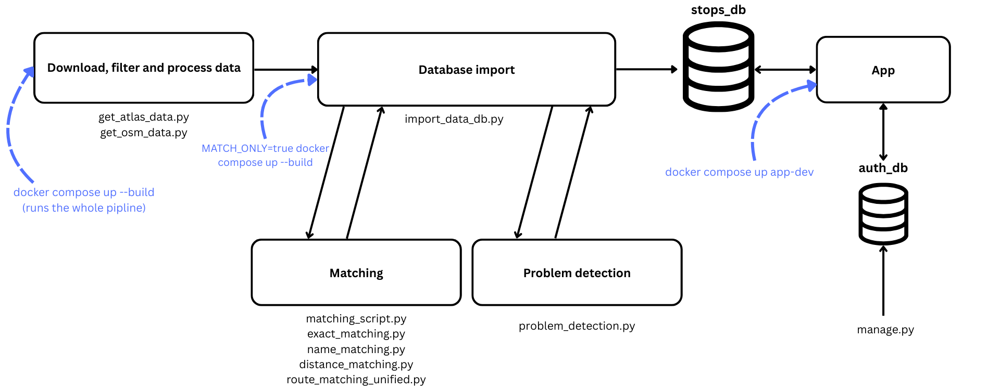

# **OSM & ATLAS Synchronization**

Welcome! This project provides a systematic pipeline to identify, analyze, and resolve discrepancies between public transport stop data from **ATLAS** (Swiss official data) and **OpenStreetMap (OSM)**.

It automates data download and processing (ATLAS, OSM, GTFS, HRDF), performs exact/distance-based/route-based matching, and serves an interactive web app for inspecting matches, problems, and manual fixes.


---

## Table of Contents

- [Prerequisites](#prerequisites)
- [Installation & Setup (with Docker)](#installation--setup-with-docker)
- [Database Setup (Migrations)](#database-setup-migrations)
- [Data Acquisition (Entrypoint)](#data-acquisition-entrypoint)
- [Data Import (Entrypoint)](#data-import-entrypoint)
- [Running the Web Application](#running-the-web-application)
- [Usage](#usage)
- [Generating Reports](#generating-reports)
- [Project Report](#project-report)
- [Project Status](#project-status)
- [CI & Tests](#ci--tests)
- [Contributing](#contributing)

---

## Prerequisites

- **Docker Desktop** with Compose v2 (required)
- Internet connection to download datasets (ATLAS, OSM, GTFS, HRDF)


## Installation & Setup (with Docker)

**Just want to run it?** Here's the fastest path:

1.  **Clone the repository**
    ```bash
    git clone https://github.com/openTdataCH/stop_sync_osm_atlas.git
    cd stop_sync_osm_atlas
    ```

2.  **Configure environment** (optional):
    - Copy `env.example` to `.env` and adjust values (DB users/passwords, URIs, flags)

3.  **Build and Run with Docker Compose** (no .env required for local):
    ```bash
    docker compose up --build
    ```
    
    **On the first run**, Docker will automatically:
    - Build the application image
    - Download and start Postgres (PostGIS) database
    - Download ATLAS data from OpenTransportData.swiss
    - Download GTFS and HRDF data for route matching
    - Download OSM data via the Overpass API
    - Process and match all data
    - Import everything into the database
    - Start the Flask web application

    This typically takes 15 minutes. Data and database state are cached across runs (`./data` directory and the `postgres_data` volume).

    **Match-Only Mode (Skip Data Downloads):**
    ```bash
    MATCH_ONLY=true docker compose up --build
    ```
    Use this when you want to re-run only the matching and database import using previously downloaded data. This is much faster than the full pipeline.

    **Development Mode (Skip Data Processing Entirely):**
    ```bash
    docker compose up app-dev
    ```
    Use this when the database is already populated and you want to iterate on the web application without re-running any data pipeline.

4.  **Access the application**:
    - Web app: [http://localhost:5001](http://localhost:5001)
    - Postgres database: `localhost:5432` (user: `stops_user`, password: `1234`)

5.  **To stop the services**:
    ```bash
    docker compose down
    ```
    To remove all data: `docker compose down -v`

## Pipline (Entrypoint)

When the `app` container starts (and data import is not skipped), the entrypoint runs:

- `Download_and_process_data/get_atlas_data.py`: downloads ATLAS data and GTFS, builds optimized route/stop artifacts
- `Download_and_process_data/get_osm_data.py`: fetches OSM data via Overpass and processes it

Downloads are cached under `data/raw/` and processed artifacts under `data/processed/`  See [DATA_ORGANIZATION.md](documentation/DATA_ORGANIZATION.md) for details.

**Speed up iterations**: Use `MATCH_ONLY=true` to skip downloads and data processing and only run the matching/import process using existing data files. This requires that a full pipeline has been run at least once to generate the necessary processed files.

### Data Import (Entrypoint)
After acquisition, `import_data_db.py` populates the Postgres databases (e.g., `stops`, `problems`, `persistent_data`, `atlas_stops`, `osm_nodes`, `routes_and_directions`).

Set `SKIP_DATA_IMPORT=true` (the `app-dev` service already does this) to bypass acquisition/import when you only want to run the web app against an existing database.

### Running the Web Application
The Flask server is started automatically by Docker Compose.

Access it at [http://localhost:5001/](http://localhost:5001/).

**Usage:**

- **Map View**: Browse stops by type (`matched`, `unmatched`, `osm`) and match method.
- **Filters & Search**: Filter by ATLAS SLOID, OSM Node ID, UIC reference, or route.
- **Problems**: On the problems page you can solve the problems. See [PROBLEMS_DEFINITIONS.md](documentation/PROBLEMS_DEFINITIONS.md).
- **Manage Data**: See [PERSISTENT_DATA.md](documentation/PERSISTENT_DATA.md).
- **Generating Reports:** The web app can generate CSV and PDF reports. See [GENERATE_REPORTS.md](documentation/GENERATE_REPORTS.md)

## Environment & Secrets

- This repo provides `env.example` (copy to `.env` if you want to override defaults). Key variables:
  - `DATABASE_URI`, `AUTH_DATABASE_URI`: SQLAlchemy URIs. Override to use your chosen users.
  - `SECRET_KEY`: Flask secret key (set a strong value in production).
  - `AUTO_MIGRATE`, `MATCH_ONLY`, `SKIP_DATA_IMPORT`: control data pipeline and migrations.
  - `TURNSTILE_SITE_KEY`, `TURNSTILE_SECRET_KEY`: Cloudflare Turnstile CAPTCHA (optional locally; required to enable CAPTCHA on auth forms).
  - `AWS_REGION`, `SES_FROM_EMAIL`: Amazon SES region and a verified sender identity (only required if you want to send emails).
  - `SES_CONFIGURATION_SET` (optional): existing SES configuration set name.
  - `AWS_ACCESS_KEY_ID`, `AWS_SECRET_ACCESS_KEY` (optional): AWS credentials if not using instance/task roles.

Example `.env` snippet:
```env
DATABASE_URI=postgresql+psycopg://stops_user:1234@db:5432/stops_db
AUTH_DATABASE_URI=postgresql+psycopg://stops_user:1234@db:5432/auth_db
SECRET_KEY=dev-insecure
AUTO_MIGRATE=true
# CAPTCHA (Cloudflare Turnstile)
TURNSTILE_SITE_KEY=your-turnstile-site-key
TURNSTILE_SECRET_KEY=your-turnstile-secret-key
# Email (Amazon SES)
AWS_REGION=eu-west-1
SES_FROM_EMAIL=no-reply@example.com
# SES_CONFIGURATION_SET=your-config-set
# If not using roles, provide AWS credentials via env
# AWS_ACCESS_KEY_ID=...
# AWS_SECRET_ACCESS_KEY=...
```

## Admin Management CLI

Use `manage.py` to list users, create users, and grant/revoke admin (run these inside the container). This is the simplest way to become admin locally:
```bash
# Inside the container
docker compose exec app python manage.py list-users
docker compose exec app python manage.py create-user --email you@example.com --password 'StrongPass' --admin
docker compose exec app python manage.py set-admin --email you@example.com --on
docker compose exec app python manage.py set-admin --email you@example.com --off
```

If you are running the `app-dev` service instead, replace `app` with `app-dev`:
```bash
docker compose exec app-dev python manage.py list-users
```

The project uses Alembic (via Flask‑Migrate) to manage schema. On startup, the application waits for Postgres and runs `flask db upgrade` to apply migrations. Auth tables live in the `auth_db` bind and are ensured by `create_auth_tables.py`.


## Authentication

- Authentication features: email/password (Argon2id), optional email verification, TOTP 2FA with backup codes, rate limiting and progressive lockout.

### Local auth notes
- You can log in with any account you create via the UI or `manage.py`.
- Email verification is optional locally; if SES is not configured, verification emails are skipped harmlessly.
- CAPTCHA (Turnstile) checks are skipped if keys are not set.

### Roles and permissions
- Anonymous (not logged in):
  - Access the web UI pages
  - Save non‑persistent solutions and notes
  - View lists of persistent and non‑persistent data
  - Cannot make anything persistent or modify persistent data
- Users (authenticated):
  - Everything anonymous users can do
  - Make a solution or note persistent individually
  - Delete or make non‑persistent their own persistent records
- Admins:
  - Everything users can do
  - Delete any persistent record
  - Make a specific solution non‑persistent
  - Clear all persistent data
  - Clear all non‑persistent data
  - Make solutions/notes persistent in bulk

See the full policy: [Permissions and Roles](documentation/PERMISSIONS.md).


## CI & Tests

This repository uses **GitHub Actions** for continuous integration.

- Workflow: [tests.yml](.github/workflows/tests.yml)
- CI documentation: [CI and Tests](documentation/7.%20GITHUB_ACTIONS_AND_TESTS.md)
  - [JavaScript tests (Jest)](documentation/7.1%20JavaScript%20tests.md)
  - [Python lint and tests](documentation/7.2%20Python%20lint%20and%20tests.md)

Quick local commands:

```bash
# JavaScript unit tests
npm ci
npm test

# Python linting
python -m pip install flake8 black isort
flake8 .
```


## Contributing and project Status

This project is a **work in progress**. Feedback and improvements are welcome!
Feel free to submit issues and pull requests. Thank you for your interest! 🚀

---

