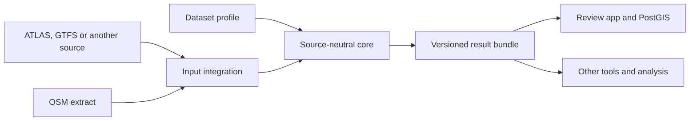

# Public Transport Matching and Review

Compare official public transport stops and routes with OpenStreetMap, explain discrepancies, and inspect the results on a map. The Swiss deployment uses ATLAS and GTFS at [atlas.osm.ch](https://atlas.osm.ch).

This repository is the review application. It is developed beside an independently runnable matching-engine checkout:

| Project | Purpose | Start here |
|---|---|---|
| Sibling `engine/` — `transport-matcher` | Producer package: source-neutral core, curated input integrations, profiles and result-bundle production. | Engine repository README |
| Review application — repository root | Flask API, PostGIS importer, map, problems, routes and reports. Reads versioned bundles without installing the engine. | Instructions below |


```mermaid
flowchart LR
    S[ATLAS, GTFS or another source] --> A[Input integration]
    O[OSM extract] --> A
    P[Dataset profile] --> E[Source-neutral core]
    A --> E
    E --> B[Versioned result bundle]
    B --> W[Review app and PostGIS]
    B --> X[Other tools and analysis]
```

The projects share the engine-owned versioned result format, with no cross-project Python imports. Docker receives the sibling checkout as a named `engine` build context: the scheduler installs its CLI, while the app image copies only its documentation and package-version metadata. The web documentation portal displays both documentation trees while keeping their ownership explicit.

## Try the engine without Docker or a database

With Python 3.10 or later:

```bash
python -m venv .venv
source .venv/bin/activate
python -m pip install -e '../engine[gtfs,test]'
transport-matcher gtfs --source ../engine/examples/gtfs --namespace demo --osm ../engine/examples/osm.xml --output /tmp/transport-demo
```

The example is synthetic and uses no Swiss identifiers. The core library only needs NumPy/SciPy; curated integrations install through optional extras. Other datasets can use external adapters implementing the public adapter contract without adding code to this repository. See the sibling engine repository README for its Python API and Swiss workflow.

## Pin the engine checkout

Keep the private repository location, sibling path and immutable revision in the ignored `.env`:

```dotenv
ENGINE_REPO=https://github.com/your-account/matching-engine.git
ENGINE_DIR=../engine
ENGINE_REF=<full-commit-sha>
```

Before building, verify that the sibling checkout has the configured origin, is clean and is exactly at that revision:

```bash
./scripts/verify_engine_checkout.sh
```

Git credentials are never passed into Docker and the private repository URL is not committed. The complete meaning of package versions, Git tags, SHA pins and schema versions is documented in [Dependencies and Builds](documentation/3.1%20Dependency%20Management%20&%20Build%20Strategy.md#engine-release-identity-and-deployment-pin).

## Run the review app with example results

Docker Desktop with Compose v2 is the easiest local setup:

```bash
./scripts/verify_engine_checkout.sh
REVIEW_CONFIG=config/gtfs-example.json docker compose up --build -d db migrator app
docker compose run --rm --no-deps --entrypoint '' app python -m backend.importing.importer tests/fixtures/result-v1
```

Open [localhost:5001](http://localhost:5001). This small synthetic compatibility fixture lives under `tests/fixtures`, and is available through the development Compose bind mount. It is not included in the application image. It works without an engine installation. Use a local development database for the example: importing publishes the example as its active dataset.

The command selects generic title, labels, map defaults and feature availability. Set `REVIEW_CONFIG=config/gtfs-example.json` in `.env` to keep that choice on later starts. `config/switzerland.json` preserves the Swiss presentation. Matching policies live in the engine and are separate from UI configuration.

## Run the Swiss deployment pipeline

```bash
./scripts/verify_engine_checkout.sh
docker compose up --build -d
docker exec stop_sync_osm_atlas_scheduler python -m backend.jobs.job_runner --mode full --trigger manual
```

The scheduler invokes the independent `transport-matcher` executable, writes a complete result bundle, and asks the app importer to publish it. Daily runs use `PIPELINE_SCHEDULE_INTERVAL_HOURS` and `PIPELINE_TIMEZONE`.

The VS Code Docker tasks build their required images before starting services. A source bind mount does not update installed packages in an existing container. If an older scheduler reports `No such file or directory: transport-matcher`, rebuild and replace it:

```bash
docker compose build scheduler
docker compose up -d --no-deps --force-recreate scheduler
docker exec stop_sync_osm_atlas_scheduler transport-matcher --help
```

Use `--mode match-import` to reuse existing source snapshots. An app-only deployment can import a result from elsewhere with `PIPELINE_BUNDLE=/path/to/result python -m backend.jobs.job_runner --mode import`. `MATCHER_COMMAND` selects a separately installed engine executable for matching modes.

The engine requires no database credentials. The importer validates files and references before loading a private PostGIS schema. Readers continue using the existing data while the new snapshot loads. The final switch is transactional; failed loads or lock timeouts preserve the old snapshot.

## Configuration and development

Copy `env.example` to `.env` to override settings. Source snapshots and runtime state live under `data/`; PostGIS persists in the Compose volume. Long-running services restart unless manually stopped. Database migrations run through the one-shot `migrator` service.

```bash
# Review application tests: engine package is not required.
python -m pip install -r requirements-base.txt -r requirements-web.txt -r requirements-scheduler.txt -r requirements-test.txt
DATABASE_URI=sqlite:// python -m pytest tests -q

# Engine tests: website and database are not required.
python -m pip install -e '../engine[swiss,gtfs,acquisition,test]'
python -m pytest ../engine/tests -q

# Browser tests.
npm ci
npm test -- --runInBand
```

Real publication tests require `TEST_POSTGRES_URI` pointing to a disposable PostGIS database whose name ends in `_test`; those tests reset its public schema. Without it, only these database integration cases are skipped.

## Contributing and documentation

Start with [CONTRIBUTING.md](CONTRIBUTING.md). A predicate contribution can use a tiny offline fixture; a UI contribution can use the precomputed bundle. No national download is required to begin.

- [Documentation overview](documentation/0.%20Intro.md)
- [Engine documentation](../engine/documentation/1.%20Download%20and%20process%20data.md)
- [Review application changelog](documentation/Changelog.md)
- [Matching engine changelog](../engine/documentation/Changelog.md)
- [Engine and app architecture](documentation/3.%20System%20Architecture.md)
- [Bundle import and publication](documentation/1.1%20Import%20Process.md)
- [Tests and CI](documentation/4.%20Test.md)
- [Contribution tutorials](documentation/Contributing.md)
- [Related tools and collaboration](../engine/documentation/Related%20projects.md)

Code remains AGPL-3.0-or-later. Source dataset attribution is recorded separately in result metadata.

For GTFS acceleration, independent source caches, COPY imports, configuration and benchmark commands, see [Pipeline Performance](../engine/documentation/5.2%20Pipeline%20Performance.md).
