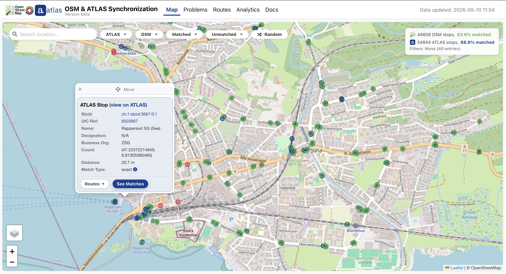
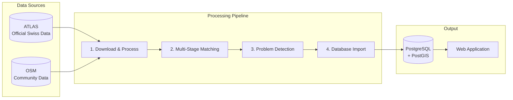

# **OSM & ATLAS Synchronization**

Welcome! This project provides a systematic pipeline to identify and analyze discrepancies between public transport stop data from **ATLAS** (Swiss official data) and **OpenStreetMap (OSM)**.

It automates data download and processing (ATLAS, OSM, GTFS), performs exact/distance-based/route-based matching, and serves an interactive web app for inspecting matches, problems, and manual fixes.

There's a public instance of the project at: https://atlas.osm.ch


---

## Table of Contents

- [Prerequisites](#prerequisites)
- [Installation & Setup (with Docker)](#installation--setup-with-docker)
- [Pipeline](#pipeline)
- [Background Scheduler & Microservices](#background-scheduler--microservices)
- [Running the Web Application](#running-the-web-application)
- [Environment & Secrets](#environment--secrets)
- [CI & Tests](#ci--tests)
- [Contributing and Project Status](#contributing-and-project-status)

---

## Prerequisites

- **Docker Desktop** with Compose v2 (required)
- Internet connection to download datasets (ATLAS, OSM, GTFS)


## Installation & Setup (with Docker)

**Just want to run it?** Here's the fastest path:

1.  **Clone the repository**
    ```bash
    git clone https://github.com/openTdataCH/stop_sync_osm_atlas.git
    cd stop_sync_osm_atlas
    ```

2.  **Configure environment** (optional):
    - The application works out-of-the-box locally without a `.env` file. If you need to customize settings (DB users/passwords, URIs, flags, pipeline timezone), copy `env.example` to `.env` and adjust the values.

3.  **Build and Run with Docker Compose**:
    ```bash
    docker compose up --build
    ```
    
    Docker will automatically:
    - Build the application images
    - Download and start Postgres (PostGIS) database
    - Start the web app container
    - Start the scheduler container (default recurring run every 24 hours in `Europe/Zurich`)

    Redis is no longer required by default. The default local setup uses file-backed pipeline state and `memory://` rate limiting.

    *Note: The data pipeline (downloading and matching ATLAS/OSM/GTFS data) does not run automatically on startup.* It runs in the dedicated scheduler service at the configured time. To run it immediately, use the VS Code Task "Docker: Trigger Scheduled Pipeline Now" (see below), or run:
    ```bash
    docker exec stop_sync_osm_atlas_scheduler python -m matching_and_import_db.scheduler.job_runner --mode full --trigger manual
    ```

    Data and database state are cached across runs (`./data` directory and the `postgres_data` volume).


4.  **Access the application**:
    - Web app: [http://localhost:5001](http://localhost:5001)
    - Postgres database: `localhost:5432` (user: `stops_user`, password: `1234`)

5.  **To stop the services**:
    ```bash
    docker compose down
    ```
    To remove all data: `docker compose down -v`

## Pipeline


```mermaid
flowchart LR
    subgraph Sources["Data Sources"]
        A[("ATLAS<br/>Official Swiss Data")]
        O[("OSM<br/>Community Data")]
    end
    
    subgraph Pipeline["Processing Pipeline"]
        direction TB
        D["1. Download & Process"]
        M["2. Multi-Stage Matching"]
        P["3. Problem Detection"]
        I["4. Database Import"]
        D --> M --> P --> I
    end
    
    subgraph Output["Output"]
        DB[("PostgreSQL<br/>+ PostGIS")]
        W["Web Application"]
        DB --> W
    end
    
    A --> D
    O --> D
    I --> DB
```

When the daily scheduled job runs (or when manually triggered), the pipeline executes:

- `matching_and_import_db/downloader/get_atlas_data.py`: downloads ATLAS data and GTFS, builds optimized route/stop artifacts
- `matching_and_import_db/downloader/get_osm_data.py`: fetches OSM data via Overpass and processes it
- `matching_and_import_db/orchestrator.py`: runs the matching pipeline
- `matching_and_import_db/database/importer.py`: imports refreshed data into the import database

Downloads are cached under `data/raw/` and processed artifacts under `data/processed/` — see [1. Download and process data](documentation/1.%20Download%20and%20process%20data.md) for details.


### Data Import

After acquisition, `matching_and_import_db/database/importer.py` populates the Postgres databases (e.g., `stops`, `problems`, `persistent_data`, `atlas_stops`, `osm_nodes`, `routes_and_directions`).

During import, the UI shows a global maintenance popup. Downloading and matching stages run in the background without blocking normal browsing.

## Background Scheduler & Microservices

Docker Compose now runs five primary services:

- `app`: Flask web app and API.
- `scheduler`: Dedicated background worker that runs the recurring pipeline on a configurable hour interval (`PIPELINE_TIMEZONE`, default `Europe/Zurich`).
- `db`: Postgres + PostGIS import database.
- `redis`: Optional shared backend for multi-worker rate limiting or Redis-backed pipeline state.
- `migrator`: One-shot startup service that runs `flask db upgrade` before `app` and `scheduler`.

For local test execution, there is also a dedicated `test` service/image with both app and pipeline dependencies.

Scheduler behavior:

- Uses APScheduler interval trigger (`PIPELINE_SCHEDULE_INTERVAL_HOURS`).
- Publishes run status to `/api/system/pipeline_status` through a shared pipeline-state backend (`redis` or `file`).
- Checks HTTP validators (`ETag` / `Last-Modified`) on the ATLAS and GTFS permalinks before re-running preprocessing.
- Sets maintenance mode only for the import phase so the UI can show "Data update in progress" with elapsed/ETA.
- Uses a distributed lock to prevent concurrent runs.

### Manual Import & Testing (VS Code Tasks)

If you have VS Code installed, we have provided built-in tasks to quickly run commands inside the running Docker containers without constantly restarting Docker:
1. Open the VS Code Command Palette (`Cmd+Shift+P` on Mac).
2. Select **`Tasks: Run Task`**.
3. Choose one of the predefined tasks:
   - **`Docker: Run All Tests`**: Executes the `pytest` suite.
    - **`Docker: Run Matching & Import (Existing Data)`**: Runs matching + import on already downloaded files through the scheduler runner.
    - **`Docker: Run Full Data Pipeline (Download & Match & Import)`**: Runs full download + matching + import through the scheduler runner.
    - **`Docker: Trigger Scheduled Pipeline Now`**: Fires a full manual run equivalent to the recurring scheduled run.

You can do this while the `app` container is running in the background.

## Environment & Secrets

Most local runs work without a `.env` file. If you want explicit local configuration, copy `env.example` to `.env` and adjust these values:

| Variable | Purpose | Default |
|---|---|---|
| `DATABASE_URI` | SQLAlchemy connection string | `postgresql+psycopg://stops_user:1234@db:5432/import_db` |
| `FLASK_DEBUG` | Enables Flask debug mode for local development | `1` |
| `FORCE_HTTPS` | Redirect HTTP requests to HTTPS when running behind TLS | `false` |
| `RATELIMIT_STORAGE_URI` | Flask-Limiter backend | `memory://` |
| `PIPELINE_STATE_BACKEND` | Shared pipeline status/lock backend (`redis`, `file`, `memory`) | `file` |
| `PIPELINE_STATE_REDIS_URL` | Redis URL for pipeline state when backend is `redis` | unset |
| `PIPELINE_STATE_DIR` | Shared directory for pipeline state when backend is `file` | `data/runtime` |
| `ASYNC_EXPORT_STATE_BACKEND` | Async report/docs export backend (`redis`, `file`, `memory`) | `file` |
| `ASYNC_EXPORT_REDIS_URL` | Redis URL for async export state when backend is `redis` | unset |
| `ASYNC_EXPORT_STATE_DIR` | Shared directory for async export state when backend is `file` | `data/runtime/async_export` |
| `PIPELINE_TIMEZONE` | Scheduler timezone | `Europe/Zurich` |
| `PIPELINE_SCHEDULE_INTERVAL_HOURS` | Automatic pipeline interval | `24` |
| `PIPELINE_IMPORT_ETA_SECONDS` | Import-phase ETA shown in the UI | `150` |
| `PIPELINE_LOG_LEVEL` | Scheduler and pipeline logging verbosity | `INFO` |
| `PIPELINE_SOURCE_PROBE_TIMEOUT_SECONDS` | Timeout for ATLAS/GTFS source validator probes | `120` |

Redis-free local deployments use:

```env
RATELIMIT_STORAGE_URI=memory://
PIPELINE_STATE_BACKEND=file
PIPELINE_STATE_DIR=data/runtime
ASYNC_EXPORT_STATE_BACKEND=file
ASYNC_EXPORT_STATE_DIR=data/runtime/async_export
```

If you want Redis-backed state instead, start it explicitly and set:

```env
RATELIMIT_STORAGE_URI=redis://redis:6379/0
PIPELINE_STATE_BACKEND=redis
PIPELINE_STATE_REDIS_URL=redis://redis:6379/0
ASYNC_EXPORT_STATE_BACKEND=redis
ASYNC_EXPORT_REDIS_URL=redis://redis:6379/0
```

## Running the Web Application

After `docker compose up --build`, the Flask app is available at [http://localhost:5001/](http://localhost:5001/).

### Usage

- **Map View**: Browse stops by type (`matched`, `unmatched`, `osm`) and match method.
- **Filters & Search**: Filter by ATLAS SLOID, OSM Node ID, UIC reference, or route.
- **Problems**: On the problems page you can solve the problems. See [3. Problems](documentation/3.%20Problems.md).
- **Manage Data**: See [4. Database](documentation/4.%20Database.md).
- **Generating Reports:** The web app can generate CSV and PDF reports. See [6.5 Generate Reports and PDFs](documentation/6.5%20Generate%20Reports%20and%20PDFs.md).


## CI & Tests

This repository uses **GitHub Actions** for continuous integration.

- Workflow: [tests.yml](.github/workflows/tests.yml)
- CI documentation: [CI and Tests](documentation/8.%20Test.md)


## Contributing and project Status

This project is a **work in progress**. Feedback and improvements are welcome!
Feel free to submit issues and pull requests. Thank you for your interest! 🚀

---

