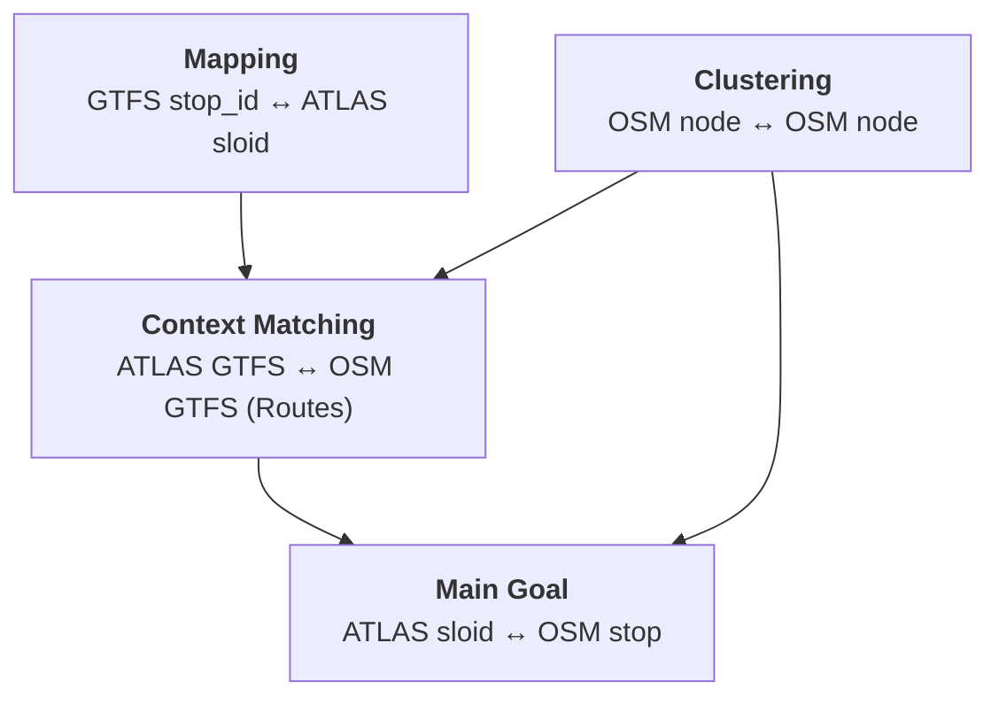
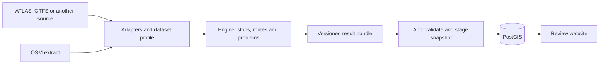

# Stop Sync: ATLAS ↔ OSM

This project contains an independent public transport matching engine and a review application. Switzerland remains the main deployment, comparing **ATLAS** (Swiss official data) with **OpenStreetMap (OSM)**. Other feeds can use the generic GTFS adapter, matching profiles and the same result contract.

The Swiss application is the first consumer of a reusable engine that also supports ordinary GTFS feeds. See [the architecture](7.%20System%20Architecture.md) and [related-project collaboration report](ecosystem-collaboration-report.md).

## Purpose

Switzerland has two valuable sources of public transport data:

- **ATLAS**: The authoritative dataset from the Swiss Federal Office of Transport, containing official traffic points, platform designations, and timetable associations.
- **OpenStreetMap (OSM)**: A community-maintained, freely available geographic database with rich attribute data.

By systematically comparing these datasets, we can:

**Improve data quality and detect anomalies for both datasets** by identifying missing stops, incorrect locations, or outdated attributes.

To link Swiss official data with OpenStreetMap, the system maintains four related mappings. The first is the main result; the other three provide identity, route, and physical-stop structure that make that result reliable:

1.  **ATLAS SLOID ↔ OSM stop**: The main matching objective, linking official platforms to geographic stop units in OSM.
2.  **ATLAS GTFS ↔ OSM GTFS (Routes)**: Since stops are best understood within the context of the lines that serve them, we perform route-to-route matching. This process depends on having correctly mapped stop IDs and clustered OSM nodes.
3.  **GTFS `stop_id` ↔ ATLAS SLOID**: opentransportdata.swiss GTFS data uses `stop_id` as its stop identifier, so a mapping layer connects timetable records to SLOIDs.
4.  **OSM Node ↔ OSM Node**: In OSM, a single physical stop is often represented by multiple nodes (e.g., platforms, stop positions). We match these nodes to cluster them into logical "OSM stops."

## Key Statistics

> **Note**: Statistics are automatically synchronized with the matching pipeline and updated on each data import.

| Metric | Value |
|--------|-------|
| ATLAS Platforms | {{stat:summary.atlas_platforms}} |
| OSM Nodes | {{stat:summary.osm_nodes}} |
| OSM Stop Units | {{stat:summary.osm_stops}} |
| Atlas Match Rate | {{stat:summary.match_rate_percent}}% |
| Matched Pairs (ATLAS ↔ OSM) | {{stat:summary.matched_pairs}} |
| Unmatched ATLAS Platforms | {{stat:summary.unmatched_atlas}} |
| Unmatched OSM Stop Units | {{stat:summary.unmatched_osm}} |

## System Workflow

Scheduled acquisition runs the standalone engine and produces a versioned result bundle. The independent app validates and stages a new database snapshot while readers use the previous data, then publishes it in a bounded atomic switch.

The engine lives in `engine/` and can be installed and tested alone. The application lives in `backend/`, `templates/` and `static/`, and can run from a precomputed example bundle. This repository establishes the split before any separate repository is published.

## Documentation Sections

| Section | Content |
|---------|---------|
| **[1. Sources, Adapters and Acquisition](1.%20Download%20and%20process%20data.md)** | Source adapters, acquisition, profiles and explicit inputs |
| **[2. Matching Process](2.%20Matching%20process.md)** | Multi-stage stop-matching algorithm |
| **[3. Routes](3.%20Routes.md)** | Route models, route data flow, and route-to-route linking |
| **[4. Problems](4.%20Problems.md)** | Problem detection and prioritization |
| **[5. Database](5.%20Database.md)** | Schema, result validation and snapshot publication |
| **[6. Web App](6.%20Web%20app.md)** | Front end, map data loading, reports, and route pages |
| **[7. System Architecture](7.%20System%20Architecture.md)** | Independent engine/app boundaries, builds, scheduling and source caches |
| **[8. Tests](8.%20Test.md)** | Independent engine/app tests and local checks |
| **[9. Contributing](9.%20Contributing.md)** | Add a predicate, support a dataset, or change the review UI |

## Source Code

The complete source code is available at: **[github.com/openTdataCH/stop_sync_osm_atlas](https://github.com/openTdataCH/stop_sync_osm_atlas)**
