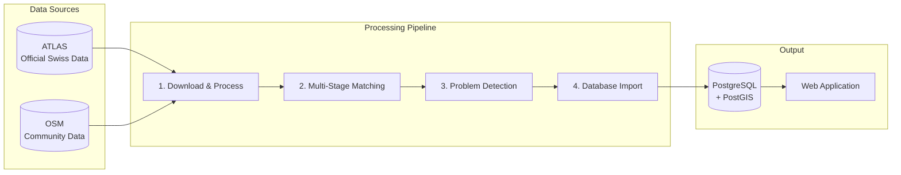

# Stop Sync: ATLAS ↔ OSM

This project provides a systematic pipeline to identify, analyze, and resolve discrepancies between public transport stop data from **ATLAS** (Swiss official data) and **OpenStreetMap (OSM)**.

## Purpose

Switzerland maintains two valuable sources of public transport stop data:

- **ATLAS**: The authoritative dataset from the Swiss Federal Office of Transport, containing official traffic points, platform designations, and timetable associations.
- **OpenStreetMap (OSM)**: A community-maintained, freely available geographic database with rich attribute data and real-world observations.

By systematically comparing these datasets, we can:

1. **Improve OSM data quality** by identifying missing stops, incorrect locations, or outdated attributes
2. **Enhance ATLAS coverage** by discovering community-mapped stops not yet in the official registry
3. **Detect anomalies** such as duplicate entries, significant location discrepancies, or naming inconsistencies

## Current Statistics

> **Note**: Statistics are automatically synchronized with the matching pipeline and updated on each data import.

| Metric | Value |
|--------|-------|
| ATLAS Platforms | {{stat:summary.atlas_platforms}} |
| Matched Pairs | {{stat:summary.matched_pairs}} |
| Match Rate | {{stat:summary.match_rate_percent}}% |
| Unmatched ATLAS | {{stat:summary.unmatched_atlas}} |
| Unmatched OSM | {{stat:summary.unmatched_osm}} |

## Pipeline Overview

The pipeline consists of four main stages:

| Stage | Description |
|-------|-------------|
| **1. Download & Process** | Fetch ATLAS traffic points, GTFS/HRDF timetables, and OSM data; apply filters |
| **2. Matching** | Sequential matching using UIC references, name similarity, distance, and routes |
| **3. Problem Detection** | Identify distance issues, unmatched stops, attribute mismatches, duplicates |
| **4. Database Import** | Persist results to PostgreSQL/PostGIS; power the web application |

## Documentation Structure

| Section | Content |
|---------|---------|
| **[1. Download and Process Data](1.%20Download%20and%20process%20data.md)** | Data sources, filters, file formats |
| **[2. Matching Process](2.%20Matching%20process.md)** | Multi-stage matching algorithm |
| **[3. Problems](3.%20Problems.md)** | Problem detection and prioritization |
| **[4. Database Import](4.%20Database%20import.md)** | Schema and persistence |
| **[5. Web App](5.%20Web%20app.md)** | Interactive map interface |
| **[6. Authentication](6.%20Authentication%20and%20permissions.md)** | User management and permissions |

## Source Code

The complete source code is available at: **[github.com/openTdataCH/stop_sync_osm_atlas](https://github.com/openTdataCH/stop_sync_osm_atlas)**
