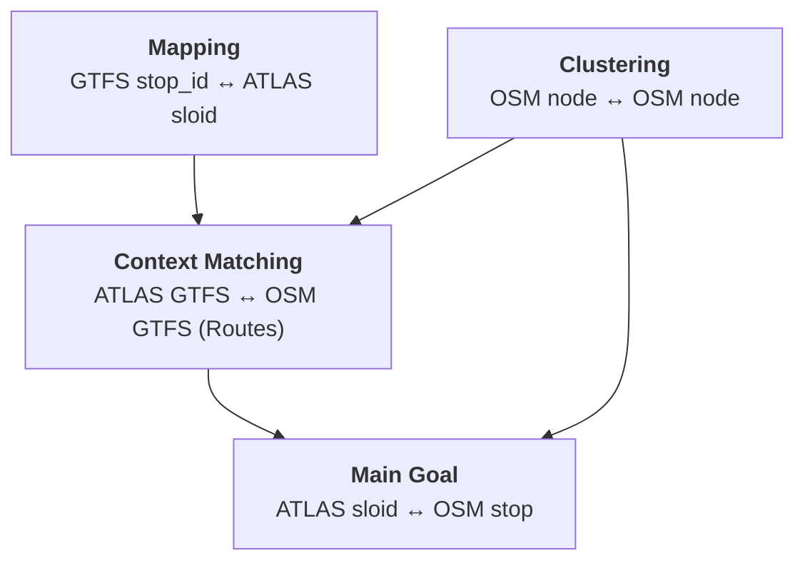
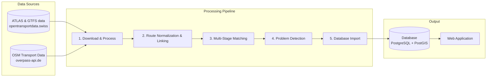

# Stop Sync: ATLAS ↔ OSM

This project provides a systematic pipeline to identify and analyze discrepancies between public transport stop data from **ATLAS** (Swiss official data) and **OpenStreetMap (OSM)**.

## Purpose

Switzerland has two valuable sources of public transport data:

- **ATLAS**: The authoritative dataset from the Swiss Federal Office of Transport, containing official traffic points, platform designations, and timetable associations.
- **OpenStreetMap (OSM)**: A community-maintained, freely available geographic database with rich attribute data.

By systematically comparing these datasets, we can:

**Improve data quality and detect anomalies for both datasets** by identifying missing stops, incorrect locations, or outdated attributes.

To accurately link Swiss official data with OpenStreetMap, the system performs **four** distinct types of matching. Linking **ATLAS sloid** to **OSM stops**, requires supporting layers:

1.  **ATLAS sloid ↔ OSM Stop**: The main matching objective, linking official platforms to geographic stop units in OSM.
2.  **ATLAS GTFS ↔ OSM GTFS (Routes)**: Since stops are best understood within the context of the lines that serve them, we perform route-to-route matching. This process depends on having correctly mapped stop IDs and clustered OSM nodes.
3.  **GTFS stop_id ↔ ATLAS sloid**: opentransportdata.swiss GTFS data uses `stop_id` as stop identifier rather than `sloid`, necessitating a mapping layer to connect timetable data to Sloids.
4.  **OSM Node ↔ OSM Node**: In OSM, a single physical stop is often represented by multiple nodes (e.g., platforms, stop positions). We match these nodes to cluster them into logical "OSM stops."

## Key Statistics

> **Note**: Statistics are automatically synchronized with the matching pipeline and updated on each data import.

| Metric | Value |
|--------|-------|
| ATLAS Platforms | {{stat:summary.atlas_platforms}} |
| OSM Nodes | {{stat:summary.osm_nodes}} |
| OSM Stop Units | {{stat:summary.osm_stops}} |
| Atlas Match Rate | {{stat:summary.match_rate_percent}}% |
| Matched Pairs (ATLAS ↔ OSM) | {{stat:summary.matched_pairs}} |
| Unmatched ATLAS Platforms | {{stat:summary.unmatched_atlas}} |
| Unmatched OSM Stop Units | {{stat:summary.unmatched_osm}} |

## System Workflow

The system is designed to re-import base data periodically (e.g., every 2 hours) to stay synchronized with ATLAS and OSM updates. The database is wiped and fully rebuilt on each run.

## Documentation Sections

| Section | Content |
|---------|---------|
| **[1. Download and Process Data](1.%20Download%20and%20process%20data.md)** | Data sources, filters, data processing|
| **[2. Routes](2.%20Routes.md)** | Route models, route data flow, and route-to-route linking |
| **[3. Matching Process](3.%20Matching%20process.md)** | Multi-stage stop-matching algorithm |
| **[4. Problems](4.%20Problems.md)** | Problem detection and prioritization |
| **[5. Database](5.%20Database.md)** | Schema, refresh modes, and import flow |
| **[6. Web App](6.%20Web%20app.md)** | Front end, map data loading, reports, and route pages |
| **[7. System Architecture](7.%20System%20Architecture.md)** | Docker services, scheduler execution, shared state, and security |
| **[8. Tests](8.%20Test.md)** | GitHub Actions, test setup, and local checks |

## Source Code

The complete source code is available at: **[github.com/openTdataCH/stop_sync_osm_atlas](https://github.com/openTdataCH/stop_sync_osm_atlas)**
