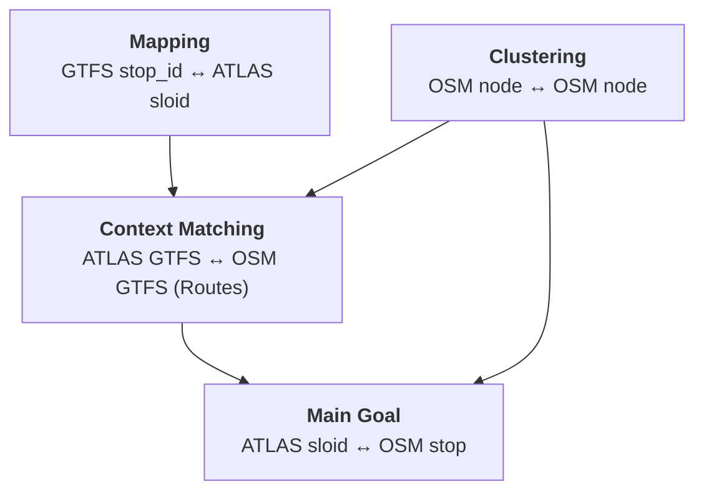
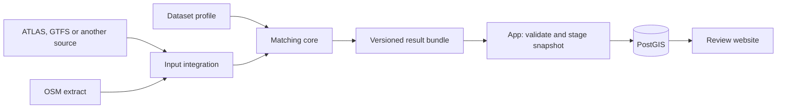

# 0. Project overview

This project uses a public transport–OSM matching engine and a web application to display matches, detected problems, and related data. This web application is about Switzerland, comparing **ATLAS** (Swiss official data) with **OpenStreetMap (OSM)**. The matching engine can also be used with other data feeds.

See [the architecture](3.%20System%20Architecture.md) and [related projects and collaboration opportunities](../engine/documentation/Related%20projects.md).

## Purpose

Switzerland has two valuable sources of public transport data:

- **ATLAS**: The authoritative dataset from the Swiss Federal Office of Transport, containing official traffic points, platform designations, and timetable associations.
- **OpenStreetMap (OSM)**: A community-maintained, freely available geographic database with rich attribute data.

By systematically comparing these datasets, we can:

**Improve data quality and detect anomalies for both datasets** by identifying missing stops, incorrect locations, or outdated attributes.

To link Swiss official data with OpenStreetMap, the system maintains four related mappings. The first is the main result; the other three provide identity, route, and physical-stop structure that make that result reliable:

1.  **ATLAS SLOID ↔ OSM stop**: The main matching objective, linking official platforms to geographic stop units in OSM.
2.  **ATLAS GTFS ↔ OSM GTFS (Routes)**: Since stops are best understood within the context of the lines that serve them, we perform route-to-route matching. This process depends on having correctly mapped stop IDs and clustered OSM nodes.
3.  **GTFS `stop_id` ↔ ATLAS SLOID**: opentransportdata.swiss GTFS data uses `stop_id` as its stop identifier, so a mapping layer connects timetable records to SLOIDs.
4.  **OSM Node ↔ OSM Node**: In OSM, a single physical stop is often represented by multiple nodes (e.g., platforms, stop positions). We match these nodes to cluster them into logical "OSM stops."

## Key Statistics

> **Note**: Statistics are automatically synchronized with the matching pipeline and updated on each data import.

| Metric | Value |
|--------|-------|
| ATLAS Platforms | {{stat:summary.atlas_platforms}} |
| OSM Nodes | {{stat:summary.osm_nodes}} |
| OSM Stop Units | {{stat:summary.osm_stops}} |
| Atlas Match Rate | {{stat:summary.match_rate_percent}}% |
| Matched Pairs (ATLAS ↔ OSM) | {{stat:summary.matched_pairs}} |
| Unmatched ATLAS Platforms | {{stat:summary.unmatched_atlas}} |
| Unmatched OSM Stop Units | {{stat:summary.unmatched_osm}} |

## System Workflow

Scheduled acquisition runs the standalone engine and produces a versioned result bundle. The independent app validates and stages a new database snapshot while readers use the previous data, then publishes it in a bounded atomic switch.

The engine lives in a sibling repository and can be installed and tested alone. Its canonical technical documentation stays with that repository and is projected into `engine/documentation/` only inside the app build/runtime layout. The application lives in `backend/`, `templates/` and `static/`; its documentation lives in `documentation/`, and it can run from a precomputed example bundle. The web documentation portal intentionally displays both collections.

### Documentation structure

The documentation has two ownership families and four reader-facing collections. The engine-owned pages are split again so input integrations are not mistaken for the matching core:

- **Engine input integrations** covers curated adapters, acquisition and the first-party Swiss workflow.
- **Matching engine core** covers source-neutral matching, routes, problem detection, performance and engine tests.
- **A — App** covers bundle import, database projection, the review website, deployment and application tests.

The Project overview is the shared fourth collection.

The **E** or **A** prefix identifies which part of the project owns each section. Both collections are available through this documentation portal.

## Documentation Sections

| Owner | Section | Content |
|---|---|---|
| Engine integrations | **[E1 Input Integrations & Acquisition](../engine/documentation/1.%20Download%20and%20process%20data.md)** | Curated format adapters, the Swiss integration, acquisition and explicit inputs |
| Matching engine | **[E2 Matching Process](../engine/documentation/2.%20Matching%20process.md)** | Multi-stage stop-matching algorithm |
| Matching engine | **[E3 Routes](../engine/documentation/3.%20Routes.md)** | Route models, route data flow and route-to-route linking |
| Matching engine | **[E4 Problems](../engine/documentation/4.%20Problems.md)** | Problem detection and prioritization |
| Matching engine | **[E5 Operations & Performance](../engine/documentation/5.%20Operations%20and%20performance.md)** | Source caching and pipeline performance |
| Matching engine | **[E6 Engine Tests](../engine/documentation/6.%20Pipeline%20tests.md)** | Independent engine and pipeline checks |
| Review application | **[A1 Database & Bundle Import](1.%20Database.md)** | Bundle validation, SQL projection and snapshot publication |
| Review application | **[A2 Web App](2.%20Web%20app.md)** | Front end, map data loading, reports and route pages |
| Review deployment | **[A3 Application Architecture & Deployment](3.%20System%20Architecture.md)** | Boundary, builds, scheduling and services |
| Review application | **[A4 Web App Tests](4.%20Test.md)** | Backend, browser and contract checks |
| Both, independently | **[Contributing](Contributing.md)** | Choose the engine or application workflow |

Release history follows the same ownership boundary: see the [review application changelog](Changelog.md) and the [matching engine changelog](../engine/documentation/Changelog.md). Result-contract changes are recorded in both from their respective consumer and producer perspectives.

## Source Code

The complete source code is available at: **[github.com/openTdataCH/stop_sync_osm_atlas](https://github.com/openTdataCH/stop_sync_osm_atlas)**
