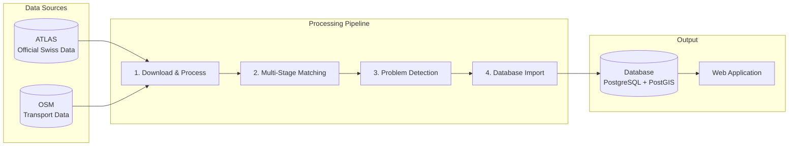

# Stop Sync: ATLAS ↔ OSM

This project provides a systematic pipeline to identify, analyze, and resolve discrepancies between public transport stop data from **ATLAS** (Swiss official data) and **OpenStreetMap (OSM)**.

## Purpose

Switzerland has two valuable sources of public transport data:

- **ATLAS**: The authoritative dataset from the Swiss Federal Office of Transport, containing official traffic points, platform designations, and timetable associations.
- **OpenStreetMap (OSM)**: A community-maintained, freely available geographic database with rich attribute data.

By systematically comparing these datasets, we can:

**Improve data quality and detect anomalies for both datasets** by identifying missing stops, incorrect locations, or outdated attributes.

## Current Statistics

> **Note**: Statistics are automatically synchronized with the matching pipeline and updated on each data import.

| Metric | Value |
|--------|-------|
| ATLAS Platforms | {{stat:summary.atlas_platforms}} |
| Matched Pairs | {{stat:summary.matched_pairs}} |
| Match Rate | {{stat:summary.match_rate_percent}}% |
| Unmatched ATLAS | {{stat:summary.unmatched_atlas}} |
| Unmatched OSM | {{stat:summary.unmatched_osm}} |

## System Workflow

The system is designed to re-import base data periodically (e.g., daily) to stay synchronized with ATLAS and OSM updates. The database is fully rebuilt on each run.

The database is wiped and rebuilt on every pipeline run. Solution persistence (feeding user corrections back into the pipeline) is modelled but not yet active. See [4. Database](4.%20Database.md) for details.

## Documentation Sections

| Section | Content |
|---------|---------|
| **[1. Download and Process Data](1.%20Download%20and%20process%20data.md)** | Data sources, filters, file formats (includes **[1.4 Route-Route Matching](1.4%20Route-Route%20Matching.md)**) |
| **[2. Matching Process](2.%20Matching%20process.md)** | Multi-stage matching algorithm (includes **[2.4 Stop-stop matching using routes](2.4%20Stop-stop%20matching%20using%20routes.md)**) |
| **[3. Problems](3.%20Problems.md)** | Problem detection and prioritization |
| **[4. Database](4.%20Database.md)** | Schema, import process, and persistence |
| **[5. Web App](5.%20Web%20app.md)** | Interactive map interface |
| **[6. System Architecture](6.%20System%20Architecture.md)** | Docker services, scheduler timing, status API, and security |
| **[7. CI and Tests](7.%20Test.md)** | GitHub Actions, test setup, and local checks |

## Source Code

The complete source code is available at: **[github.com/openTdataCH/stop_sync_osm_atlas](https://github.com/openTdataCH/stop_sync_osm_atlas)**
