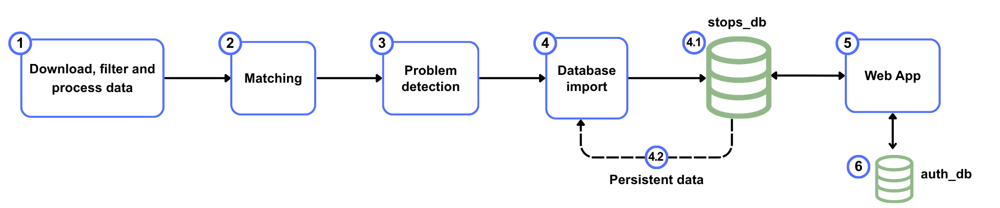

Welcome! This project provides a systematic pipeline to identify, analyze, and resolve discrepancies between public transport stop data from **ATLAS** (Swiss official data) and **OpenStreetMap (OSM)**.

It automates data download and processing (ATLAS, OSM, GTFS, HRDF), performs exact/distance-based/route-based matching, and serves an interactive web app for inspecting matches, problems, and manual fixes.

The idea is that combining the two datasets we can improve the quality of Swiss public transport data. Both datasets can help each other.
The code of the project is available here: https://github.com/openTdataCH/stop_sync_osm_atlas

