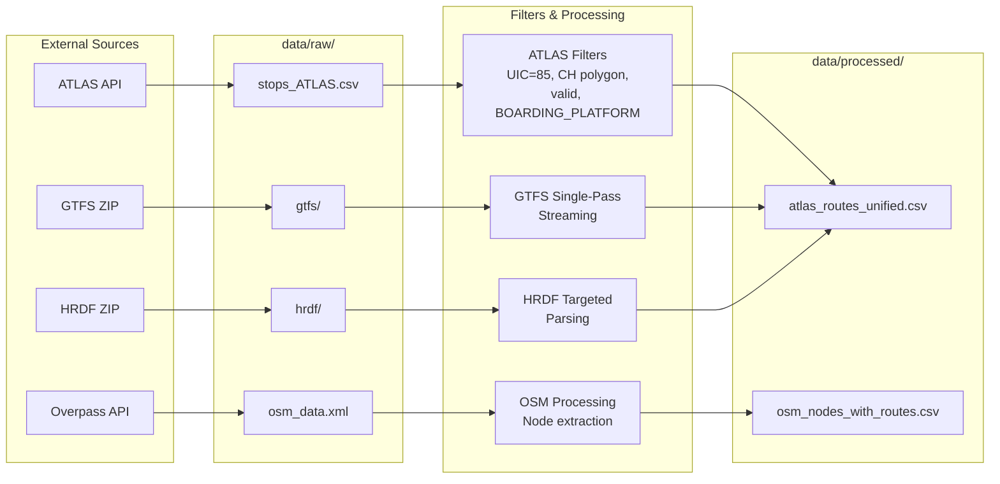

# Download and Process Data

This chapter explains how the pipeline prepares the datasets that power the matching process. Before any ATLAS–OSM matching occurs, we download data from external sources, apply filters, and produce clean CSV files for downstream steps.

## Pipeline Overview

## Data Sources

| Input | Source | Key Filters | Output |
|-------|--------|-------------|--------|
| **ATLAS Traffic Points** | [opentransportdata.swiss](https://data.opentransportdata.swiss/en/dataset/traffic-points-actual-date/permalink) | UIC `85`, CH polygon, valid, `BOARDING_PLATFORM` | `stops_ATLAS.csv` |
| **GTFS Timetable** | [opentransportdata.swiss](https://data.opentransportdata.swiss/de/dataset/timetable-2025-gtfs2020/permalink) | Swiss stops, two-pass streaming | `atlas_routes_unified.csv` |
| **HRDF Railway** | [opentransportdata.swiss](https://opentransportdata.swiss/en/cookbook/timetable-cookbook/hafas-rohdaten-format-hrdf/) | `GLEISE_LV95`, `FPLAN`, `BAHNHOF` | `atlas_routes_unified.csv` |
| **OpenStreetMap** | [Overpass API](http://overpass-api.de/api/interpreter) | Switzerland, PT nodes, route relations | `osm_nodes_with_routes.csv` |

## Output Files

| File | Description |
|------|-------------|
| `data/raw/stops_ATLAS.csv` | Swiss boarding platforms (~55K entries) |
| `data/raw/osm_data.xml` | Raw Overpass response (~50MB) |
| `data/processed/atlas_routes_unified.csv` | GTFS + HRDF routes per `sloid` |
| `data/processed/osm_nodes_with_routes.csv` | Node–route pairs with direction |

## Detailed Documentation

- **[1.1 ATLAS Data](1.1%20ATLAS%20data.md)**: Filters and platform extraction
- **[1.1.1 GTFS Data](1.1.1%20GTFS%20ATLAS%20data.md)**: Two-pass streaming processing
- **[1.1.2 HRDF Data](1.1.2%20HRDF%20ATLAS%20data.md)**: Railway direction extraction
- **[1.2 OSM Data](1.2%20OSM%20data.md)**: Overpass query and node extraction
- **[1.2.1 Operator Normalization](1.2.1%20OSM%20operator%20normalization.md)**: Standardizing operators
- **[1.3 Data Organization](1.3%20Data%20Organization.md)**: Directory structure reference