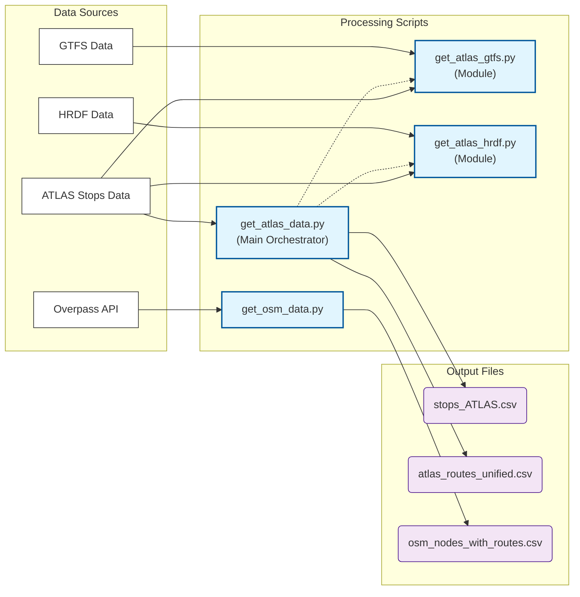

# Download and Process Data

This chapter explains how the pipeline prepares the datasets that power the matching process. Before any ATLAS–OSM matching occurs, we download the data from various sources, apply filters, and produce clean CSV files for downstream steps.

## Overview

The goal of this stage is to produce **three main files** that will be used in the matching process:

1.  **`stops_ATLAS.csv`**: A clean list of Swiss public transport boarding platforms.
2.  **`atlas_routes_unified.csv`**: A unified list of routes and directions associated with each ATLAS stop, derived from GTFS and HRDF data.
3.  **`osm_nodes_with_routes.csv`**: OSM nodes with their associated route information.



## Data Sources

| Input | Source | Key Filters | Output |
|-------|--------|-------------|--------|
| **ATLAS Traffic Points** | [OpenTransportData.swiss](https://data.opentransportdata.swiss/en/dataset/traffic-points-actual-date/permalink) | UIC `85`, CH polygon, valid, `BOARDING_PLATFORM` | `stops_ATLAS.csv` |
| **GTFS** | [OpenTransportData.swiss](https://data.opentransportdata.swiss/de/dataset/timetable-2025-gtfs2020/permalink) | Swiss stops, single-pass streaming | `atlas_routes_unified.csv` |
| **HRDF** | [OpenTransportData.swiss](https://opentransportdata.swiss/en/cookbook/timetable-cookbook/hafas-rohdaten-format-hrdf/) | `GLEISE_LV95`, `FPLAN`, `BAHNHOF` | `atlas_routes_unified.csv` |
| **OpenStreetMap** | [Overpass API](http://overpass-api.de/api/interpreter) | Switzerland, PT nodes, route relations | `osm_nodes_with_routes.csv` |

## Directory Structure

The pipeline organizes data into the following structure:

```
data/
├── raw/                          # Downloaded source data
│   ├── osm_data.xml             # Raw OSM from Overpass API
│   ├── stops_ATLAS.csv          # Filtered ATLAS platforms
│   ├── switzerland.geojson      # Swiss border polygon
│   ├── gtfs/                    # GTFS timetable files
│   └── hrdf/                    # HRDF railway files
├── processed/                    # Transformed data
│   ├── osm_nodes_with_routes.csv
│   ├── osm_routes_with_nodes.csv
│   └── atlas_routes_unified.csv
└── debug/                        # Review files
    └── org_mismatches_review.txt
```

## File Descriptions

### Raw Data (`data/raw/`)

Source data downloaded from external APIs and archives.

| File | Description | Source | Size |
|------|-------------|--------|------|
| `osm_data.xml` | OSM nodes and route relations for Switzerland | Overpass API | ~50MB |
| `stops_ATLAS.csv` | Swiss boarding platforms (filtered) | OpenTransportData.swiss | ~15MB |
| `switzerland.geojson` | Swiss administrative boundary | swisstopo | ~2MB |
| `gtfs/` | GTFS timetable files | OpenTransportData.swiss | ~200MB |
| `hrdf/` | HRDF railway files | OpenTransportData.swiss | ~50MB |

### Processed Data (`data/processed/`)

Transformed data ready for matching and database import.

| File | Description | Used By | Required |
|------|-------------|---------|----------|
| `osm_nodes_with_routes.csv` | Node–route pairs with direction info | Route matching, DB import | ✅ Yes |
| `atlas_routes_unified.csv` | GTFS + HRDF routes per sloid | Route matching, DB import | ✅ Yes |
| `osm_routes_with_nodes.csv` | Routes with node lists | Future use | ❌ Optional |

## Detailed Documentation

- **[1.1 ATLAS Stops](1.1%20ATLAS%20stops.md)**: How we filter the official stop registry.
- **[1.2 ATLAS Routes Unified](1.2%20ATLAS%20Routes%20Unified.md)**: How we combine GTFS and HRDF data.
    - **[1.2.1 GTFS Data](1.2.1%20GTFS%20ATLAS%20data.md)**: Processing the massive GTFS dataset.
    - **[1.2.2 HRDF Data](1.2.2%20HRDF%20ATLAS%20data.md)**: Extracting precise platform data from HRDF.
- **[1.3 OSM Data](1.3%20OSM%20data.md)**: Querying and processing OpenStreetMap data.
