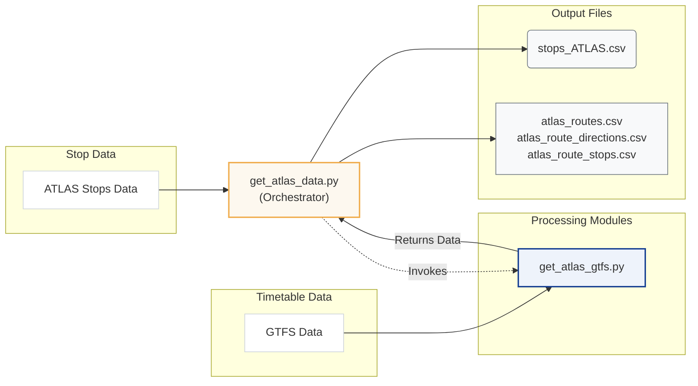
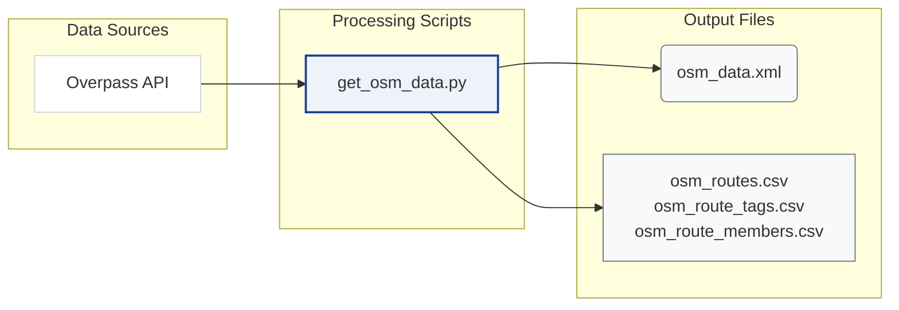

# Download and Process Data

This chapter explains how the pipeline prepares the datasets that power the matching process. We download the data, apply filters, and produce CSV files for downstream steps.

The diagrams below illustrate the different files generated by the different data sources and scripts.

### ATLAS Pipeline



### OSM Pipeline



## Data Sources

| Input | Source | Key Filters | Output |
|-------|--------|-------------|--------|
| **ATLAS Traffic Points** | [OpenTransportData.swiss](https://data.opentransportdata.swiss/dataset/traffic-point-v2/resource_permalink/actual-date-world-traffic-point.csv) | UIC `85`, CH polygon, valid, `BOARDING_PLATFORM` | `stops_ATLAS.csv` |
| **GTFS** | [OpenTransportData.swiss](https://data.opentransportdata.swiss/en/dataset/timetable-2026-gtfs2020/permalink) | Extract only `stops.txt`, `stop_times.txt`, `trips.txt`, `routes.txt`; Swiss stops; single-pass streaming | `atlas_routes.csv`, `atlas_route_directions.csv`, `atlas_route_stops.csv` |
| **OpenStreetMap** | [Overpass API](https://overpass-api.de/api/interpreter) | Switzerland, public transport nodes, way stops, route relations | `osm_data.xml`, `osm_routes.csv`, `osm_route_tags.csv`, `osm_route_members.csv` |

## Directory Structure

The pipeline organizes data into the following structure:

```
data/
├── raw/                          # Downloaded source data
│   ├── osm_data.xml             # Raw OSM from Overpass API
│   ├── stops_ATLAS.csv          # Filtered ATLAS platforms
│   ├── switzerland.geojson      # Swiss border polygon
│   ├── gtfs/                    # Extracted GTFS subset used by this project
├── processed/                    # Transformed data
│   ├── atlas_routes.csv
│   ├── atlas_route_directions.csv
│   ├── atlas_route_stops.csv
│   ├── osm_data.xml             # Raw OSM from Overpass API
│   ├── osm_routes.csv
│   ├── osm_route_tags.csv
│   └── osm_route_members.csv
└── debug/                        # Review files
    └── org_mismatches_review.txt
```

## Detailed Documentation

- **[1.1 ATLAS Stops](1.1%20ATLAS%20stops.md)**: How do we filter ATLAS stops.
- **[1.2 GTFS ATLAS Data](1.2%20GTFS%20ATLAS%20data.md)**: Processing GTFS dataset and building ATLAS route associations.
- **[1.3 OSM Data](1.3%20OSM%20data.md)**: Querying and processing OpenStreetMap data.
