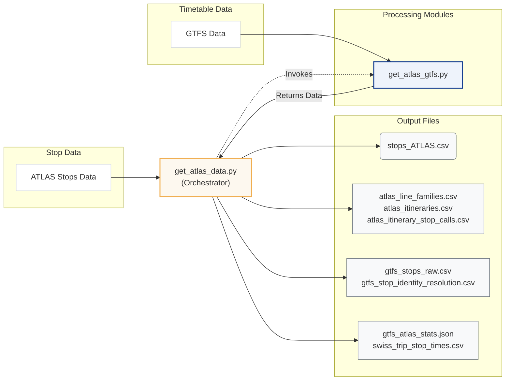
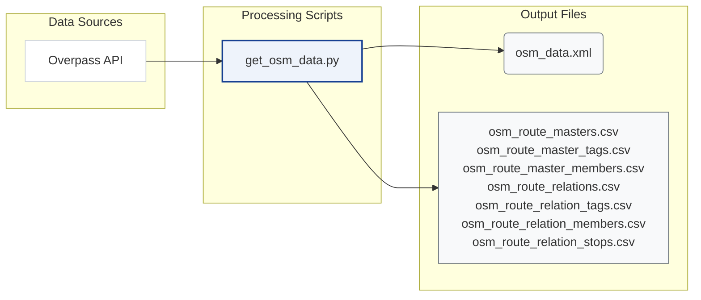

# Download and Process Data

This chapter explains the source-side preprocessing performed by `matching_and_import_db/downloader/`.

The downloader layer has two jobs:

1. fetch and filter the raw ATLAS, GTFS, and OSM inputs
2. materialize the source-side CSV artifacts consumed later by the matching runtime and the database importer

The route comparison logic itself is documented in [2. Routes](2.%20Routes.md). This chapter stops at the files written under `data/raw/` and `data/processed/`.

The preprocessing output falls into two artifact families:

- **Stop identity artifacts** used by stop matching and the GTFS `stop_id` <-> `sloid` diagnostic map
- **Source-side route artifacts** used by `matching_and_import_db/database/route_loader.py`

The diagrams below show the files produced by each source-processing path.

### ATLAS + GTFS Pipeline



### OSM Pipeline



## Data Sources

| Input | Source | Key Filters | Output |
|-------|--------|-------------|--------|
| **ATLAS Traffic Points** | [OpenTransportData.swiss](https://data.opentransportdata.swiss/dataset/traffic-point-v2/resource_permalink/actual-date-world-traffic-point.csv) | UIC `85`, CH polygon, valid, `BOARDING_PLATFORM` | `stops_ATLAS.csv` |
| **GTFS** | [OpenTransportData.swiss](https://data.opentransportdata.swiss/en/dataset/timetable-2026-gtfs2020/permalink) | Extract only `stops.txt`, `stop_times.txt`, `trips.txt`, `routes.txt`; Swiss stops; single-pass streaming; canonical GTFS `stop_id` <-> ATLAS `sloid` resolution | `atlas_line_families.csv`, `atlas_itineraries.csv`, `atlas_itinerary_stop_calls.csv`, `gtfs_stops_raw.csv`, `gtfs_stop_identity_resolution.csv`, `gtfs_atlas_stats.json` |
| **OpenStreetMap** | [Overpass API](https://overpass-api.de/api/interpreter) | Switzerland, public transport nodes, way stops, route relations, route_master relations | `osm_data.xml`, `osm_route_masters.csv`, `osm_route_master_tags.csv`, `osm_route_master_members.csv`, `osm_route_relations.csv`, `osm_route_relation_tags.csv`, `osm_route_relation_members.csv`, `osm_route_relation_stops.csv` |

## Source-Side Code Paths

| Module | Responsibility |
|--------|----------------|
| `matching_and_import_db/downloader/get_atlas_data.py` | ATLAS download, filtering, GTFS orchestration, and high-level preprocessing flow |
| `matching_and_import_db/downloader/get_atlas_gtfs.py` | GTFS extraction, Swiss stop-time streaming, GTFS `stop_id` resolution, and ATLAS route CSV generation |
| `matching_and_import_db/downloader/get_osm_data.py` | Overpass download plus route-master / route-relation CSV generation |

## Directory Structure

The pipeline organizes data into the following structure:

```
data/
├── raw/                          # Downloaded source data
│   ├── osm_data.xml             # Raw OSM from Overpass API
│   ├── stops_ATLAS.csv          # Filtered ATLAS platforms
│   ├── switzerland.geojson      # Swiss border polygon
│   ├── gtfs/                    # Extracted GTFS subset used by this project
│   │   ├── stops.txt
│   │   ├── stop_times.txt
│   │   ├── trips.txt
│   │   ├── routes.txt
│   │   └── swiss_trip_stop_times.csv
├── processed/                    # Transformed data
│   ├── atlas_line_families.csv
│   ├── atlas_itineraries.csv
│   ├── atlas_itinerary_stop_calls.csv
│   ├── gtfs_stops_raw.csv
│   ├── gtfs_stop_identity_resolution.csv
│   ├── osm_route_masters.csv
│   ├── osm_route_master_tags.csv
│   ├── osm_route_master_members.csv
│   ├── osm_route_relations.csv
│   ├── osm_route_relation_tags.csv
│   ├── osm_route_relation_members.csv
│   └── osm_route_relation_stops.csv
├── gtfs_atlas_stats.json         # GTFS-to-ATLAS sidecar stats
└── debug/                        # Review files
    └── org_mismatches_review.txt
```

## Output Boundaries

The downloader layer produces source-side artifacts only.

- `atlas_line_families.csv`, `atlas_itineraries.csv`, and `atlas_itinerary_stop_calls.csv` preserve the ATLAS-side GTFS reconstruction.
- `osm_route_masters.csv`, `osm_route_relations.csv`, and their tag/member tables preserve the OSM PTv2 route entities.
- `gtfs_stops_raw.csv` and `gtfs_stop_identity_resolution.csv` preserve the canonical GTFS identity state.

The shared comparison tables (`line_families`, `itineraries`, `stop_calls`, `line_family_matches`, `itinerary_matches`) are built later by `matching_and_import_db/database/route_loader.py` during import preparation.

## Detailed Documentation

- **[1.1 ATLAS Stops](1.1%20ATLAS%20stops.md)**: Filtering ATLAS traffic points into the canonical stop input file.
- **[1.2 GTFS ATLAS Data](1.2%20GTFS%20ATLAS%20data.md)**: Streaming GTFS processing, canonical GTFS `stop_id` resolution, and ATLAS-side route artifact generation.
- **[1.3 OSM Data](1.3%20OSM%20data.md)**: Overpass download, retained stop attributes, and OSM route-master / route-relation artifact generation.
- **[2. Routes](2.%20Routes.md)**: How the importer turns those source artifacts into shared route families, itineraries, and route matches.
