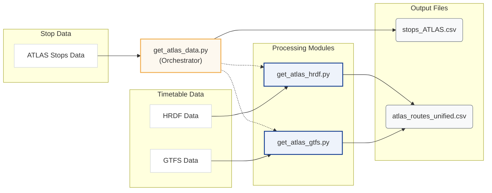
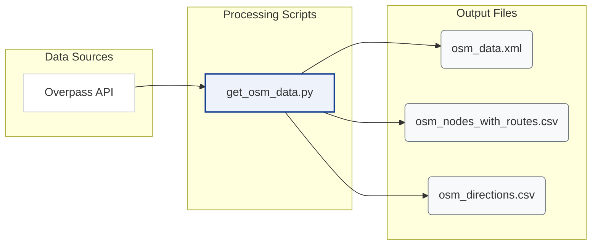

# Download and Process Data

This chapter explains how the pipeline prepares the datasets that power the matching process. Before any ATLAS–OSM matching occurs, we download the data from various sources, apply filters, and produce clean CSV files for downstream steps.

## Overview

The goal of this stage is to download external data and produce the files used by the matching pipeline and database import. The key outputs are:

1.  **`stops_ATLAS.csv`** (raw): A clean list of Swiss public transport boarding platforms.
2.  **`osm_data.xml`** (raw): The full OSM dataset (nodes and route relations) for Switzerland, parsed directly by the matching script.
3.  **`atlas_routes_unified.csv`** (processed): A unified list of routes and directions associated with each ATLAS stop, derived from GTFS and HRDF data.
4.  **`osm_nodes_with_routes.csv`** (processed): A flattened export of OSM node–route memberships derived from the XML relation pass.
5.  **`osm_directions.csv`** (processed): Pre-computed direction strings (first→last stop) extracted from OSM route relations and loaded by `OsmState` as a sidecar cache when available.

### ATLAS Pipeline



### OSM Pipeline



## Data Sources

| Input | Source | Key Filters | Output |
|-------|--------|-------------|--------|
| **ATLAS Traffic Points** | [OpenTransportData.swiss](https://data.opentransportdata.swiss/en/dataset/traffic-points-actual-date/permalink) | UIC `85`, CH polygon, valid, `BOARDING_PLATFORM` | `stops_ATLAS.csv` |
| **GTFS** | [OpenTransportData.swiss](https://data.opentransportdata.swiss/de/dataset/timetable-2025-gtfs2020/permalink) | Extract only `stops.txt`, `stop_times.txt`, `trips.txt`, `routes.txt`; Swiss stops; single-pass streaming | `atlas_routes_unified.csv` |
| **HRDF** | [OpenTransportData.swiss](https://opentransportdata.swiss/en/cookbook/timetable-cookbook/hafas-rohdaten-format-hrdf/) | Extract only `GLEISE_LV95`, `FPLAN`, `BAHNHOF` | `atlas_routes_unified.csv` |
| **OpenStreetMap** | [Overpass API](http://overpass-api.de/api/interpreter) | Switzerland, PT nodes, route relations | `osm_data.xml`, `osm_nodes_with_routes.csv`, `osm_directions.csv` |

## Directory Structure

The pipeline organizes data into the following structure:

```
data/
├── raw/                          # Downloaded source data
│   ├── osm_data.xml             # Raw OSM from Overpass API
│   ├── stops_ATLAS.csv          # Filtered ATLAS platforms
│   ├── switzerland.geojson      # Swiss border polygon
│   ├── gtfs/                    # Extracted GTFS subset used by this project
│   └── hrdf/                    # Extracted HRDF subset used by this project
├── processed/                    # Transformed data
│   ├── osm_nodes_with_routes.csv
│   ├── osm_directions.csv
│   └── atlas_routes_unified.csv
└── debug/                        # Review files
    └── org_mismatches_review.txt
```

## File Descriptions

### Raw Data (`data/raw/`)

Source data downloaded from external APIs and archives.

| File | Description | Source | Size |
|------|-------------|--------|------|
| `osm_data.xml` | OSM nodes and route relations for Switzerland | Overpass API | ~90MB |
| `stops_ATLAS.csv` | Swiss boarding platforms (filtered) | OpenTransportData.swiss | ~20MB |
| `switzerland.geojson` | Swiss administrative boundary | swisstopo | ~0.2MB |
| `gtfs/` | Extracted GTFS subset (`stops.txt`, `stop_times.txt`, `trips.txt`, `routes.txt`) | OpenTransportData.swiss | Varies by release |
| `hrdf/` | Extracted HRDF subset (`GLEISE_LV95`, `FPLAN`, `BAHNHOF`) | OpenTransportData.swiss | Varies by release |

### Processed Data (`data/processed/`)

Transformed data ready for matching and database import.

| File | Description | Used By |
|------|-------------|---------|
| `osm_nodes_with_routes.csv` | Flattened node–route export derived from OSM relations | DB import, inspection/debugging |
| `atlas_routes_unified.csv` | GTFS + HRDF routes per sloid | Route matching, DB import |
| `osm_directions.csv` | First->Last stop direction strings extracted from relations | Route matching sidecar cache |

## Detailed Documentation

- **[1.1 ATLAS Stops](1.1%20ATLAS%20stops.md)**: How do we we filter ATLAS stops.
- **[1.2 ATLAS Routes Unified](1.2%20ATLAS%20Routes%20Unified.md)**: How we combine GTFS and HRDF data.
    - **[1.2.1 GTFS Data](1.2.1%20GTFS%20ATLAS%20data.md)**: Processing GTFS dataset.
    - **[1.2.2 HRDF Data](1.2.2%20HRDF%20ATLAS%20data.md)**: Extracting platform data from HRDF.
- **[1.3 OSM Data](1.3%20OSM%20data.md)**: Querying and processing OpenStreetMap data.
