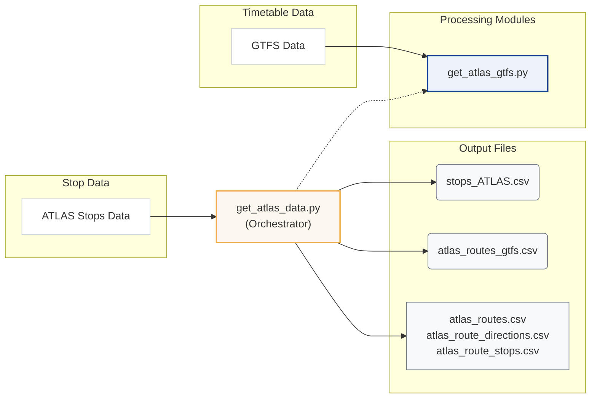
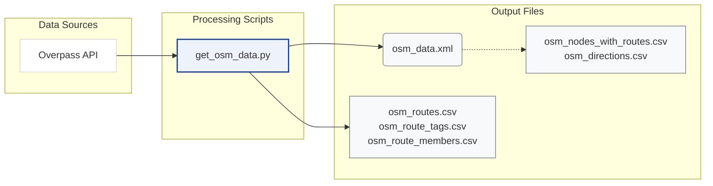

# Download and Process Data

This chapter explains how the pipeline prepares the datasets that power the matching process. Before any ATLAS–OSM matching occurs, we download the data from various sources, apply filters, and produce clean CSV files for downstream steps.

## Overview

The goal of this stage is to download external data and produce the files used by stop matching, route import, and the route UI/stats helpers. The key outputs are:

1.  **`stops_ATLAS.csv`** (raw): A clean list of Swiss public transport boarding platforms.
2.  **`osm_data.xml`** (raw): The full OSM dataset (nodes, selected ways, and route relations) for Switzerland, parsed directly by the matching script.
3.  **`atlas_routes_gtfs.csv`** (processed): A stop-level GTFS route sidecar keyed by `sloid`, used by stop-level route matching and route stats/UI helpers.
4.  **`atlas_routes.csv`**, **`atlas_route_directions.csv`**, **`atlas_route_stops.csv`** (processed): Entity-first GTFS route tables used during route import and route-route linking.
5.  **`osm_nodes_with_routes.csv`** and **`osm_directions.csv`** (processed): Flattened/sidecar OSM route exports used by stop-level matching, stats, and inspection helpers.
6.  **`osm_routes.csv`**, **`osm_route_tags.csv`**, **`osm_route_members.csv`** (processed): Entity-first OSM route tables used during route import and route-route linking.

### ATLAS Pipeline



### OSM Pipeline



## Data Sources

| Input | Source | Key Filters | Output |
|-------|--------|-------------|--------|
| **ATLAS Traffic Points** | [OpenTransportData.swiss](https://data.opentransportdata.swiss/en/dataset/traffic-points-actual-date/permalink) | UIC `85`, CH polygon, valid, `BOARDING_PLATFORM` | `stops_ATLAS.csv` |
| **GTFS** | [OpenTransportData.swiss](https://data.opentransportdata.swiss/en/dataset/timetable-2026-gtfs2020/permalink) | Extract only `stops.txt`, `stop_times.txt`, `trips.txt`, `routes.txt`; Swiss stops; single-pass streaming | `atlas_routes_gtfs.csv`, `atlas_routes.csv`, `atlas_route_directions.csv`, `atlas_route_stops.csv` |
| **OpenStreetMap** | [Overpass API](https://overpass-api.de/api/interpreter) | Switzerland, PT nodes, selected way stops, route relations | `osm_data.xml`, `osm_nodes_with_routes.csv`, `osm_directions.csv`, `osm_routes.csv`, `osm_route_tags.csv`, `osm_route_members.csv` |

## Directory Structure

The pipeline organizes data into the following structure:

```
data/
├── raw/                          # Downloaded source data
│   ├── osm_data.xml             # Raw OSM from Overpass API
│   ├── stops_ATLAS.csv          # Filtered ATLAS platforms
│   ├── switzerland.geojson      # Swiss border polygon
│   ├── gtfs/                    # Extracted GTFS subset used by this project
├── processed/                    # Transformed data
│   ├── atlas_routes_gtfs.csv
│   ├── atlas_routes.csv
│   ├── atlas_route_directions.csv
│   ├── atlas_route_stops.csv
│   ├── osm_nodes_with_routes.csv
│   ├── osm_directions.csv
│   ├── osm_routes.csv
│   ├── osm_route_tags.csv
│   └── osm_route_members.csv
└── debug/                        # Review files
    └── org_mismatches_review.txt
```

## File Descriptions

### Raw Data (`data/raw/`)

Source data downloaded from external APIs and archives.

| File | Description | Source | Size |
|------|-------------|--------|------|
| `osm_data.xml` | OSM nodes and route relations for Switzerland | Overpass API | ~90MB |
| `stops_ATLAS.csv` | Swiss boarding platforms (filtered) | OpenTransportData.swiss | ~20MB |
| `switzerland.geojson` | Swiss administrative boundary | swisstopo | ~0.2MB |
| `gtfs/` | Extracted GTFS subset (`stops.txt`, `stop_times.txt`, `trips.txt`, `routes.txt`) | OpenTransportData.swiss | Varies by release |

### Processed Data (`data/processed/`)

Transformed data ready for matching and database import.

| File | Description | Used By |
|------|-------------|---------|
| `atlas_routes_gtfs.csv` | GTFS route rows per `sloid` | Stop-level route matching, route stats/UI helpers |
| `atlas_routes.csv` | GTFS route entities | Route import, `RouteState` |
| `atlas_route_directions.csv` | GTFS route-direction entities | Route import |
| `atlas_route_stops.csv` | GTFS route-stop memberships | Route import |
| `osm_nodes_with_routes.csv` | Flattened node–route export derived from OSM relations | Route stats/UI helpers, inspection/debugging |
| `osm_directions.csv` | First->last stop direction strings extracted from relations | Route matching sidecar cache |
| `osm_routes.csv` | OSM route entities | Route import, `RouteState` |
| `osm_route_tags.csv` | OSM route tags exploded into key/value rows | Route import |
| `osm_route_members.csv` | Ordered OSM route members with derived direction buckets | Route import |

## Detailed Documentation

- **[1.1 ATLAS Stops](1.1%20ATLAS%20stops.md)**: How do we filter ATLAS stops.
- **[1.2 GTFS ATLAS Data](1.2%20GTFS%20ATLAS%20data.md)**: Processing GTFS dataset and building ATLAS route associations.
- **[1.3 OSM Data](1.3%20OSM%20data.md)**: Querying and processing OpenStreetMap data.
