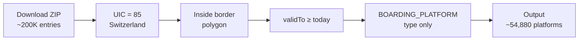

# ATLAS Data

ATLAS (Authoritative List of Transit Access Stations) is the **official registry** of Swiss public transport stops. We download and filter it to extract boarding platforms for matching.

## Filtering Pipeline

## Filters Applied

| Filter | Criterion | Rationale |
|--------|-----------|----------|
| Country | `uicCountryCode == 85` | Switzerland's UIC code |
| Geography | Inside Swiss border polygon | Exclude cross-border stops |
| Validity | `validTo >= today` | Only active stops |
| Type | `BOARDING_PLATFORM` | Passenger boarding locations only |

## Data Source

| Property | Value |
|----------|------|
| URL | `https://data.opentransportdata.swiss/.../traffic-points-actual-date/permalink` |
| Format | ZIP → CSV (semicolon-separated, UTF-8) |
| Updates | Daily |

## Filter Details

### Country Code (UIC 85)

Filters out neighboring countries: Austria (81), Germany (80), France (87), Italy (83).

### Geographic Boundary

Some stops have Swiss UIC codes but are physically outside Switzerland (border stations). We use `switzerland.geojson` with GeoPandas for precise filtering.

### Validity

ATLAS uses ISO date strings: active stops have future `validTo`, permanently valid stops have `9999-12-31`. We compare strings lexicographically.

### Element Type

| Type | Description | Included |
|------|-------------|----------|
| `BOARDING_PLATFORM` | Passenger boarding location | ✅ |
| `STATION` | Station building/area | ❌ |
| `STOP_PLACE` | Logical stop grouping | ❌ |
| `ENTRANCE` | Station entrance | ❌ |

## Output Schema

`data/raw/stops_ATLAS.csv` key columns:

| Column | Description | Example |
|--------|-------------|---------|
| `number` | UIC reference (8-digit) | `8503000` |
| `sloid` | Swiss Location ID | `ch:1:sloid:8503000:1` |
| `designationOfficial` | Official stop name | `Zürich HB` |
| `designation` | Platform identifier | `1`, `A`, `Nord` |
| `wgs84North` / `wgs84East` | Coordinates | `47.3782` / `8.5401` |
| `validFrom` / `validTo` | Validity period | `2020-01-01` / `9999-12-31` |
| `operator` | Operating company | `SBB` |

## Downstream Usage

1. **GTFS integration** → [1.1.1 GTFS](1.1.1%20GTFS%20ATLAS%20data.md)
2. **HRDF integration** → [1.1.2 HRDF](1.1.2%20HRDF%20ATLAS%20data.md)
3. **Matching pipeline** → [2. Matching process](2.%20Matching%20process.md)
