# ATLAS Stops

<a href="https://atlas.app.sbb.ch/service-point-directory" target="_blank">ATLAS</a> is the official registry of Swiss public transport stops. We download and filter it to extract boarding platforms. We do GTFS `stop_id` to `sloid` mapping for GTFS route integration.
> [!NOTE]
> The scheduler checks the ATLAS and GTFS source validators before preprocessing. When both sources are unchanged, the pipeline can reuse the existing ATLAS + GTFS artifacts; otherwise it reruns the combined preprocessing job. The shared preprocessing step exists because of the GTFS `stop_id` <-> ATLAS `sloid` mapping layer. More info in [7.3 Background Scheduler](7.3%20Background%20Scheduler.md).
>
> Last ATLAS data download: {{stat:source_downloads.atlas.downloaded_at}}
> Last GTFS data download: {{stat:source_downloads.gtfs.downloaded_at}}

## Filtering Pipeline

```mermaid
flowchart LR
    A["Raw download<br/>{{stat:atlas_filtering.raw_total}}"] -->|"UIC number (85...)<br/>−{{stat:atlas_filtering.eliminated_by_uic_number}}"| B["{{stat:atlas_filtering.after_uic_number_filter}}"]
    B -->|"Geography<br/>−{{stat:atlas_filtering.eliminated_by_geo}}"| C["{{stat:atlas_filtering.after_geo_filter}}"]
    C -->|"Validity<br/>−{{stat:atlas_filtering.eliminated_by_validity}}"| D["{{stat:atlas_filtering.after_validity_filter}}"]
    D -->|"Type<br/>−{{stat:atlas_filtering.eliminated_by_type}}"| E["{{stat:atlas_filtering.after_type_filter}}<br/>BOARDING_PLATFORMs"]
```

## Filters Applied

| # | Filter | Criterion | Before | Eliminated | Kept |
|---|--------|-----------|-------:|----------:|-----:|
| 1 | UIC number | `uicCountryCode == 85` | {{stat:atlas_filtering.raw_total}} | {{stat:atlas_filtering.eliminated_by_uic_number}} | {{stat:atlas_filtering.after_uic_number_filter}} |
| 2 | Geography | Inside Swiss border polygon | {{stat:atlas_filtering.after_uic_number_filter}} | {{stat:atlas_filtering.eliminated_by_geo}} | {{stat:atlas_filtering.after_geo_filter}} |
| 3 | Validity | `validTo >= today` | {{stat:atlas_filtering.after_geo_filter}} | {{stat:atlas_filtering.eliminated_by_validity}} | {{stat:atlas_filtering.after_validity_filter}} |
| 4 | Type | `trafficPointElementType == BOARDING_PLATFORM` | {{stat:atlas_filtering.after_validity_filter}} | {{stat:atlas_filtering.eliminated_by_type}} | {{stat:atlas_filtering.after_type_filter}} |

ATLAS filtering snapshot: {{stat:source_downloads.atlas.downloaded_at}}.

> [!NOTE]
> Some stops have Swiss UIC codes but are physically outside Switzerland. We use <a href="https://github.com/ZHB/switzerland-geojson" target="_blank">`switzerland.geojson`</a> with GeoPandas for precise filtering.

## trafficPointElementType Values

The raw ATLAS dataset contains exactly **two types**:

| Type | Count after filters | % | Kept|
|------|----------:|--:|----------------------:|
| `BOARDING_PLATFORM` | {{stat:atlas_filtering.type_counts.BOARDING_PLATFORM}} | {{stat:atlas_filtering.boarding_platform_pct}} % | {{stat:atlas_filtering.after_type_filter}} |
| `BOARDING_AREA` | {{stat:atlas_filtering.type_counts.BOARDING_AREA}} | {{stat:atlas_filtering.boarding_area_pct}} % | 0 (filtered out) |

## Output File

`data/raw/stops_ATLAS.csv` key columns:

| Column | Description | Example |
|--------|-------------|---------|
| `number` | UIC reference (7-digit) | `8503000` |
| `sloid` | Swiss Location ID | `ch:1:sloid:8503000:1` |
| `designationOfficial` | Official stop name | `Zürich HB` |
| `designation` | Platform identifier | `1`, `A`, `Nord` |
| `wgs84North` / `wgs84East` | Coordinates | `47.3782` / `8.5401` |
| `validFrom` / `validTo` | Validity period | `2020-01-01` / `9999-12-31` |
| `servicePointBusinessOrganisationAbbreviationDe/Fr/It/En` | Operating company | `SBB/CFF/FFS` |

The filtered ATLAS coordinates are reused downstream in two places:

- during the main OSM <-> ATLAS stop matching pipeline (stored in the database via `stops_matched`)
- during the GTFS `stop_id` <-> `sloid` matching phase in `get_atlas_gtfs.py` (stored in the database via `gtfs_stop_identity_resolution`)

## Downstream Usage

1. **GTFS integration + GTFS `stop_id` <-> `sloid` mapping** -> [1.2 GTFS](1.2%20GTFS%20ATLAS%20data.md)
2. **Routes tab diagnostic map** -> [6.6 Routes Pages](6.6%20Routes%20Pages.md)
3. **Matching pipeline** -> [2. Matching process](2.%20Matching%20process.md)
