# ATLAS Stops

ATLAS is the **official registry** of Swiss public transport stops. We download and filter it to extract boarding platforms for matching.

## Filtering Pipeline

```mermaid
flowchart LR
    A["Raw download<br/>{{stat:atlas_filtering.raw_total}}"] -->|"Country<br/>−{{stat:atlas_filtering.eliminated_by_country}}"| B["{{stat:atlas_filtering.after_country_filter}}"]
    B -->|"Geography<br/>−{{stat:atlas_filtering.eliminated_by_geo}}"| C["{{stat:atlas_filtering.after_geo_filter}}"]
    C -->|"Validity<br/>−{{stat:atlas_filtering.eliminated_by_validity}}"| D["{{stat:atlas_filtering.after_validity_filter}}"]
    D -->|"Type<br/>−{{stat:atlas_filtering.eliminated_by_type}}"| E["{{stat:atlas_filtering.after_type_filter}}<br/>BOARDING_PLATFORMs"]
```

## Filters Applied

| # | Filter | Criterion | Before | Eliminated | Kept |
|---|--------|-----------|-------:|----------:|-----:|
| 1 | Country | `uicCountryCode == 85` | {{stat:atlas_filtering.raw_total}} | {{stat:atlas_filtering.eliminated_by_country}} | {{stat:atlas_filtering.after_country_filter}} |
| 2 | Geography | Inside Swiss border polygon | {{stat:atlas_filtering.after_country_filter}} | {{stat:atlas_filtering.eliminated_by_geo}} | {{stat:atlas_filtering.after_geo_filter}} |
| 3 | Validity | `validTo >= today` | {{stat:atlas_filtering.after_geo_filter}} | {{stat:atlas_filtering.eliminated_by_validity}} | {{stat:atlas_filtering.after_validity_filter}} |
| 4 | Type | `trafficPointElementType == BOARDING_PLATFORM` | {{stat:atlas_filtering.after_validity_filter}} | {{stat:atlas_filtering.eliminated_by_type}} | {{stat:atlas_filtering.after_type_filter}} |

> Last updated: {{stat:atlas_filtering.downloaded_at}}.

## trafficPointElementType Values

The raw ATLAS dataset contains exactly **two types**:

| Type | Raw count | % | Kept after all filters |
|------|----------:|--:|----------------------:|
| `BOARDING_PLATFORM` | {{stat:atlas_filtering.type_counts.BOARDING_PLATFORM}} | {{stat:atlas_filtering.boarding_platform_pct}} % | {{stat:atlas_filtering.after_type_filter}} |
| `BOARDING_AREA` | {{stat:atlas_filtering.type_counts.BOARDING_AREA}} | {{stat:atlas_filtering.boarding_area_pct}} % | 0 (filtered out) |

> Some stops have Swiss UIC codes but are physically outside Switzerland. We use `switzerland.geojson` with GeoPandas for precise filtering.

## Output File

`data/raw/stops_ATLAS.csv` key columns:

| Column | Description | Example |
|--------|-------------|---------|
| `number` | UIC reference (7-digit) | `8503000` |
| `sloid` | Swiss Location ID | `ch:1:sloid:8503000:1` |
| `designationOfficial` | Official stop name | `Zürich HB` |
| `designation` | Platform identifier | `1`, `A`, `Nord` |
| `wgs84North` / `wgs84East` | Coordinates | `47.3782` / `8.5401` |
| `validFrom` / `validTo` | Validity period | `2020-01-01` / `9999-12-31` |
| `servicePointBusinessOrganisationAbbreviationDe/Fr/It/En` | Operating company | `SBB/CFF/FFS` |

## Downstream Usage

1. **GTFS integration** → [1.2 GTFS](1.2%20GTFS%20ATLAS%20data.md)
2. **Matching pipeline** → [2. Matching process](2.%20Matching%20process.md)
