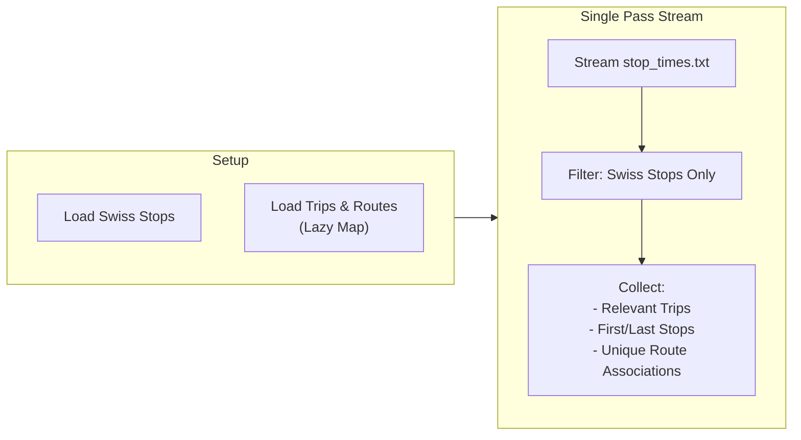

# GTFS ATLAS Data

GTFS (General Transit Feed Specification) provides timetable data that enriches ATLAS stops with route associations, enabling route-based matching.

## Challenge

The `stop_times.txt` file contains **100+ million rows**—too large to load into memory. We use an **optimized single-pass streaming** approach:

## Processing Steps

### Step 0: Filter Swiss Stops

Keep only stops where `stop_id` starts with `85` (Swiss UIC prefix) and coordinates fall inside Switzerland.

### Step 1: Load Reference Data

Load `trips.txt` and `routes.txt` into memory-efficient structures (Pandas Series) to allow fast lookups without full joins.

### Step 2: Single Pass — Collect Information

Stream `stop_times.txt` in 500K-row chunks. For each chunk:
1. Filter for rows referencing Swiss stops.
2. Identify trips that touch Swiss stops.
3. Record first/last stops for direction naming.
4. Build unique `(stop_id, route_id, direction_id)` triples using the pre-loaded trip/route maps.

### Step 3: Finalize

Filter the loaded `trips` and `routes` dataframes to keep only those referenced by the processed Swiss stops.

### Step 4: Map stop_id → sloid

| Priority | Rule | Description |
|----------|------|-------------|
| 1 | **Strict** | Parse `stop_id` → match `(uic_number, local_ref)` to ATLAS `(number, designation)` |
| 2 | **Unique UIC** | If ATLAS has exactly one row for the UIC, use that `sloid` |
| 3 | **Token match** | Match `last-token(sloid)` to normalized `local_ref` |

## Output

Contributes to `data/processed/atlas_routes_unified.csv`:

| Column | Description | Example |
|--------|-------------|--------|
| `sloid` | ATLAS stop identifier | `ch:1:sloid:8503000:1` |
| `source` | Data source | `gtfs` |
| `route_id` | GTFS route identifier | `11-4-A-j25-1` |
| `route_id_normalized` | Cleaned (removes `-j2025` suffixes) | `11-4-A` |
| `direction_id` | Direction | `0` (outbound), `1` (inbound) |
| `direction_name` | Human-readable | `Zürich HB → Bern` |

## Implementation

| Component | Location |
|-----------|----------|
| Entry function | `load_gtfs_data_streaming()` |
| Integration | `build_integrated_gtfs_data_streaming()` |
| Source file | `Download_and_process_data/get_atlas_gtfs.py` |
