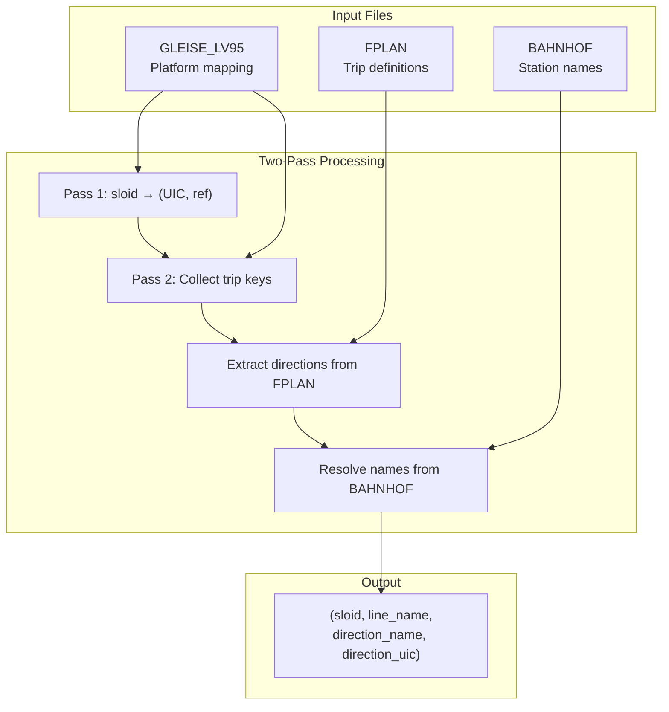

# HRDF ATLAS Data

HRDF (HAFAS Rohdaten Format) provides detailed track and platform assignments for railway stations. We parse specific files to extract human-readable direction information like "Zürich HB → Basel SBB".

## Input Files

| File | Purpose | Content |
|------|---------|---------|
| `GLEISE_LV95` | Platform mapping | Links sloid identifiers to (UIC, track ref) pairs |
| `FPLAN` | Trip definitions | Line names and first/last stops per trip |
| `BAHNHOF` | Station names | UIC code → human-readable name |

## Processing Steps

| Step | Action | Output |
|------|--------|--------|
| 1 | Parse `GLEISE_LV95` | `sloid → (UIC, track_ref)` mapping |
| 2 | Parse `GLEISE_LV95` again | Trip keys for needed (UIC, ref) pairs |
| 3 | Parse `FPLAN` | Line names + first/last stops per trip |
| 4 | Parse `BAHNHOF` | UIC → station name lookup |
| 5 | Combine | `(sloid, line_name, direction_name, direction_uic)` |

## Output

Contributes to `data/processed/atlas_routes_unified.csv`:

| Column | Description | Example |
|--------|-------------|--------|
| `sloid` | ATLAS stop identifier | `ch:1:sloid:8503000:1` |
| `source` | Data source | `hrdf` |
| `line_name` | Line identifier | `S3`, `IC 5` |
| `direction_name` | Human-readable | `Bern → Zürich HB` |
| `direction_uic` | UIC code direction | `8507000 → 8503000` |

## Why Two-Pass?

HRDF files are large, but we only need data for specific ATLAS sloids:

1. **Pass 1**: Identify which (UIC, ref) pairs we need
2. **Pass 2**: Process only relevant records, skip ~95% of data

## Implementation

| Component | Location |
|-----------|----------|
| Entry function | `process_hrdf_direction_data()` |
| GLEISE parser | `parse_gleise_lv95_for_sloids()` |
| FPLAN parser | `extract_fplan_directions_for_trips()` |
| Source file | `Download_and_process_data/get_atlas_hrdf.py` |
