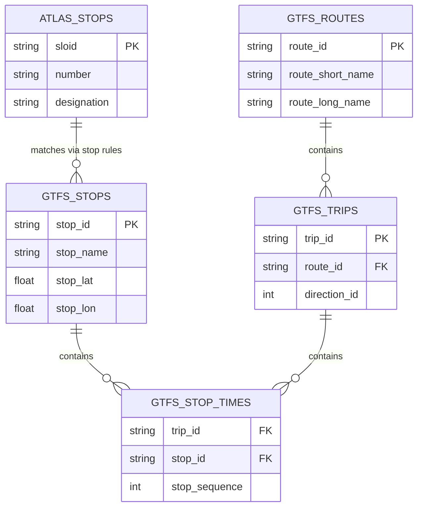
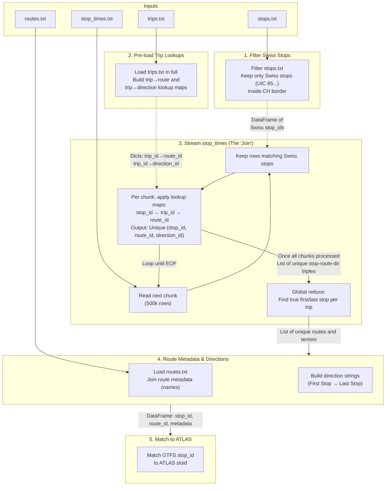

# GTFS ATLAS Data

The GTFS integration stage produces a unified output family:

1. **`data/processed/atlas_line_families.csv`**, **`atlas_itineraries.csv`**, and **`atlas_itinerary_stop_calls.csv`**: normalized ATLAS route artifacts used during route import, stop-level route matching (`AtlasState`), and line-family / itinerary comparison.
2. **`data/processed/gtfs_stops_raw.csv`** and **`gtfs_stop_identity_resolution.csv`**: cached GTFS stop identity artifacts used by the main database refresh and the GTFS diagnostic map.
3. **`data/gtfs_atlas_stats.json`**: canonical GTFS-to-ATLAS stats sidecar later embedded into `data/stats.json`.

Together, these artifacts map ATLAS stops to their associated transit routes and directions using GTFS (General Transit Feed Specification) timetable data, and they also materialize the canonical GTFS `stop_id` <-> ATLAS `sloid` state used by the Routes diagnostic map.

GTFS provides the underlying data that allows us to know which routes (e.g., "Tram 11") serve which stops, and in which direction (e.g., "towards Rehalp").

## Statistics

We track how many ATLAS stops are successfully touched by GTFS-derived route data.

- **ATLAS Stops**: {{stat:gtfs_atlas.atlas.total}}
- **ATLAS Stops Touched by GTFS Routes**: {{stat:gtfs_atlas.atlas.touched_by_gtfs_routes}}
- **ATLAS Coverage**: {{stat:gtfs_atlas.atlas.coverage_percent}}%

These ATLAS-side coverage stats are distinct from the GTFS `stop_id` mapping stats below. An ATLAS stop is counted here if at least one GTFS-derived route row touches its `sloid`, while the next block measures how many GTFS `stop_id`s were successfully mapped to any ATLAS `sloid`.

How the GTFS `stop_id`s map to the ATLAS `sloid`s:
- **Total GTFS Stops Processed**: {{stat:gtfs_atlas.gtfs_stop_ids.total}}
- **Matched GTFS Stops**: {{stat:gtfs_atlas.gtfs_stop_ids.matched_to_atlas}} ({{stat:gtfs_atlas.gtfs_stop_ids.coverage_percent}}%)
- **Unmatched GTFS Stops**: {{stat:gtfs_atlas.gtfs_stop_ids.unmatched}}
- **Strict Matching Assignments**: {{stat:gtfs_atlas.assignments.strict}}
- **Coordinate Proximity Assignments**: {{stat:gtfs_atlas.assignments.coordinate_proximity}}
- **Unique-Number Fallback Assignments**: {{stat:gtfs_atlas.assignments.unique_number_fallback}}

## GTFS File Structure

Before processing the data, it is helpful to understand the core structure of a GTFS feed. A GTFS feed is a collection of CSV files (with a `.txt` extension) zipped together. The files we use to build route associations are:

1. **`stops.txt`**: Contains the physical locations of transit stops. Each stop has a unique `stop_id` (e.g., `8503000:0:1` for a specific platform), coordinates, and names.
2. **`routes.txt`**: Contains the definition of transit lines, such as "Tram 11" or "S12". Each route has a unique `route_id`, a `route_short_name`, and optional route metadata such as `route_long_name`, `route_desc`, and `route_type`.
3. **`trips.txt`**: Defines individual journeys along a route. It links a specific `trip_id` to a `route_id` and includes direction information (`direction_id`). The file also contains fields like `trip_headsign`, but the current route export focuses on route/direction linkage.
4. **`stop_times.txt`**: This is the connective tissue. It defines the exact schedule. Each row links a `trip_id` to a `stop_id` and provides the arrival/departure times, as well as the order the stop appears in the trip (`stop_sequence`).

**Example of `stop_times.txt`:**

| `trip_id` | `arrival_time` | `departure_time` | `stop_id` | `stop_sequence` |
| :--- | :--- | :--- | :--- | :--- |
| `trip_1001` | `08:00:00` | `08:00:00` | `8503000:0:1` | `1` |
| `trip_1001` | `08:05:00` | `08:05:00` | `8503001:0:2` | `2` |
| `trip_1001` | `08:10:00` | `08:10:00` | `8503002:0:1` | `3` |

To know what route serves a physical `stop_id`, we must join these tables: `stop_times.txt` -> `trips.txt` -> `routes.txt`.

### Entity Relationship Diagram

Here is a conceptual database diagram illustrating how the GTFS files relate to each other, and how they ultimately map to the ATLAS stops data:

## The Challenge

The Swiss GTFS dataset is massive. The `stop_times.txt` file, which links stops to trips, contains over **25 million rows**. Loading this entire dataset into memory using standard tools like pandas would require excessive RAM (2.5GB+).

To handle this efficiently, we use a **streaming approach** that reads `stop_times.txt` in chunks (e.g., 500,000 rows at a time), keeping only the data relevant to Swiss stops.

## Processing Pipeline

The Entity Relationship diagram above shows a chain of joins: `stops` → `stop_times` → `trips` → `routes`. In a standard database, you would join all these tables together. However, because `stop_times.txt` is too large for memory, we perform this "chaining join" virtually while streaming, using pre-loaded lookup dictionaries.

## Detailed Steps & Data Structures

How the "chaining joins" (`stops` → `stop_times` → `trips` → `routes`) happen without loading everything into memory:

### 1. Filter Swiss Stops
**Goal:** Reduce the number of stops we care about.
**Action:** Load `stops.txt` and keep only geographically Swiss stops.
**Data Structure:** A pandas DataFrame of `swiss_stops` containing `stop_id`, `stop_name`, `stop_lat`, and `stop_lon`. (e.g. `['8503000:0:1', 'Zürich HB', ...]`)

### 2. Pre-load Trip Lookups
**Goal:** Prepare for the `trips` → `routes` join.
**Action:** Load `trips.txt` completely. Instead of a bulky table, we create two lightweight Python dictionary maps (pandas Series) to instantly look up a route or direction for any given trip.
**Data Structure:**
- `route_by_trip` map: `{'trip_1001': 'route_11', ...}`
- `dir_by_trip` map: `{'trip_1001': '0', ...}`

### 3. Stream `stop_times` (The "Join" Step)
**Goal:** Perform the `stops` → `stop_times` → `trips` join in a memory-efficient way.
**Action:** We read `stop_times.txt` in chunks of 500,000 rows. For each chunk:
1. **Filter (`stops` → `stop_times`):** Discard any row where the `stop_id` is not in our `swiss_stops` DataFrame from Step 1.
2. **Join (`stop_times` → `trips` → `routes`):** For the surviving rows, we have a `stop_id` and a `trip_id`. We immediately use our maps from Step 2 to find the `route_id` and `direction_id`.
3. **Collect:** We save the unique combinations of `(stop_id, route_id, direction_id)`.
**Data Structure Output:** A concise DataFrame listing every unique route and direction serving a stop: `[['8503000:0:1', 'route_11', '0'], ...]`.

### 4. Fetch Route Metadata & Finalize Directions
**Goal:** Now that we know exactly which `route_id`s serve our stops, we can safely load their metadata (like "Tram 11").
**Action:**
1. We load `routes.txt` and filter it to only the `route_id`s we discovered in Step 3.
2. We join this route metadata (like `route_short_name`) onto our main DataFrame.
3. We format the "first and last stops" we tracked during the stream into a readable string (e.g., `Zürich HB → Bern`).
**Data Structure Output:** A DataFrame containing `stop_id`, `route_id`, `route_short_name`, `direction_id`, and `direction` string.

### 5. Match GTFS to ATLAS (`stop_id` → `sloid`)
**Goal:** Link the physical GTFS platform to our ATLAS database.
**Action:** Apply matching algorithms to connect the GTFS `stop_id` (e.g., `8503000:0:1`) to the ATLAS `sloid` (e.g., `ch:1:sloid:8503000:1`).
**Data Structure Output:** A reusable GTFS-to-ATLAS payload containing the integrated route rows, the canonical `stop_id` <-> `sloid` matches, and exported mapping stats.

| Strategy | Description |
|----------|-------------|
| **1. Strict Match** | Parse the GTFS `stop_id` into `uic_number` and `local_ref`, normalize special platform codes (`10000 -> 1`, `10001 -> 2`), then match `(uic_number, normalized_local_ref)` against ATLAS `(number, designation)`. |
| **2. Coordinate Proximity** | For stops that fail strict matching, the system searches for ATLAS stops with the same UIC number within a **0.5-meter radius**. The match is only assigned if it is unambiguous (1-to-1). |
| **3. Unique-Number Fallback** | Only for GTFS stops that failed both strict and coordinate matching: if the ATLAS `number` appears exactly once in the dataset, assign that single `sloid`. |

The canonical matcher is reused in three places:

- route integration (`atlas_line_families.csv`, `atlas_itineraries.csv`, `atlas_itinerary_stop_calls.csv`)
- import payload generation (`gtfs_stops_raw.csv`, `gtfs_stop_identity_resolution.csv`)
- exported stats (`data/gtfs_atlas_stats.json`)

## GTFS Route Identifiers

### A Note on GTFS route_ids
The `route_id` is an internally generated ID specific to the system creating the timetable data. In Switzerland, it follows a strict naming convention:
`<Betriebszweig>-<Liniennummer>-<Projektkurzbezeichnung>-<Linienversionsnummer>`
(Branch of operation) - (Line number) - (Project short designation) - (Line version number)

### Normalization Strategy
In Switzerland's GTFS data, the `route_id` format includes a `<Projektkurzbezeichnung>` (project short designation) that denotes the specific timetable year (e.g., `-j24`, `-j25`, `-j26`). This means a physical route gets a new ID every year. 

If an OSM mapper entered `gtfs:route_id=11-T-j24-1` in 2024, it wouldn't match the backend's 2026 data (`11-T-j26-1`). The `route_id_normalized` field replaces these year-specific codes with `-jXX` (e.g., `11-T-jXX-1`), allowing historical OSM tags to successfully match against current datasets. 
## Outputs

The pipeline materializes the GTFS-derived output family in `data/processed/`.

### 1. `atlas_line_families.csv`

Defines the ATLAS line-family entities for the normalized route import path.

| Column | Description |
|--------|-------------|
| `run_id` | Pipeline run timestamp |
| `atlas_line_id` | Stable ATLAS line-family identifier |
| `route_id` | GTFS route ID |
| `route_id_normalized` | Simplified `-jXX` version |
| `agency_id` | GTFS Agency ID |
| `route_short_name` | Short route name |
| `route_long_name` | Long route name |
| `route_desc` | Route description |
| `route_type` | Transport mode |

### 2. `atlas_itineraries.csv`

Defines the itinerary rows derived from GTFS trips/directions.

| Column | Description |
|--------|-------------|
| `atlas_itinerary_id` | Stable itinerary identifier |
| `atlas_line_id` | Foreign key to `atlas_line_families.csv` |
| `route_id` | GTFS route ID |
| `direction_id` | Direction ID (`0` or `1`) |
| `representative_headsign` | Reserved headsign field for downstream route UI/import use |
| `direction_label` | Derived direction name (e.g. `Zürich HB → Bern`) |

### 3. `atlas_itinerary_stop_calls.csv`

Maps individual stops to the normalized itineraries.

| Column | Description |
|--------|-------------|
| `atlas_itinerary_id` | Foreign key to `atlas_itineraries.csv` |
| `sloid` | ATLAS unique identifier |
| `stop_sequence` | Sequence of the stop (relative) |
| `mapping_method` | GTFS stop-to-ATLAS assignment method used for that row (`strict`, `coordinate_proximity`, or `unique_number`) |

### 4. `gtfs_stops_raw.csv`

Cached raw GTFS stop rows for the database import and GTFS diagnostic map.

| Column | Description |
|--------|-------------|
| `stop_id` | GTFS stop identifier |
| `stop_name` | GTFS stop name |
| `uic_number` | Parsed Swiss UIC number |
| `local_ref` | Raw local/platform suffix parsed from `stop_id` |
| `normalized_local_ref` | Local ref normalized for strict matching |
| `stop_lat` / `stop_lon` | GTFS coordinates |

### 5. `gtfs_stop_identity_resolution.csv`

Cached GTFS <-> ATLAS identity-resolution rows for the database import and the `/routes/gtfs-stop-id-sloid` map.

This file contains both matched pairs and unmatched per-side state rows.

| Column | Description |
|--------|-------------|
| `stop_id` | GTFS stop identifier, NULL for ATLAS-only unmatched rows |
| `sloid` | ATLAS SLOID, NULL for GTFS-only unmatched rows |
| `stop_type` | `matched`, `gtfs_unmatched`, or `atlas_unmatched` |
| `match_method` | `strict`, `coordinate_proximity`, `unique_number`, or NULL |
| `distance_m` | Coordinate-proximity distance when applicable |
| `gtfs_stop_lat` / `gtfs_stop_lon` | GTFS-side coordinates copied onto the state row |
| `atlas_lat` / `atlas_lon` | ATLAS-side coordinates copied onto the state row |

### 6. `data/gtfs_atlas_stats.json`

Canonical GTFS-to-ATLAS stats sidecar later embedded into `data/stats.json` under the `gtfs_atlas` key.

It includes:

- ATLAS-side coverage (`atlas.total`, `atlas.touched_by_gtfs_routes`, `atlas.coverage_percent`)
- GTFS-side mapping coverage (`gtfs_stop_ids.*`)
- assignment counts (`strict`, `coordinate_proximity`, `unique_number_fallback`)
- cardinality and unmatched-reason diagnostics

## Implementation
- **Scripts**: `matching_and_import_db/downloader/get_atlas_gtfs.py`, `matching_and_import_db/downloader/get_atlas_data.py`
- **Key Functions**:
    - `load_gtfs_data_streaming()`: Efficiently streams the massive GTFS dataset in a single pass, using pre-loaded trip lookup maps to avoid per-chunk merges.
    - `build_gtfs_atlas_payload()`: Builds the canonical reusable GTFS-to-ATLAS payload for route export, stats, and DB import.
    - `build_integrated_gtfs_data_streaming()`: Integrates the loaded GTFS data with ATLAS stops for route-level outputs.
    - `match_gtfs_to_atlas()`: Maps GTFS `stop_id` to ATLAS `sloid` using strict matching, coordinate proximity rescue, and unique-number fallback.
    - `build_gtfs_db_payload_rows()`: Materializes GTFS stop rows and GTFS <-> ATLAS state rows for database import.
    - `write_gtfs_db_payload_cache()`: Writes `gtfs_stops_raw.csv` and `gtfs_stop_identity_resolution.csv` into `data/processed/`.
    - `write_atlas_route_csvs()`: Writes the normalized ATLAS route tables from the integrated GTFS data.

The Routes tab diagnostic map reads the imported versions of these payloads from the `gtfs_stops_raw` and `gtfs_stop_identity_resolution` tables. See [5.6 Routes Pages](5.6%20Routes%20Pages.md).
