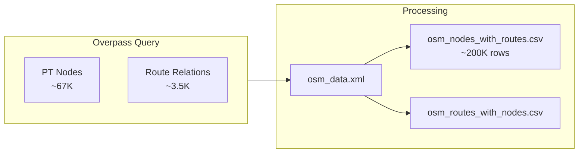

# OSM Data

OpenStreetMap provides community-maintained public transport data. We fetch Swiss PT nodes and their route relations via Overpass API.

## Data Source

| Property | Value |
|----------|------|
| Endpoint | `http://overpass-api.de/api/interpreter` |
| Coverage | Switzerland (`ISO3166-1=CH`) |
| Updates | Live (reflects current OSM state) |

## Node Selection Criteria

| Tag | Values |
|-----|--------|
| `public_transport` | `platform`, `stop_position`, `station`, `halt`, `stop` |
| `railway` | `tram_stop`, `halt`, `station` |
| `highway` | `bus_stop` |
| `amenity` | `ferry_terminal`, `bus_station` |
| `aerialway` | `station` |

## CSV Generation

The raw XML is processed into two CSV files:

### osm_nodes_with_routes.csv

One row per node–route combination:

| Column | Description | Example |
|--------|-------------|---------|
| `node_id` | OSM node ID | `123456789` |
| `lat` | Latitude | `47.3782` |
| `lon` | Longitude | `8.5401` |
| `name` | Stop name | `Zürich HB` |
| `uic_ref` | UIC reference | `8503000` |
| `local_ref` | Platform identifier | `1` |
| `route_ref` | Route number | `11` |
| `route_name` | Route name | `Zürich HB - Oerlikon` |
| `direction_id` | Direction (0/1) | `0` |
| `operator` | Transit operator | `VBZ` |

### osm_routes_with_nodes.csv

One row per route with its node list:

| Column | Description | Example |
|--------|-------------|---------|
| `route_id` | OSM relation ID | `12345` |
| `route_ref` | Route number | `11` |
| `route_name` | Full name | `Tram 11: Auzelg - Rehalp` |
| `from` / `to` | Origin / Destination | `Auzelg` / `Rehalp` |
| `node_ids` | Comma-separated node list | `123,456,789` |

### Direction Extraction

OSM routes often have a `ref_trips` tag encoding direction:
- `.H` suffix → outbound (`direction_id = 0`)
- `.R` suffix → inbound (`direction_id = 1`)

Many routes lack this tag, leaving `direction_id` empty.

## Key OSM Tags for Matching

| Tag | Purpose | Used In |
|-----|---------|---------|
| `uic_ref` | UIC reference number | Exact matching |
| `name` / `uic_name` | Stop name | Name matching |
| `local_ref` | Platform identifier | Disambiguation |
| `ref` | Route number | Route matching |
| `from` / `to` | Route direction | Route matching |

## Operator Normalization

OSM operator names vary widely (e.g., "SBB", "SBB CFF FFS", "Swiss Federal Railways"). These are normalized before matching—see [1.2.1 Operator normalization](1.2.1%20OSM%20operator%20normalization.md).

## Typical Dataset Size

| Content | Count |
|---------|-------|
| PT nodes | ~67,000 |
| Route relations | ~3,500 |
| Node–route pairs | ~200,000 |

