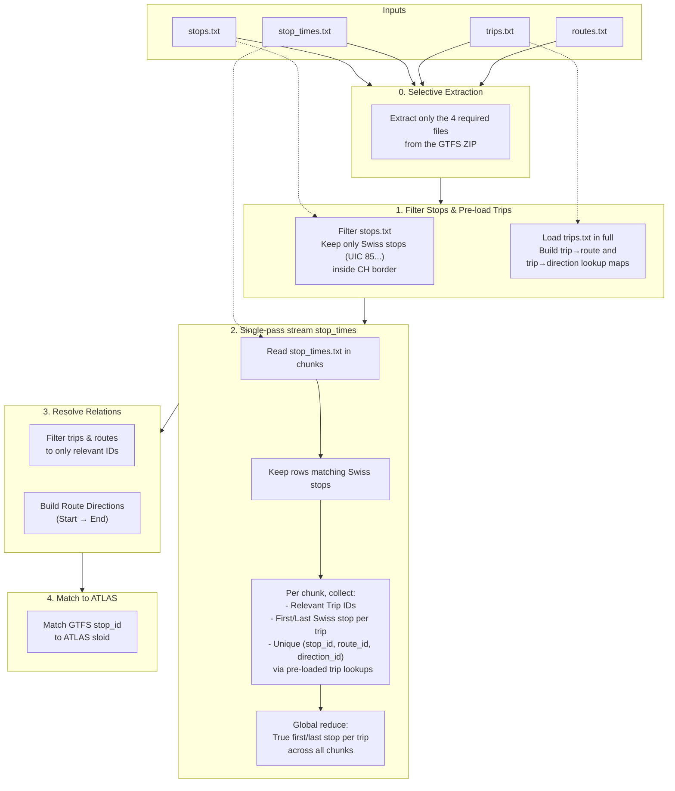

# GTFS ATLAS Data

GTFS (General Transit Feed Specification) provides timetable data that enriches ATLAS stops with route associations. This allows us to know which routes (e.g., "Tram 11") serve which stops, and in which direction (e.g., "towards Rehalp").

## Statistics

We track how many ATLAS stops are successfully matched to GTFS routes.

- **Total ATLAS Stops**: {{stat:routes.atlas_total}}
- **Stops Matched to GTFS**: {{stat:routes.atlas_gtfs_matches}}
- **Coverage**: {{stat:routes.gtfs_coverage_percent}}%

## GTFS File Structure

Before processing the data, it is helpful to understand the core structure of a GTFS feed. A GTFS feed is a collection of CSV files (with a `.txt` extension) zipped together. The files we use to build route associations are:

1. **`stops.txt`**: Contains the physical locations of transit stops. Each stop has a unique `stop_id` (e.g., `8503000:0:1` for a specific platform), coordinates, and names.
2. **`routes.txt`**: Contains the definition of transit lines, such as "Tram 11" or "S12". Each route has a unique `route_id`, a `route_short_name` (e.g., "11") and a `route_long_name`.
3. **`trips.txt`**: Defines individual journeys along a route. It links a specific `trip_id` to a `route_id`, and contains information about the direction of travel (`direction_id` and `trip_headsign`).
4. **`stop_times.txt`**: This is the connective tissue. It defines the exact schedule. Each row links a `trip_id` to a `stop_id` and provides the arrival/departure times, as well as the order the stop appears in the trip (`stop_sequence`).

**Example of `stop_times.txt`:**

| `trip_id` | `arrival_time` | `departure_time` | `stop_id` | `stop_sequence` |
| :--- | :--- | :--- | :--- | :--- |
| `trip_1001` | `08:00:00` | `08:00:00` | `8503000:0:1` | `1` |
| `trip_1001` | `08:05:00` | `08:05:00` | `8503001:0:2` | `2` |
| `trip_1001` | `08:10:00` | `08:10:00` | `8503002:0:1` | `3` |

To know what route serves a physical `stop_id`, we must join these tables: `stop_times.txt` -> `trips.txt` -> `routes.txt`.

## The Challenge

The Swiss GTFS dataset is massive. The `stop_times.txt` file, which links stops to trips, contains over **25 million rows**. Loading this entire dataset into memory using standard tools like pandas would require excessive RAM (2.5GB+).

To handle this efficiently, we use a **streaming approach** that reads `stop_times.txt` in chunks (e.g., 500,000 rows at a time), keeping only the data relevant to Swiss stops.

## Processing Pipeline

## Detailed Steps

### 0. Selective Extraction
The GTFS ZIP is large. Instead of extracting the full archive, we only extract the 4 required files (`stops.txt`, `stop_times.txt`, `trips.txt`, `routes.txt`), saving disk space and time. The ZIP is downloaded in a streaming fashion and removed after extraction.

### 1. Filter Stops & Pre-load Trips
We first load `stops.txt` and filter it to keep only stops that:
- Have a `stop_id` starting with `85` (the UIC country code for Switzerland).
- Are geographically located within the Swiss border (using `switzerland.geojson`).

This reduces the number of stops we need to track.

We also **pre-load `trips.txt` in full** and build two pandas Series lookup maps:
- `route_by_trip`: maps `trip_id` → `route_id`
- `dir_by_trip`: maps `trip_id` → `direction_id`

These maps allow us to resolve route/direction information *during* the streaming step without per-chunk merge operations.

### 2. Single-pass Stream `stop_times.txt`
We read `stop_times.txt` in chunks (500,000 rows at a time). For each chunk:
1.  **Filter**: We discard any row that doesn't reference one of our filtered Swiss stops.
2.  **Collect Trips**: We record the `trip_id` of every matching row.
3.  **Track Termini**: For each trip, we track the first and last stop sequence *among the Swiss stops* within this chunk.
4.  **Build Relations**: Using the pre-loaded trip lookup maps, we resolve `route_id` and `direction_id` for each row and collect unique `(stop_id, route_id, direction_id)` tuples. This avoids per-chunk merge operations.

After all chunks are processed, a **global reduce** step finds the true first and last Swiss stop per trip across all chunks (since a single trip may span multiple chunks).

### 3. Load Trips and Routes (filtered)
Once streaming is complete:
1.  We filter `trips.txt` (already loaded) to keep only the trips we saw.
2.  We identify the `route_id`s associated with those trips.
3.  We load `routes.txt` and keep only those routes.

This ensures we only load metadata for routes that actually operate in Switzerland.

### 4. Match GTFS to ATLAS (`stop_id` → `sloid`)
GTFS uses `stop_id` (e.g., `8503000:0:1`), while ATLAS uses `sloid` (e.g., `ch:1:sloid:8503000:1`). We link them with a conservative strategy designed to reduce noisy expansions.

The implementation now uses one strict rule plus one limited fallback:

| Strategy | Description |
|----------|-------------|
| **1. Strict Match** | Parse the GTFS `stop_id` into `uic_number` and `local_ref`, normalize special platform codes (`10000 -> 1`, `10001 -> 2`), then match `(uic_number, normalized_local_ref)` against ATLAS `(number, designation)`. |
| **2. Unique-Number Fallback** | Only for GTFS stops that failed strict matching: if the ATLAS `number` appears exactly once, assign that single `sloid`. |

Legacy broad fallbacks (parent-station broadcast and `sloid` token fallback) were removed.

## Output

The result is integrated into `data/processed/atlas_routes_unified.csv`.

| Column | Description | Example |
|--------|-------------|---------|
| `sloid` | ATLAS unique identifier | `ch:1:sloid:8503000:1` |
| `source` | Source of the data | `gtfs` |
| `evidence` | How the data was derived | `gtfs_first_last` |
| `route_id` | GTFS route ID | `11-4-A-j25-1` |
| `route_id_normalized` | Normalized route ID for matching | `11-4-A-jXX-1` |
| `route_name_short` | Short route name | `11` |
| `route_name_long` | Long route name | `Zürich, Rehalp - Zürich, Auzelg` |
| `line_name` | Line name (HRDF-sourced rows only) | `null` |
| `direction_id` | GTFS direction ID (0 or 1) | `0` |
| `direction_name` | Representative first→last Swiss-stop direction string for the `route_id` | `Zürich HB → Bern` |
| `direction_uic` | Direction UIC (HRDF-sourced rows only) | `null` |

## Implementation
- **Script**: `matching_and_import_db/downloader/get_atlas_gtfs.py`
- **Key Functions**:
    - `load_gtfs_data_streaming()`: Efficiently streams the massive GTFS dataset in a single pass, using pre-loaded trip lookup maps to avoid per-chunk merges.
    - `build_integrated_gtfs_data_streaming()`: Integrates the loaded GTFS data with ATLAS stops.
    - `match_gtfs_to_atlas()`: Maps GTFS `stop_id` to ATLAS `sloid` using strict matching plus unique-number fallback.
