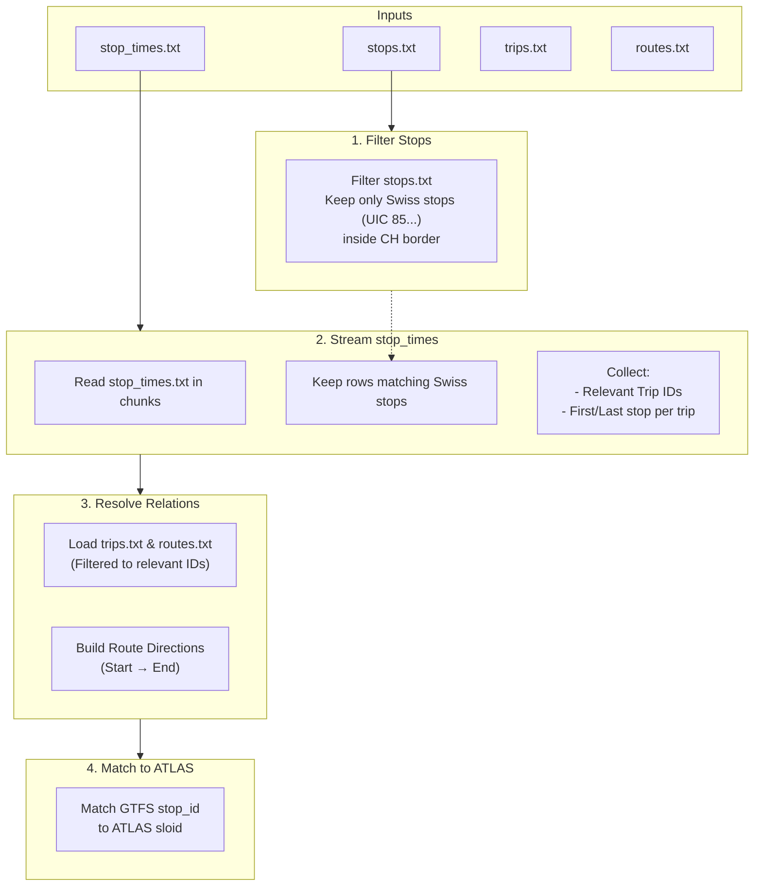

# GTFS ATLAS Data

GTFS (General Transit Feed Specification) provides timetable data that enriches ATLAS stops with route associations. This allows us to know which routes (e.g., "Tram 11") serve which stops, and in which direction (e.g., "towards Rehalp").

## The Challenge

The Swiss GTFS dataset is massive. The `stop_times.txt` file, which links stops to trips, contains over **25 million rows**. Loading this entire dataset into memory using standard tools like pandas would require excessive RAM (2.5GB+).

To handle this efficiently, we use a **streaming approach** that processes the file line-by-line (or chunk-by-chunk), keeping only the data relevant to the Swiss stops we care about.

## Processing Pipeline

## Detailed Steps

### 1. Filter Stops (`stops.txt`)
We first load `stops.txt` and filter it to keep only stops that:
- Have a `stop_id` starting with `85` (the UIC country code for Switzerland).
- Are geographically located within the Swiss border (using `switzerland.geojson`).

This reduces the number of stops we need to track.

### 2. Stream `stop_times.txt`
We read `stop_times.txt` in chunks (e.g., 500,000 lines at a time). For each chunk:
1.  **Filter**: We discard any row that doesn't reference one of our filtered Swiss stops.
2.  **Collect Trips**: We record the `trip_id` of every matching row.
3.  **Track Termini**: For each trip, we track the first and last stop sequence *among the Swiss stops*. This helps us determine the direction of the trip (e.g., "Zürich HB" to "Bern").
4.  **Build Relations**: We build a set of unique `(stop_id, route_id, direction_id)` tuples.

### 3. Load Trips and Routes
Once we have the set of "relevant" `trip_id`s from the previous step:
1.  We load `trips.txt` and keep only the trips we saw.
2.  We identify the `route_id`s associated with those trips.
3.  We load `routes.txt` and keep only those routes.

This ensures we only load metadata for routes that actually operate in Switzerland.

### 4. Match GTFS to ATLAS (`stop_id` → `sloid`)
GTFS uses `stop_id` (e.g., `8503000:0:1`), while ATLAS uses `sloid` (e.g., `ch:1:sloid:8503000:1`). We need to link them.

We use a two-step matching strategy:

| Strategy | Description |
|----------|-------------|
| **1. Strict Match** | We parse the GTFS `stop_id` to extract the UIC number (`8503000`) and the platform (`1`). We match this against the ATLAS `number` and `designation`. |
| **2. Fallback** | If strict matching fails (e.g., platform naming mismatch), we try to match based on the UIC number alone if it's unique, or by matching the last part of the `sloid` string. |

## Output

The result is integrated into `data/processed/atlas_routes_unified.csv`.

| Column | Description | Example |
|--------|-------------|---------|
| `sloid` | ATLAS unique identifier | `ch:1:sloid:8503000:1` |
| `source` | Source of the data | `gtfs` |
| `route_id` | GTFS route ID | `11-4-A-j25-1` |
| `route_name_short` | Short route name | `11` |
| `direction_name` | Computed direction | `Zürich HB → Bern` |

## Implementation
- **Script**: `Download_and_process_data/get_atlas_gtfs.py`
- **Key Function**: `load_gtfs_data_streaming()`

