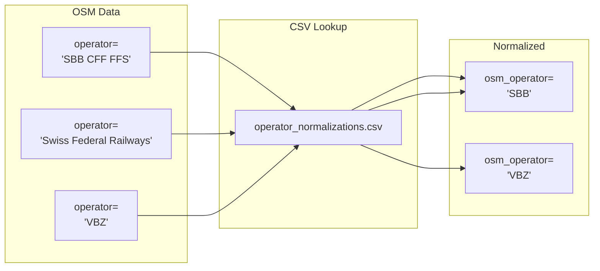

# OSM Operator Normalization

OSM `operator` tag values vary widely for the same transit company. This normalization converts known aliases to canonical names.



## Why Normalize?

| OSM Variation | Canonical Name |
|---------------|----------------|
| "SBB", "SBB CFF FFS", "Swiss Federal Railways" | SBB |
| "VBZ", "Verkehrsbetriebe Zürich" | VBZ |

Without normalization, attribute comparison flags these as mismatches.

## Mapping File

Located at [operator_normalizations.csv](../matching_process/operator_normalizations.csv):

```csv
alias,standard_name
SBB CFF FFS,SBB
Swiss Federal Railways,SBB
Verkehrsbetriebe Zürich,VBZ
```

## Behavior

| Characteristic | Behavior |
|----------------|----------|
| Case sensitivity | Exact match required |
| Whitespace | Trimmed before lookup |
| Unknown operators | Kept as-is |
| Persistence | Only normalized value stored in DB |

## Maintaining the Mapping

1. Check `data/debug/org_mismatches_review.txt` for unmatched operator pairs
2. Add new aliases to CSV
3. Re-run the pipeline

Each alias must be unique. Different capitalizations need separate entries.
