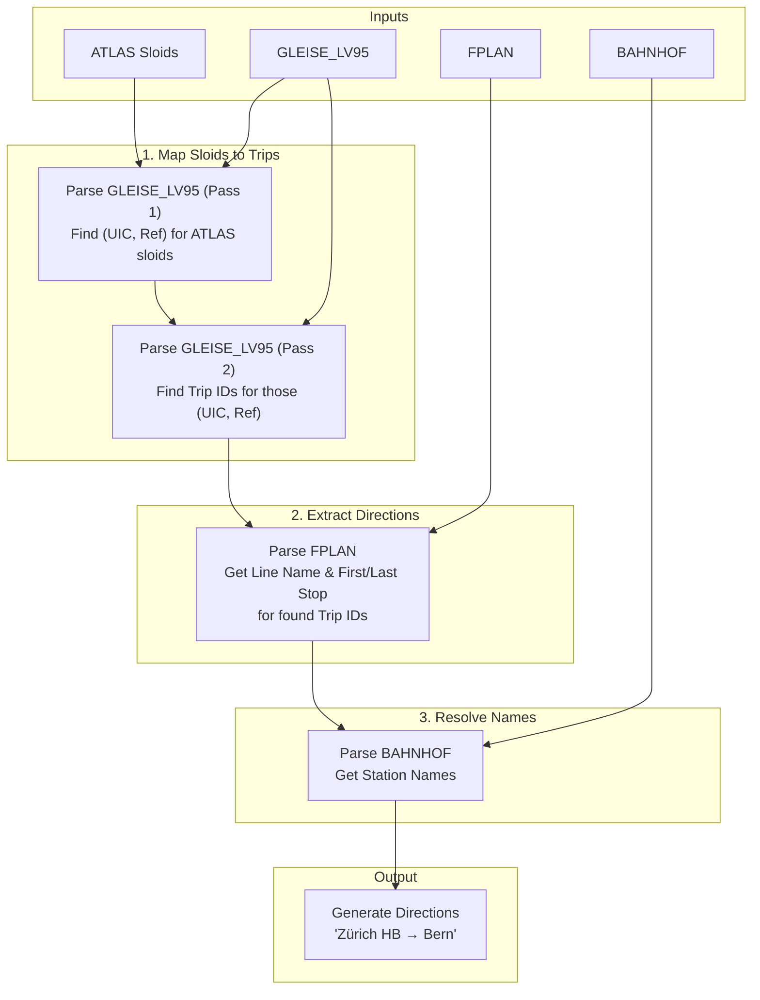

# HRDF ATLAS Data

HRDF (HAFAS Rohdaten Format) is another timetable dataformat.  We use it to complement the ATLAS GTFS information.

> **Current status**: HRDF ingestion is currently disconnected from the active pipeline. This page documents the previous implementation for possible future reuse.

## Statistics

- **Total ATLAS Stops**: {{stat:routes.atlas_total}}
- **Stops Matched to GTFS routes (active)**: {{stat:routes.atlas_gtfs_matches}}

## Input Files

The HRDF dataset consists of many text files. We only use three:

| File | Description | Content Example |
|------|-------------|-----------------|
| **`GLEISE_LV95`** | Links platforms to trips. | Maps a `sloid` (e.g., `ch:1:sloid:8503000:1`) to a UIC code and a reference number, which then links to a list of trips. |
| **`FPLAN`** | Trip definitions. | Contains the schedule for each trip, including the line name (e.g., "S3") and the sequence of stops. |
| **`BAHNHOF`** | Station names. | Maps UIC codes (e.g., `8503000`) to human-readable names (e.g., "Zürich HB"). |

## Processing Pipeline

We use a targeted, memory-efficient approach to extract only the data we need for our ATLAS stops.

## Detailed Steps

### 1. Map Sloids to Trips (`GLEISE_LV95`)
The `GLEISE_LV95` file is complex. It links a specific platform (identified by `sloid`) to a "track reference", and then links that "track reference" to many "trip references".

To avoid loading the whole file, we use a **two-pass approach**:
1.  **Pass 1**: We scan the file to find which `(UIC, Ref)` pairs correspond to the ATLAS `sloid`s we are interested in.
2.  **Pass 2**: We scan the file again to find all the `Trip IDs` associated with those `(UIC, Ref)` pairs.

### 2. Extract Directions (`FPLAN`)
Now that we have a list of relevant `Trip IDs`, we scan the `FPLAN` file.
- When we find a trip from our list, we extract:
    - The **Line Name** (e.g., "IC 1", "S12").
    - The **First Stop** (Origin).
    - The **Last Stop** (Destination).

### 3. Resolve Names (`BAHNHOF`)
The `FPLAN` file uses UIC codes for stations. We load `BAHNHOF` to translate these codes into names (e.g., `8500010` → "Basel SBB").

### 4. Generate Output
We combine all this information to create a direction string for each `sloid`.

**Example Output:**
For `sloid: ch:1:sloid:8503000:1` (Zürich HB, Platform 1):
- Line: `S3`
- Direction: `Wetzikon → Baden`

## Output

The result is integrated into `data/processed/atlas_routes_unified.csv`.

| Column | Description | Example |
|--------|-------------|---------|
| `sloid` | ATLAS stop identifier | `ch:1:sloid:8503000:1` |
| `source` | Data source | `hrdf` |
| `line_name` | Line identifier | `S3` |
| `direction_name` | Human-readable direction | `Wetzikon → Baden` |

## Implementation
- **Script**: `matching_and_import_db/downloader/get_atlas_hrdf.py`
- **Key Function**: `process_hrdf_direction_data()`

