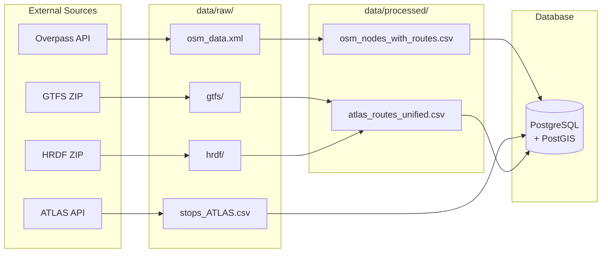

# Data Organization

File structure used by the data processing pipeline.



## Directory Structure

```
data/
├── raw/                          # Downloaded source data
│   ├── osm_data.xml             # Raw OSM from Overpass API
│   ├── stops_ATLAS.csv          # Filtered ATLAS platforms
│   ├── switzerland.geojson      # Swiss border polygon
│   ├── gtfs/                    # GTFS timetable files
│   └── hrdf/                    # HRDF railway files
├── processed/                    # Transformed data
│   ├── osm_nodes_with_routes.csv
│   ├── osm_routes_with_nodes.csv
│   └── atlas_routes_unified.csv
└── debug/                        # Review files
    └── org_mismatches_review.txt
```

## File Descriptions

### Raw Data (`data/raw/`)

Source data downloaded from external APIs and archives.

| File | Description | Source | Size |
|------|-------------|--------|------|
| `osm_data.xml` | OSM nodes and route relations for Switzerland | Overpass API | ~50MB |
| `stops_ATLAS.csv` | Swiss boarding platforms (filtered) | OpenTransportData.swiss | ~15MB |
| `switzerland.geojson` | Swiss administrative boundary | swisstopo | ~2MB |
| `gtfs/` | GTFS timetable files | OpenTransportData.swiss | ~200MB |
| `hrdf/` | HRDF railway files | OpenTransportData.swiss | ~50MB |

### Processed Data (`data/processed/`)

Transformed data ready for matching and database import.

| File | Description | Used By | Required |
|------|-------------|---------|----------|
| `osm_nodes_with_routes.csv` | Node–route pairs with direction info | Route matching, DB import | ✅ Yes |
| `atlas_routes_unified.csv` | GTFS + HRDF routes per sloid | Route matching, DB import | ✅ Yes |
| `osm_routes_with_nodes.csv` | Routes with node lists | Future use | ❌ Optional |

### Debug Files (`data/debug/`)

Generated during processing for quality review.

| File | Description | Purpose |
|------|-------------|---------|
| `org_mismatches_review.txt` | Operator name mismatches | Add to normalization CSV |
| `route_org_mismatches_review.txt` | Route-based operator mismatches | Quality assurance |

## File Formats

### osm_nodes_with_routes.csv

One row per node–route combination:

```csv
node_id,lat,lon,name,uic_ref,local_ref,route_ref,route_name,direction_id,operator
123456,47.378,8.540,Zürich HB,8503000,1,11,Tram 11,0,VBZ
123456,47.378,8.540,Zürich HB,8503000,1,14,Tram 14,1,VBZ
```

### atlas_routes_unified.csv

One row per sloid–route combination from GTFS or HRDF:

```csv
sloid,source,route_id,route_id_normalized,route_name_short,direction_id,line_name,direction_uic,direction_name
ch:1:sloid:8503000:1,gtfs,11-4-A-j25-1,11,Tram 11,0,,,
ch:1:sloid:8503000:1,hrdf,,,,S3,8503000,Bern
```

### osm_routes_with_nodes.csv

One row per route with node list:

```csv
route_id,route_ref,route_name,route_type,from,to,node_ids
12345,11,Tram 11: Auzelg - Rehalp,tram,Auzelg,Rehalp,"123,456,789"
```

## Data Flow

```
External Sources          raw/                processed/              Database
────────────────────────────────────────────────────────────────────────────────

Overpass API    ───►  osm_data.xml      ───►  osm_nodes_with_routes.csv  ───►
                                              osm_routes_with_nodes.csv       │
                                                                              │
ATLAS API       ───►  stops_ATLAS.csv   ─────────────────────────────────►   │  stops
                                                                              │  atlas_stops
GTFS ZIP        ───►  gtfs/             ───►  atlas_routes_unified.csv  ───►  │  osm_nodes
                                                                              │
HRDF ZIP        ───►  hrdf/             ───►                                  │
                                                                              ▼
```

## Storage Requirements

| Directory | Typical Size | Notes |
|-----------|--------------|-------|
| `data/raw/` | ~350MB | Can be cleared after processing |
| `data/processed/` | ~50MB | Required for import |
| `data/debug/` | <1MB | Optional, for troubleshooting |

## Regenerating Data

To regenerate all data from scratch:

```bash
# Download and process ATLAS data
python Download_and_process_data/get_atlas_data.py

# Download and process OSM data  
python Download_and_process_data/get_osm_data.py

# Run matching pipeline
python matching_process/matching_script.py

# Import to database
python import_data_db.py
```

Each step depends on the previous one completing successfully.
