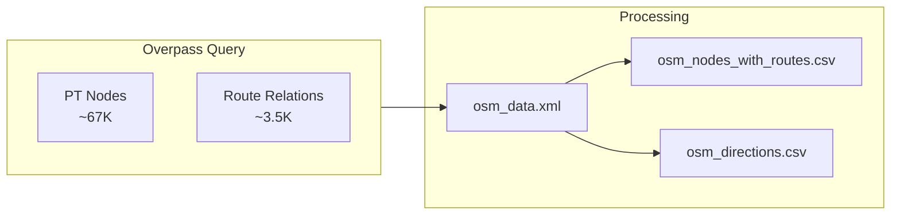

# OSM Data

OpenStreetMap provides community-maintained public transport data. We fetch Swiss PT nodes and their route relations via Overpass API.




## Statistics

- **OSM Nodes with Route Data**: {{stat:routes.osm_with_routes}}

## Data Source

| Property | Value |
|----------|------|
| Endpoint | `http://overpass-api.de/api/interpreter` |
| Coverage | Switzerland (`ISO3166-1=CH`) |
| Updates | Live (reflects current OSM state) |

## Node Selection Criteria

| Tag | Values |
|-----|--------|
| `public_transport` | `platform`, `stop_position`, `station`, `halt`, `stop` |
| `railway` | `tram_stop`, `halt`, `station` |
| `highway` | `bus_stop` |
| `amenity` | `ferry_terminal`, `bus_station` |
| `aerialway` | `station` |

## CSV Generation

The raw XML is processed into two CSV files:

### osm_nodes_with_routes.csv

One row per node–route combination. The current exporter writes a compact flattened view with these columns:

| Column | Description | Example |
|--------|-------------|---------|
| `node_id` | OSM node ID | `123456789` |
| `node_type` | `public_transport` value when present | `platform` |
| `route_name` | OSM route relation `name` | `Zürich HB - Oerlikon` |
| `gtfs_route_id` | OSM relation `gtfs:route_id` | `11-T-j25-1` |
| `direction_id` | Direction parsed from `ref_trips` (`0`/`1`, or empty if unknown) | `0` |
| `uic_ref` | Node `uic_ref` tag | `8503000` |

This CSV is a flattened export. The matcher itself reads route memberships directly from the OSM XML relation pass in `OsmState.from_xml_file()`.

### osm_directions.csv

One row per node with an extracted textual direction (by node Name or UIC reference):

| Column | Description | Example |
|--------|-------------|---------|
| `node_id` | OSM node ID | `12345` |
| `dir_type` | Direction type (`name` or `uic`) | `name` |
| `direction_string` | Full start->end direction | `Auzelg → Rehalp` |

### Direction Extraction

OSM routes often have a `ref_trips` tag encoding direction:
- `.H` suffix → outbound (`direction_id = 0`)
- `.R` suffix → inbound (`direction_id = 1`)

Many routes lack this tag, leaving `direction_id` empty in the CSV export. In the in-memory matcher, relations without a detectable suffix are expanded to both directions so GTFS token matching can still fall back to route ID alone.

## Key OSM Tags for Matching

| Tag | Purpose | Used In |
|-----|---------|---------|
| `uic_ref` | UIC reference number | Exact matching |
| `name` / `uic_name` | Stop name | Name matching |
| `local_ref` | Platform identifier | Disambiguation |
| `ref` | Route number | Route matching |
| `from` / `to` | Route direction | Route matching |

## Operator Normalization

OSM operator names vary widely (for example, `CFF`, `FFS`, and `SBB CFF FFS` for SBB). These are normalized before matching—see [1.3.1 OSM operator normalization](1.3.1%20OSM%20operator%20normalization.md).


## Overpass Query

The following Overpass QL query is used to fetch the data from the Overpass API:

```
[out:xml][timeout:180];
area["ISO3166-1"="CH"]->.searchArea;
(
node(area.searchArea)["public_transport"~"platform|stop_position|station|halt|stop"];
node(area.searchArea)["railway"="tram_stop"];
node(area.searchArea)["amenity"="ferry_terminal"];
node(area.searchArea)["amenity"="bus_station"];
node(area.searchArea)["highway"="bus_stop"];
node(area.searchArea)["railway"="halt"];
node(area.searchArea)["railway"="station"];
node(area.searchArea)["aerialway"="station"];
);
out;
(
  relation(bn)[type=route];
);
out meta;
```

