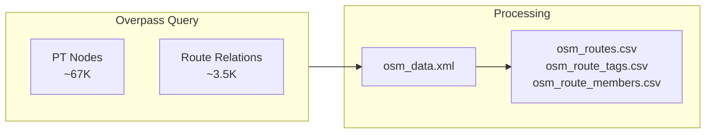

# OSM Data

OpenStreetMap provides community-maintained public transport data. We fetch Swiss PT nodes and their route relations via Overpass API.

## Way Ingestion Policy (Issue #37)

In addition to OSM nodes, we now ingest a narrow subset of OSM ways as virtual stop elements.

Included way categories:

1. `aerialway=station` + `public_transport=station`
2. ways with `uic_ref` where no existing node has the same `uic_ref`

Kept ways are converted to virtual IDs (`way_<osm_way_id>`) and represented as point elements using `out center` from Overpass (or a centroid fallback in parser logic). These virtual IDs are propagated through matching and route membership the same way as node IDs.




## Statistics

- **OSM Nodes with Route Data**: {{stat:routes.osm_with_routes}}

## Data Source

| Property | Value |
|----------|------|
| Endpoint | `https://overpass-api.de/api/interpreter` |
| Coverage | Switzerland (`ISO3166-1=CH`) |
| Updates | Live (reflects current OSM state) |
| Request body | Raw Overpass QL POST body (`text/plain; charset=utf-8`) |
| Client timeout | 30s connect, 600s read |
| Retry policy | Retries HTTP `502` and `504` with exponential backoff |

The downloader is intentionally fail-fast after retry exhaustion: if Overpass still returns a non-`200` response, the OSM download step raises and the pipeline stops rather than importing stale route data.

## Node Selection Criteria

| Tag | Values |
|-----|--------|
| `public_transport` | `platform`, `stop_position`, `station`, `halt`, `stop` |
| `railway` | `tram_stop`, `halt`, `station` |
| `highway` | `bus_stop` |
| `amenity` | `ferry_terminal`, `bus_station` |
| `aerialway` | `station` |

## Generated Route Artifacts

The raw XML feeds the entity-first route tables for route import.

### Entity-first route tables

| File | Description | Used By |
|------|-------------|---------|
| `osm_routes.csv` | One row per OSM route relation with core metadata (`route`, `name`, `ref`, `operator`, `network`, `gtfs_route_id`, ...). | Route import, `RouteState` |
| `osm_route_tags.csv` | Exploded key/value tags for each route relation. | Route import |
| `osm_route_members.csv` | Ordered relation members with resolved node/way IDs and a derived `direction_id_derived`. | Route import |


### Direction Extraction

OSM routes often have a `ref_trips` tag encoding direction:
- `.H` suffix → outbound (`direction_id = 0`)
- `.R` suffix → inbound (`direction_id = 1`)

Many routes lack this tag, leaving the exported `direction_id` / `direction_id_derived` empty. In the in-memory matcher, relations without a detectable suffix are expanded to both directions so GTFS token matching can still fall back to route ID alone.

## Key OSM Tags for Matching

| Tag | Purpose | Used In |
|-----|---------|---------|
| `uic_ref` | UIC reference number | Exact matching |
| `name` / `uic_name` | Stop name | Name matching |
| `local_ref` | Platform identifier | Disambiguation |
| `ref` | Route number | Route matching |
| `from` / `to` | Route direction | Route matching |


## Overpass Query

The following Overpass QL query is used to fetch the data from the Overpass API:

- Query timeout requested from Overpass: `360` seconds (`[timeout:360]`)
- Configurable environment variables: `OVERPASS_API_URL`, `OVERPASS_USER_AGENT`, `OVERPASS_MAX_RETRIES`, `OVERPASS_RETRY_BACKOFF_SECONDS`

```
[out:xml][timeout:360];
area["ISO3166-1"="CH"]->.searchArea;

(
    node(area.searchArea)["public_transport"~"platform|stop_position|station|halt|stop"];
    node(area.searchArea)["railway"="tram_stop"];
    node(area.searchArea)["amenity"="ferry_terminal"];
    node(area.searchArea)["amenity"="bus_station"];
    node(area.searchArea)["highway"="bus_stop"];
    node(area.searchArea)["railway"="halt"];
    node(area.searchArea)["railway"="station"];
    node(area.searchArea)["aerialway"="station"];
)->.pt_nodes;

(
    way(area.searchArea)["aerialway"="station"]["public_transport"="station"];
    way(area.searchArea)["uic_ref"];
)->.candidate_ways;

.pt_nodes out body qt;
.candidate_ways out body center qt;

(
    relation(bn.pt_nodes)[type=route];
    relation(bw.candidate_ways)[type=route];
);
out meta;
```

