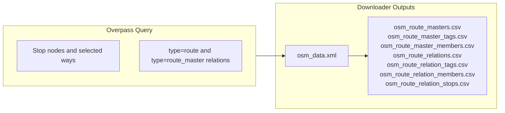

# OSM Data

OpenStreetMap provides the stop geometry and route-relation side of the comparison pipeline.

The OSM downloader in `matching_and_import_db/downloader/get_osm_data.py` performs two distinct tasks:

1. fetch Swiss public-transport stop elements from Overpass
2. materialize route-master and route-relation CSVs that preserve the OSM PTv2 structure for later import

The same raw XML is also parsed by `matching_and_import_db/state.py` into `OsmState`, which keeps the stop attributes needed by the matching runtime.

## Data Source

| Property | Value |
|----------|------|
| Endpoint | `https://overpass-api.de/api/interpreter` |
| Coverage | Switzerland (`ISO3166-1=CH`) |
| Request body | Raw Overpass QL POST body (`text/plain; charset=utf-8`) |
| Client timeout | 30s connect, 600s read |
| Retry policy | Retries HTTP `502` and `504` with exponential backoff |

The downloader is intentionally fail-fast after retry exhaustion. If Overpass still returns a non-`200` response, the OSM download step raises and the pipeline stops.

## Node Selection Criteria

| Tag | Values |
|-----|--------|
| `public_transport` | `platform`, `stop_position`, `station`, `halt`, `stop` |
| `railway` | `tram_stop`, `halt`, `station` |
| `highway` | `bus_stop` |
| `amenity` | `ferry_terminal`, `bus_station` |
| `aerialway` | `station` |

## Way Ingestion Policy

In addition to OSM nodes, the pipeline ingests a narrow subset of OSM ways as virtual stop elements.

Included way categories:

1. `aerialway=station` + `public_transport=station`
2. ways with `uic_ref` where no existing node already carries the same `uic_ref`

Kept ways are converted to virtual IDs (`way_<osm_way_id>`) and represented as point elements using `out center` from Overpass. These virtual IDs are treated like node IDs during stop matching and route membership export. OSM pair/trio pre-grouping explicitly excludes virtual ways.



## Retained Stop Attributes

`OsmState.from_xml_file()` parses the raw XML into `OsmNode` entities. The runtime keeps the following stop-level attributes because the matching predicates and route export depend on them.

| Attribute | Source | Used For |
|-----------|--------|----------|
| `node_id` | OSM node ID or virtual way ID | Stable stop identity in the runtime |
| `lat` / `lon` | Node coordinates or way center | Spatial matching and route preview maps |
| `local_ref` | `local_ref` tag, or `ref` as fallback | Platform disambiguation |
| `name` | `name` tag | Name matching and route labels |
| `uic_name` | `uic_name` tag | Name/UIC anchoring |
| `uic_ref` | `uic_ref` tag | Exact matching and route stop identity fallback |
| `network` | `network` tag | Route-family display metadata |
| `operator` | `operator` tag | Route-family display metadata |
| `public_transport` | `public_transport` tag | OSM grouping and node typing |
| `railway` | `railway` tag | OSM grouping and node typing |
| `amenity` | `amenity` tag | OSM grouping and node typing |
| `aerialway` | `aerialway` tag | Aerialway stop support |
| `tags` | full tag map | downstream helpers such as `operator:wikidata` and `network:wikidata` |

## Route Artifacts Written to `data/processed/`

The downloader writes entity-first route tables that preserve the OSM PTv2 hierarchy.

### `osm_route_masters.csv`

One row per `type=route_master` relation.

| Column | Description |
|--------|-------------|
| `route_master_id` | OSM relation ID |
| `route_master` | Mode family from the `route_master` tag |
| `name` / `ref` | Public line name and short ref |
| `operator` / `operator_wikidata` | Operator metadata |
| `network` / `network_wikidata` | Network metadata |
| `colour` | Colour tag if present |
| `gtfs_route_id` | Linked GTFS route identifier if tagged |
| `is_non_gtfs` | Flag used for explicitly non-GTFS families such as Flixbus |

### `osm_route_relations.csv`

One row per `type=route` relation. In practice this is the OSM-side itinerary or variant layer.

| Column | Description |
|--------|-------------|
| `relation_id` | OSM relation ID |
| `route` | Mode tag such as `bus`, `tram`, or `train` |
| `name` / `ref` | Public route name and short ref |
| `operator` / `operator_wikidata` | Operator metadata |
| `network` / `network_wikidata` | Network metadata |
| `from_name` / `to_name` / `via` | Directional labels |
| `public_transport_version` | PTv1/PTv2 metadata when tagged |
| `colour` | Colour tag if present |
| `gtfs_route_id` | GTFS route link used for deterministic family matching |
| `gtfs_trip_id` / `gtfs_trip_id_sample` | Sample GTFS trip metadata from tags |
| `gtfs_shape_id` | Optional GTFS shape metadata |
| `route_master_id` | Parent route-master relation when present |
| `family_origin` | Whether the family comes from a route master or a standalone relation |
| `synthetic_family_key` | Fallback grouping key used later by the importer |

### Tag and Membership Tables

| File | Description |
|------|-------------|
| `osm_route_master_tags.csv` | exploded key/value tags for route masters |
| `osm_route_master_members.csv` | ordered route relations belonging to a route master |
| `osm_route_relation_tags.csv` | exploded key/value tags for route relations |
| `osm_route_relation_members.csv` | ordered relation members with `member_type`, `member_ref`, `member_role`, `member_sequence`, `resolved_node_id`, and derived direction |
| `osm_route_relation_stops.csv` | stop-only membership rows with canonical stop keys and coordinates |

## Stop Rows Kept for Route Import

`osm_route_relation_stops.csv` is the OSM-side stop-call source for the route importer.

| Column | Description |
|--------|-------------|
| `relation_id` | Source route relation |
| `direction_id` | Direction derived from `ref_trips` when available |
| `stop_sequence` | Ordered member sequence |
| `osm_node_id` | Resolved node or virtual way ID |
| `stop_role` | Raw member role from the relation |
| `canonical_stop_key` | `uic:<uic_ref>` when available, otherwise `osm:<node_id>` |
| `stop_label` | Best available public stop label |
| `uic_ref` | UIC reference for stop identity fallback |
| `stop_lat` / `stop_lon` | Stop coordinates copied onto the route row |

## Direction Extraction

OSM route relations often carry a `ref_trips` tag with direction suffixes:

- `.H` suffix → outbound (`direction_id = 0`)
- `.R` suffix → inbound (`direction_id = 1`)

The downloader copies this value onto relation-member and relation-stop rows as `direction_id_derived` / `direction_id` when available.

For stop-level route matching, `OsmState` also expands route memberships without a detectable direction into both `0` and `1`, so the `RouteMatchPredicate` can still fall back to route ID alone.

## Key OSM Tags Used by the Matching Runtime

| Tag | Purpose | Used In |
|-----|---------|---------|
| `uic_ref` | Exact stop identity and route-stop fallback | Exact matching, route loader |
| `name` / `uic_name` / `gtfs:name` | Stop-name lookup | Name matching |
| `local_ref` | Platform identifier | Exact/name disambiguation |
| `gtfs:route_id` | Deterministic route-family link | Route matching and route import |
| `ref_trips` | Direction suffix extraction | Route matching and route import |
| `operator` / `network` | Route-family metadata | Routes page and normalized families |

## Overpass Query

The downloader issues a raw Overpass QL POST body with:

- requested timeout: `360` seconds (`[timeout:360]`)
- configurable environment variables: `OVERPASS_API_URL`, `OVERPASS_USER_AGENT`, `OVERPASS_MAX_RETRIES`, `OVERPASS_RETRY_BACKOFF_SECONDS`

The query fetches:

- selected Swiss public-transport stop nodes
- selected Swiss way-based stop elements
- `type=route` relations that reference those elements
- parent `type=route_master` relations and their child route relations

Exact Overpass QL body:

```overpassql
[out:xml][timeout:360];
area["ISO3166-1"="CH"]->.searchArea;

(
  node(area.searchArea)["public_transport"~"platform|stop_position|station|halt|stop"];
  node(area.searchArea)["railway"="tram_stop"];
  node(area.searchArea)["amenity"="ferry_terminal"];
  node(area.searchArea)["amenity"="bus_station"];
  node(area.searchArea)["highway"="bus_stop"];
  node(area.searchArea)["railway"="halt"];
  node(area.searchArea)["railway"="station"];
  node(area.searchArea)["aerialway"="station"];
)->.pt_nodes;

(
  way(area.searchArea)["aerialway"="station"]["public_transport"="station"];
  way(area.searchArea)["uic_ref"];
)->.candidate_ways;

(
  relation(bn.pt_nodes)[type=route][route!=hiking];
  relation(bw.candidate_ways)[type=route][route!=hiking];
)->.seed_routes;

relation(br.seed_routes)[type=route_master]->.route_masters;

(
  .seed_routes;
  relation(r.route_masters)[type=route][route!=hiking];
)->.routes;

.pt_nodes out body qt;
.candidate_ways out body center qt;
.routes out meta;
.route_masters out meta;
```

## Statistics

- **OSM Nodes with Route Data**: {{stat:routes.osm_with_routes}}
