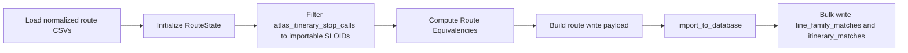
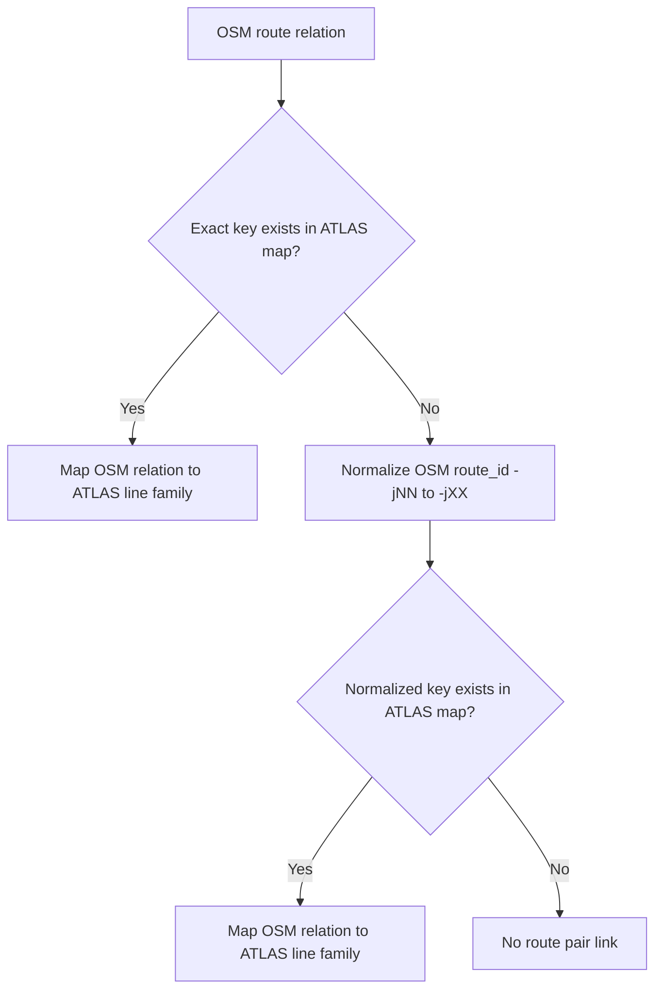

# Route-Route Matching

This section explains how normalized ATLAS line families are linked to OSM route relations via the `RouteState` module.

Important distinction:

- [2.3 Stop-stop matching using routes](2.3%20Stop-stop%20matching%20using%20routes.md) is stop-level matching (ATLAS stop <-> OSM stop).
- This section is route-level linking (ATLAS line family <-> OSM route relation), which pre-computes route equivalency for the normalized comparison layer.

## Where It Happens In The Pipeline

Route-route matching runs during route import preparation, after stop matching has already produced the set of importable ATLAS SLOIDs.

Concretely, `matching_and_import_db/database/route_loader.py` loads the normalized ATLAS and OSM route CSVs, filters `atlas_itinerary_stop_calls.csv` to the SLOIDs that will actually be imported, and then calls `RouteState.load_and_match()` to populate the route equivalency map. Only the stop-call rows are filtered by importable SLOIDs; the route-to-route lookup itself still reads the full `atlas_line_families.csv` and `osm_route_relations.csv` inputs. The resulting map is then materialized into normalized comparison rows for `importer.py`.

## Inputs

The broader route import path depends on the normalized route metadata:

- `atlas_line_families.csv`, `atlas_itineraries.csv`, and `atlas_itinerary_stop_calls.csv`
- `osm_route_masters.csv`, `osm_route_relations.csv`, and their tag/member files

The route equivalency lookup itself only needs `atlas_line_families.csv` and `osm_route_relations.csv`.

## Matching Rules

The linker applies the following route-pair rules for each OSM route (relation):

1. Exact key match first
   - If the OSM `gtfs_route_id` exists in the ATLAS line families, link directly.

2. Normalized route-id fallback
   - If no exact key match exists, normalize the OSM route id with `normalize_route_id()`.
   - Normalization rule: replace `-jNN` with `-jXX` (for example `11-T-j25-1` -> `11-T-jXX-1`).
   - Match the normalized route id against ATLAS normalized route IDs.

3. Unique pair write guard
   - The mapping creates an $O(1)$ lookup dictionary `osm_route_to_atlas_route`.
   - At most one ATLAS line-family ID is mapped to any OSM route relation.

## Resolution Flow

## What This Step Does Not Do

- It does not run spatial distance checks.
- It does not run fuzzy text similarity matching.
- It does not consume stop predicate scores.

Its responsibility is deterministic route-id linking using prepared route tables. Itinerary rows and stop-call rows are loaded alongside that mapping for normalized import, but they are not part of the `RouteState` equivalency decision.

## Output Tables Affected

- `line_family_matches`: ATLAS line-family to OSM route-relation links.
- `itinerary_matches`: itinerary-level links derived from the matched line families.
- `stop_alignments`: stop-call alignments used for route diagnostics.

## Related Documentation

- [1.2 GTFS ATLAS data](1.2%20GTFS%20ATLAS%20data.md)
- [1.3 OSM data](1.3%20OSM%20data.md)
- [2.3 Stop-stop matching using routes](2.3%20Stop-stop%20matching%20using%20routes.md)
- [4.1 Import Process](4.1%20Import%20Process.md)
