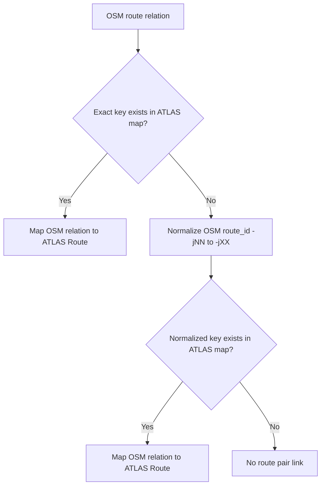

# Route-Route Matching

This section explains how ATLAS routes are linked to OSM routes via the `RouteState` module.

Important distinction:

- [2.4 Stop-stop matching using routes](2.4%20Stop-stop%20matching%20using%20routes.md) is stop-level matching (ATLAS stop <-> OSM stop).
- This section is route-level linking (ATLAS route <-> OSM route), which pre-computes route equivalency and later writes to `routes_matched`.

## Where It Happens In The Pipeline

Route-route matching runs during route import preparation, after stop matching has already produced the set of importable ATLAS SLOIDs.

Concretely, `matching_and_import_db/database/route_loader.py` loads the entity-first route CSVs, filters `atlas_route_stops.csv` to the SLOIDs that will actually be imported, and then calls `RouteState.load_and_match()` to populate the route equivalency map. Only the `route_atlas_stops` rows are filtered by importable SLOIDs; the route-to-route lookup itself still reads the full `atlas_routes.csv` and `osm_routes.csv` inputs. The resulting map is then materialized into `routes_matched` rows for `importer.py`.

## Inputs

The broader route import path depends on the entity-first route metadata:

- `atlas_routes.csv`, `atlas_route_directions.csv`, and `atlas_route_stops.csv`
- `osm_routes.csv`, `osm_route_tags.csv`, and `osm_route_members.csv`

The route equivalency lookup itself only needs `atlas_routes.csv` and `osm_routes.csv`.

## Matching Rules

The linker applies the following route-pair rules for each OSM route (relation):

1. Exact key match first
   - If the OSM `gtfs_route_id` exists in the ATLAS routes, link directly.

2. Normalized route-id fallback
   - If no exact key match exists, normalize the OSM route id with `normalize_route_id()`.
   - Normalization rule: replace `-jNN` with `-jXX` (for example `11-T-j25-1` -> `11-T-jXX-1`).
   - Match the normalized route id against ATLAS normalized route IDs.

3. Unique pair write guard
   - The mapping creates an $O(1)$ lookup dictionary `osm_route_to_atlas_route`.
   - At most one ATLAS route ID is mapped to any OSM route relation.

## Resolution Flow

## What This Step Does Not Do

- It does not run spatial distance checks.
- It does not run fuzzy text similarity matching.
- It does not consume stop predicate scores.

Its responsibility is deterministic route-id linking using prepared route tables. Direction rows and stop-membership rows are loaded alongside that mapping for route import, but they are not part of the `RouteState` equivalency decision.

## Output Tables Affected

- `route_osm_stops`: ordered OSM route membership rows.
- `route_atlas_stops`: ordered ATLAS route membership rows.
- `routes_matched`: route-route links between ATLAS and OSM.

## Related Documentation

- [1.2 GTFS ATLAS data](1.2%20GTFS%20ATLAS%20data.md)
- [1.3 OSM data](1.3%20OSM%20data.md)
- [2.4 Stop-stop matching using routes](2.4%20Stop-stop%20matching%20using%20routes.md)
- [4.1 Import Process](4.1%20Import%20Process.md)
