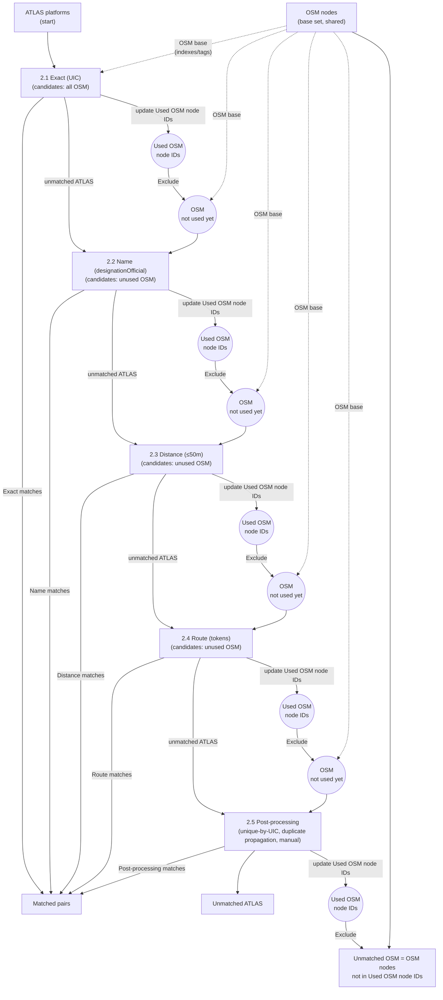

# Matching Process

The matching pipeline correlates ATLAS boarding platforms with OSM public transport nodes using a **sequential, hit-first approach**: once matched, entries are removed from subsequent stages.

The most important mental model is that each stage is a pure-ish transformation:

- **Input**: remaining (unmatched) ATLAS rows + the full OSM node set
- **State**: a `used_osm_node_ids` set (OSM IDs that later stages must not re-use)
- **Output**: new match pairs + remaining unmatched ATLAS rows + updated `used_osm_node_ids`

This is why the pipeline is easy to reason about: later stages only see what earlier stages could not confidently match.

## Matching Contract

### What is a “match”?

A match is a **pair**: one ATLAS platform row (identified by `sloid`) paired with one OSM node (`osm_node_id`).

Important: the pipeline aims for **unique OSM usage across stages**, but it does **not** guarantee a global 1:1 mapping:

- **Many-to-one is allowed** in specific high-confidence cases (e.g. when exactly one OSM candidate exists for a UIC, the algorithm may match *all* ATLAS entries for that UIC to that single OSM node).
- **Duplicate propagation** can also intentionally create multiple ATLAS rows pointing to the same OSM node (because the ATLAS rows are duplicates).

### Used-OSM rule (what it really means)

`used_osm_node_ids` prevents *later* stages from picking an OSM node that earlier stages already relied on.
It is a guard against “double spending” the same OSM node in multiple independent decisions.

It does **not** mean “an OSM node can only appear in one match record”, because some stages intentionally produce many-to-one matches.

## Pipeline Architecture



Note: the dotted arrows from **OSM nodes (base set)** mean the code reuses the same OSM-derived structures in every stage (indexes + tags). Each stage then derives its own candidate subset by filtering (e.g. non-station, not already used, within radius).

## Matching Stages

| Stage | Method | Matches | Description |
|-------|--------|---------|-------------|
| **2.1** | [Exact](2.1%20Exact%20matching.md) | {{stat:matching_stages.exact.count}} | UIC reference equality |
| **2.2** | [Name](2.2%20Name%20matching.md) | {{stat:matching_stages.name.count}} | Official name string match |
| **2.3** | [Distance](2.3%20Distance%20matching.md) | {{stat:matching_stages.distance.count}} | Spatial proximity ≤50m |
| **2.4** | [Route](2.4%20Route%20Matching.md) | {{stat:matching_stages.route.count}} | Shared transit routes |
| **2.5** | [Post-processing](2.5%20Post-processing.md) | {{stat:matching_stages.post_processing.unique_by_uic}} | Unique-by-UIC + propagation |

**Total matched pairs**: {{stat:summary.matched_pairs}} (~{{stat:summary.match_rate_percent}}% of ATLAS)

## Results Summary

| Metric | Value |
|--------|-------|
| **ATLAS platforms** | {{stat:summary.atlas_platforms}} |
| **Matched pairs** | {{stat:summary.matched_pairs}} |
| **Match rate** | {{stat:summary.match_rate_percent}}% |
| **Unmatched ATLAS** | {{stat:summary.unmatched_atlas}} |
| **Unmatched OSM** | {{stat:summary.unmatched_osm}} |

## Key Concepts

### Input Filtering

| Dataset | Filter | Reason |
|---------|--------|--------|
| **ATLAS** | `BOARDING_PLATFORM` only | Platform-level granularity |
| **OSM** | Exclude `railway=station` | Match platforms, not stations |

### Used-Node Set

Prevents the same OSM node from matching multiple ATLAS platforms:

```python
used_osm_node_ids = set()

# Before matching
if osm_node_id in used_osm_node_ids:
    continue  # Skip

# After successful match
used_osm_node_ids.add(osm_node_id)
```

In practice this rule is enforced **between** stages (and for most within-stage decisions).
Some steps intentionally produce many-to-one matches (see “Matching Contract” above).

## Code References

| Component | File |
|-----------|------|
| Orchestrator | [matching_script.py](../matching_process/matching_script.py) |
| Exact matching | [exact_matching.py](../matching_process/exact_matching.py) |
| Name matching | [name_matching.py](../matching_process/name_matching.py) |
| Distance matching | [distance_matching.py](../matching_process/distance_matching.py) |
| Route matching | [route_matching_unified.py](../matching_process/route_matching_unified.py) |
