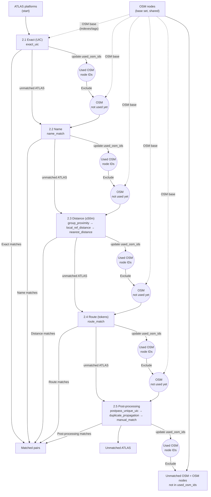

# Matching Process

The matching pipeline correlates ATLAS boarding platforms with OSM public transport nodes using a **sequential, hit-first approach**: once matched, entries are removed from subsequent stages.

## Predicate-Based Architecture

The pipeline is built around a uniform **predicate** interface. Each matching stage is a plain function:

```python
def predicate(ctx: MatchingContext) -> list[dict]:
    """Return new match records. May mutate ctx.used_osm_ids internally."""
```

A **pipeline runner** chains predicates sequentially, handling bookkeeping between calls:

```python
from matching_process.pipeline import MatchingContext, run_pipeline

output = run_pipeline([exact_uic, name_match, group_proximity, ...], ctx)
```

Before each predicate the runner refreshes `ctx.atlas_unmatched` (the subset of ATLAS rows not yet matched). After each predicate it updates `ctx.matched_atlas_ids`, `ctx.used_osm_ids`, and `ctx.all_matches` from the returned records.

### MatchingContext

`MatchingContext` is a shared mutable dataclass that holds all state across the pipeline:

| Field | Type | Description |
|-------|------|-------------|
| `atlas_df` | `DataFrame` | Full ATLAS dataset |
| `osm_nodes` | `dict` | `{(lat, lon): node_dict}` — all parsed OSM nodes |
| `uic_ref_dict` | `dict` | `{uic_ref_str: [node_entry, …]}` — UIC reference index |
| `name_index` | `dict` | `{name_str: [node_entry, …]}` — name index (name / uic_name / gtfs:name) |
| `used_osm_ids` | `set` | OSM node IDs claimed by any predicate so far |
| `matched_atlas_ids` | `set` | ATLAS SLOIDs matched so far |
| `all_matches` | `list` | Accumulated match records |
| `atlas_unmatched` | `DataFrame` | Refreshed before each predicate (rows not in `matched_atlas_ids`) |
| `max_distance` | `float` | Spatial radius in metres (default 50) |
| `osm_xml_file` | `str` | Path to the raw OSM XML (used by route matching) |
| `duplicate_sloid_map` | `dict` | `{sloid: [group_sloids]}` — ATLAS duplicate groups |

## Matching Contract

### What is a "match"?

A match is a **pair**: one ATLAS platform row (identified by `sloid`) paired with one OSM node (`osm_node_id`).

Important: the pipeline does not always aim for 1:1 mapping. For example:

- **Many-to-one is allowed** in specific high-confidence cases (e.g. when exactly one OSM candidate exists for a UIC, the algorithm may match *all* ATLAS entries for that UIC to that single OSM node).
- **OSM Platform/Stop-position** Some ATLAS platforms might be represented by two OSM nodes: one with the tag "public_transport=platform" and another with the tag "public_transport=stop_position"

### Used-OSM rule (what it really means)

`used_osm_ids` prevents *later* stages from picking an OSM node that earlier stages already relied on.
It is a guard against "double spending" the same OSM node in multiple independent decisions.

It does **not** mean "an OSM node can only appear in one match record", because some stages intentionally produce many-to-one matches.

## Pipeline Architecture



Note: the dotted arrows from **OSM nodes (base set)** mean the code reuses the same OSM-derived structures in every stage (indexes + tags). Each predicate then derives its own candidate subset by filtering (e.g. non-station, not already used, within radius).

## Default Pipeline

The orchestrator (`matching_script.py`) defines the default predicate order:

```python
DEFAULT_PIPELINE = [
    exact_uic,           # 2.1 Exact UIC matching
    name_match,          # 2.2 Name matching
    group_proximity,     # 2.3 Distance: group-based proximity
    local_ref_distance,  # 2.3 Distance: exact local_ref within 50m
    nearest_distance,    # 2.3 Distance: single-candidate / ratio test
    route_match,         # 2.4 Route matching (GTFS/HRDF tokens)
    postpass_unique_uic, # 2.5 Post-pass unique-by-UIC
    duplicate_propagation, # 2.5 Duplicate propagation
    manual_match,        # 2.5 Manual matches from database
]
```

## Matching Stages

| Stage | Predicate(s) | Matches | Description |
|-------|--------------|---------|-------------|
| **2.1** | [`exact_uic`](2.1%20Exact%20matching.md) | {{stat:matching_stages.exact.count}} | UIC reference equality |
| **2.2** | [`name_match`](2.2%20Name%20matching.md) | {{stat:matching_stages.name.count}} | Official name string match |
| **2.3** | [`group_proximity`, `local_ref_distance`, `nearest_distance`](2.3%20Distance%20matching.md) | {{stat:matching_stages.distance.count}} | Spatial proximity ≤50m |
| **2.4** | [`route_match`](2.4%20Route%20Matching.md) | {{stat:matching_stages.route.count}} | Shared transit routes |
| **2.5** | [`postpass_unique_uic`, `duplicate_propagation`, `manual_match`](2.5%20Post-processing.md) | Variable | Unique-by-UIC + propagation + manual |

**Total matched pairs**: {{stat:summary.matched_pairs}} (~{{stat:summary.match_rate_percent}}% of ATLAS)

## Results Summary

| Metric | Value |
|--------|-------|
| **ATLAS platforms** | {{stat:summary.atlas_platforms}} |
| **Matched pairs** | {{stat:summary.matched_pairs}} |
| **Match rate** | {{stat:summary.match_rate_percent}}% |
| **Unmatched ATLAS** | {{stat:summary.unmatched_atlas}} |
| **Unmatched OSM** | {{stat:summary.unmatched_osm}} |

## Key Concepts

### Input Filtering

| Dataset | Filter | Reason |
|---------|--------|--------|
| **ATLAS** | `BOARDING_PLATFORM` only | Platform-level granularity |
| **OSM** | Exclude `railway=station` | Match platforms/stop_positions, not stations |

*Note: Station exclusion is applied per-predicate (exact, name, distance predicates all filter out stations). Route matching does NOT exclude stations, since route tokens can match station-level nodes.*

### Used-Node Set

Prevents the same OSM node from matching multiple ATLAS platforms across stages:

```python
# The runner handles this automatically after each predicate:
for m in matches:
    ctx.used_osm_ids.add(m['osm_node_id'])

# Each predicate checks before matching:
if node['node_id'] in ctx.used_osm_ids:
    continue  # Skip
```

In practice this rule is enforced **between** stages (and for most within-stage decisions).
Some steps intentionally produce many-to-one matches (see "Matching Contract" above).

### Match Records

All predicates create match records through the `make_match()` helper in `pipeline.py`, which delegates to `create_match_record()` in `match_record.py`. This ensures a consistent ~20-field structure across all stages.

### No-Nearby-OSM Detection

After the pipeline completes, `compute_no_nearby_osm()` flags unmatched ATLAS entries that have **no OSM node at all** within 50m. These SLOIDs are returned separately for problem detection.

## Code References

| Component | File | Key Functions |
|-----------|------|---------------|
| Pipeline framework | [pipeline.py](../matching_process/pipeline.py) | `MatchingContext`, `run_pipeline()`, `make_match()`, `compute_no_nearby_osm()` |
| Orchestrator | [matching_script.py](../matching_process/matching_script.py) | `final_pipeline()`, `parse_osm_xml()`, `DEFAULT_PIPELINE` |
| Match records | [match_record.py](../matching_process/match_record.py) | `create_match_record()`, `extract_atlas_fields()` |
| Exact matching | [exact_matching.py](../matching_process/exact_matching.py) | `exact_uic()` |
| Name matching | [name_matching.py](../matching_process/name_matching.py) | `name_match()` |
| Distance matching | [distance_matching.py](../matching_process/distance_matching.py) | `group_proximity()`, `local_ref_distance()`, `nearest_distance()` |
| Route matching | [route_matching_unified.py](../matching_process/route_matching_unified.py) | `route_match()` |
| Post-processing | [postpass_matching.py](../matching_process/postpass_matching.py) | `postpass_unique_uic()`, `duplicate_propagation()`, `manual_match()` |
| Spatial index | [spatial_index.py](../matching_process/spatial_index.py) | `build_kdtree_from_nodes()`, `meters_to_unit_chord_radius()` |
| Utilities | [utils.py](../matching_process/utils.py) | `haversine_distance()`, `is_osm_station()` |
