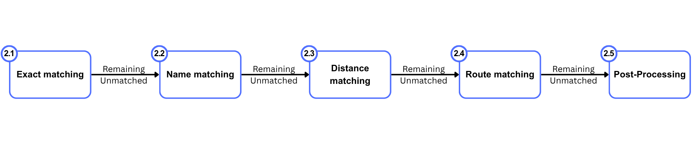

## Matching Process

The matcher is sequential and “hit-first”: once an ATLAS row matches, it is removed from later stages. It targets platform-level granularity and avoids station-level OSM nodes.

- **Entrypoint**: `final_pipeline()` in [matching_process/matching_script.py](https://github.com/openTdataCH/stop_sync_osm_atlas/blob/main/matching_process/matching_script.py)
- **Input filters**: Only ATLAS `BOARDING_PLATFORM`; OSM stations are excluded via `utils.is_osm_station`
- A used-OSM-node set prevents unintended reuse across stages

Stages (in order):
1. `exact_matching()` — UIC (`number` ↔ `uic_ref`), disambiguate with `designation` ↔ `local_ref`
2. `name_based_matching()` — `designationOfficial` ↔ `name`/`uic_name`/`gtfs:name`, `local_ref` tie-breaker
3. `distance_matching()` 
4. `perform_unified_route_matching()` —  GTFS/HRDF 
5. Post-pass unique-by-UIC consolidation 
6. Duplicate propagation across ATLAS duplicates (`number` + `designation`)
7. Apply persistent manual matches from DB

---

## Headline numbers:

- ATLAS considered: 54,880 `BOARDING_PLATFORM`
- Matches (pairs): 48,213; distinct matched ATLAS: 46,611 (~85.0%)
- By method (pairs):
  - Exact: 21,124
  - Name: 535
  - Distance: 18,661
    - Stage 1 (group proximity): 15,384
    - Stage 2 (`local_ref` ≤ 50 m): 129
    - Stage 3a (single candidate): 2,012
    - Stage 3b (relative distance): 1,136
  - Routes (unified GTFS/HRDF): 6,944
  - Post-pass unique-by-UIC: 883
  - Duplicate propagation: 66
- Unmatched ATLAS: 8,269; of which 3,856 have no OSM within 50 m
- Unmatched OSM nodes: 19,107; of which 14,003 have ≥1 route, 14,906 have `uic_ref`, 876 have `local_ref`

## Key code references

- Orchestrator: `final_pipeline()` in [matching_process/matching_script.py](https://github.com/openTdataCH/stop_sync_osm_atlas/blob/main/matching_process/matching_script.py)
- Exact: `exact_matching()` in [matching_process/exact_matching.py](https://github.com/openTdataCH/stop_sync_osm_atlas/blob/main/matching_process/exact_matching.py)
- Name: `name_based_matching()` in [matching_process/name_matching.py](https://github.com/openTdataCH/stop_sync_osm_atlas/blob/main/matching_process/name_matching.py)
- Distance: `distance_matching()` and `transform_for_distance_matching()` in [matching_process/distance_matching.py](https://github.com/openTdataCH/stop_sync_osm_atlas/blob/main/matching_process/distance_matching.py)
- Routes: `perform_unified_route_matching()` in [matching_process/route_matching_unified.py](https://github.com/openTdataCH/stop_sync_osm_atlas/blob/main/matching_process/route_matching_unified.py)
- Utilities: `is_osm_station`, `haversine_distance` in [matching_process/utils.py](https://github.com/openTdataCH/stop_sync_osm_atlas/blob/main/matching_process/utils.py); KDTree helpers in [matching_process/spatial_index.py](https://github.com/openTdataCH/stop_sync_osm_atlas/blob/main/matching_process/spatial_index.py)
