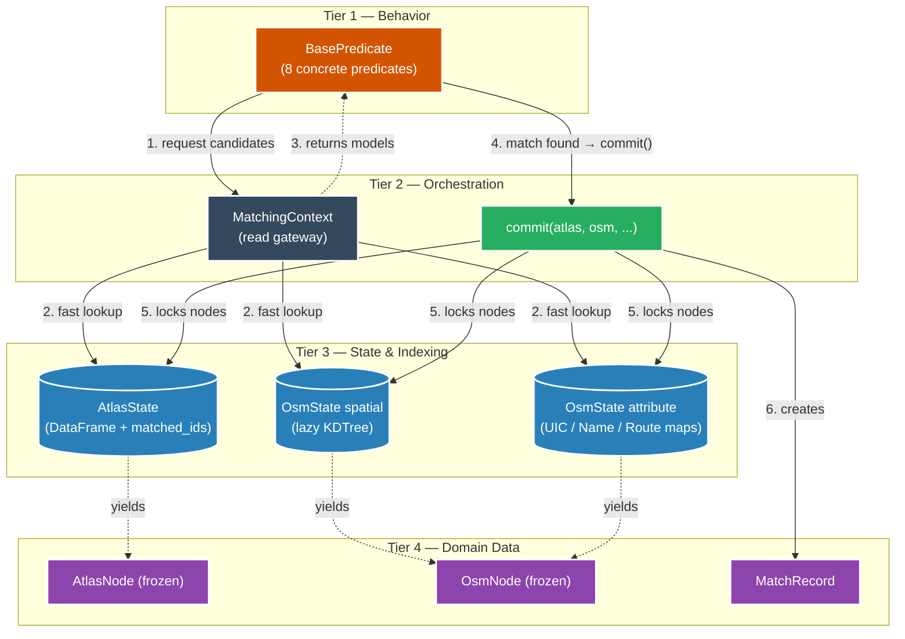
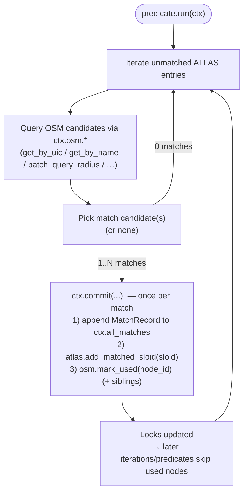
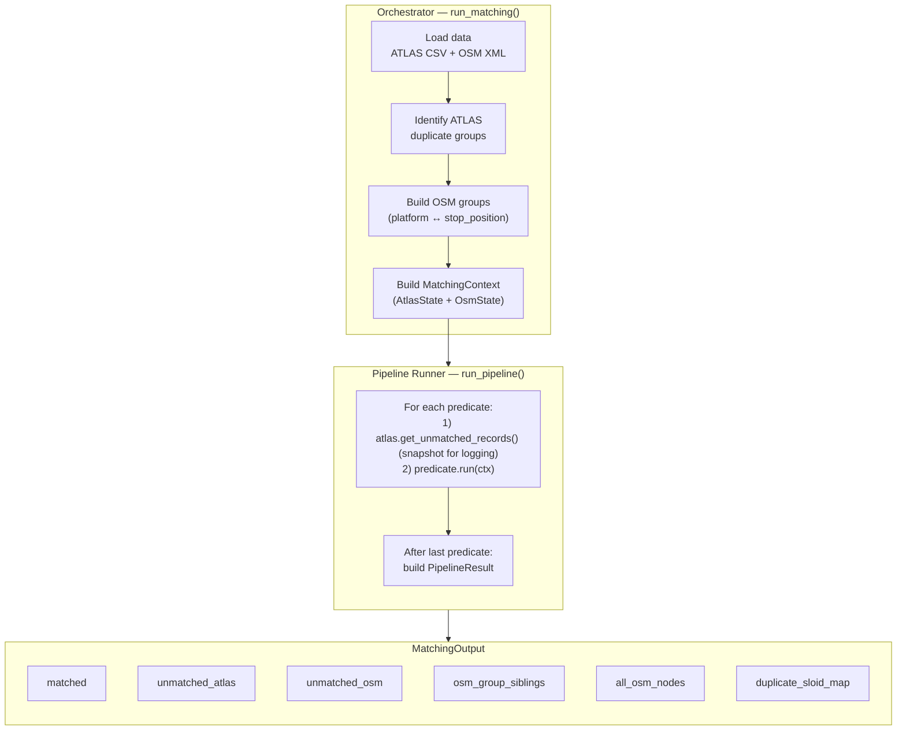
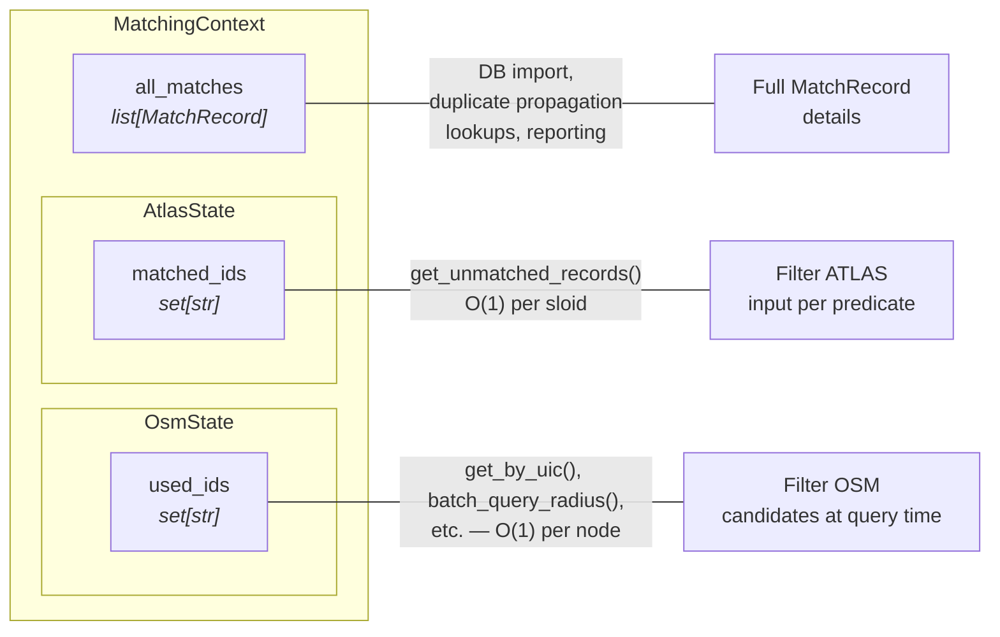

# Matching Process

The matching pipeline correlates ATLAS boarding platforms with OSM public transport nodes. It uses a **sequential, hit-first approach**: predicates run in priority order, and once an ATLAS entry or OSM node is claimed, later stages skip it.

## What is a "match"?

A **match** pairs one ATLAS platform (identified by `sloid`) with one OSM node (`node_id`), producing a `MatchRecord`. The pipeline is **ATLAS-driven**: for every ATLAS entry, it tries to find the best OSM node using a chain of increasingly permissive heuristics.

A `MatchRecord` carries four key fields:

| Field | Description |
|-------|-------------|
| `match_type` | Which predicate produced the match (e.g. `exact`, `name`, `distance_matching_3b`) |
| `distance_m` | Haversine distance in metres between the two nodes |
| `notes` | Human-readable explanation of why the match was made |
| `problems` | Quality flags populated later by `evaluate_problems()` |

### Cardinality — it is not always 1:1

Most matches are 1 ATLAS → 1 OSM, but the pipeline deliberately allows exceptions:

| Cardinality | Cause | Produced by |
|-------------|-------|-------------|
| N ATLAS → 1 OSM | Single OSM node covers all ATLAS entries for a UIC | `ExactUicPredicate` (single-OSM case), `PostpassUniqueUicPredicate` |
| N ATLAS → 1 OSM | ATLAS duplicate group: entries sharing the same `number` + `designation` propagate one match to all siblings | `DuplicatePropagationPredicate` |
| 1 ATLAS → N OSM | Single ATLAS entry but multiple OSM nodes carry the same UIC | `ExactUicPredicate` (single-ATLAS case) |

**OSM groups (platform ↔ stop_position pairs) are transparent at the `MatchRecord` level.** When the representative node of a group is matched, its sibling is automatically locked but does **not** appear as a separate `MatchRecord` — it is stored in `osm_group_siblings` and handled by the database importer separately.

---

## Architecture: The Four Tiers

The pipeline is structured around four responsibility tiers. Reads flow upward; mutations flow downward only through `commit()`.



| Tier | Components | Responsibility |
|------|-----------|---------------|
| **Tier 1 — Behavior** | 8 concrete predicates | All matching heuristics; interact only through `MatchingContext` |
| **Tier 2 — Orchestration** | `MatchingContext`, `commit()` | Single gateway between predicates and data; atomically locks matched nodes |
| **Tier 3 — State & Indexing** | `AtlasState`, `OsmState` | In-memory storage, KDTree, hash-map indexes; automatically filters matched nodes |
| **Tier 4 — Domain Data** | `AtlasNode`, `OsmNode`, `MatchRecord` | Immutable value objects flowing upward; `MatchRecord` created by `commit()` |

---

## The Predicate Pipeline

The pipeline runs **8 predicates** sequentially. Each successive predicate only sees ATLAS/OSM nodes that remain unmatched after all previous predicates.


| # | Predicate class | Match types | Strategy |
|---|-----------------|-------------|----------|
| **2.1** | [`ExactUicPredicate`](2.1%20Exact%20matching.md) | `exact` | UIC reference equality, refined by `local_ref` when ambiguous |
| **2.2** | [`NameMatchPredicate`](2.2%20Name%20matching.md) | `name` | `designationOfficial` against OSM name indexes |
| **2.3a** | [`GroupProximityPredicate`](2.3%20Distance%20matching.md) | `distance_matching_1_*` | Conflict-free bipartite matching within UIC/name groups |
| **2.3b** | [`LocalRefDistancePredicate`](2.3%20Distance%20matching.md) | `distance_matching_2` | Exact `local_ref == designation` within 50 m |
| **2.3c** | [`NearestDistancePredicate`](2.3%20Distance%20matching.md) | `distance_matching_3a/3b` | Single candidate or ratio test (d2/d1 ≥ 4) |
| **2.4** | [`RouteMatchPredicate`](2.4%20Route%20Matching.md) | `route_unified_gtfs/hrdf` | GTFS/HRDF route token intersection |
| **2.5a** | [`PostpassUniqueUicPredicate`](2.5%20Post-processing.md) | `exact_postpass` | Last-resort: only one unused OSM node left for a UIC |
| **2.5b** | [`DuplicatePropagationPredicate`](2.5%20Post-processing.md) | `duplicate_propagation` | Copy a match to all unmatched ATLAS duplicates |

Each stage is documented in its own sub-page (links above).

### Inside a predicate

All predicates inherit from `BasePredicate` with a uniform interface:

```python
class BasePredicate(ABC):
    @abstractmethod
    def run(self, ctx: MatchingContext) -> None:
        """Calls ctx.commit() for each match found."""
```

Predicates interact with state exclusively through `ctx.commit()` — they never return match records or mutate state directly.



---

## Domain Models

The pipeline operates on strongly typed `dataclass` entities defined in `models.py`, eliminating raw dictionaries from the matching logic.

### `AtlasNode` (frozen)

Immutable value object representing one ATLAS boarding platform. Constructed once per row by `AtlasState._to_atlas_node()`.

| Field | Type | Source column |
|-------|------|---------------|
| `sloid` | `str` | `sloid` |
| `lat` | `float` | `wgs84North` |
| `lon` | `float` | `wgs84East` |
| `uic_ref` | `str` | `number` |
| `designation` | `str` | `designation` |
| `designation_official` | `str` | `designationOfficial` |
| `business_org_abbr` | `str` | `servicePointBusinessOrganisationAbbreviationEn` |

### `OsmNode` (frozen)

Immutable value object representing one OSM public transport node. Constructed by `OsmState._to_osm_node()`.

| Field | Type | OSM tag |
|-------|------|---------|
| `node_id` | `str` | XML `id` attribute |
| `lat`, `lon` | `float` | XML `lat`/`lon` attributes |
| `local_ref` | `Optional[str]` | `local_ref` (falls back to `ref`) |
| `name` | `Optional[str]` | `name` |
| `uic_name` | `Optional[str]` | `uic_name` |
| `uic_ref` | `Optional[str]` | `uic_ref` |
| `network` | `str` | `network` |
| `operator` | `str` | `operator` (standardized via `standardize_operator()`) |
| `public_transport` | `Optional[str]` | `public_transport` |
| `railway` | `Optional[str]` | `railway` |
| `amenity` | `Optional[str]` | `amenity` |
| `aerialway` | `Optional[str]` | `aerialway` |
| `tags` | `dict[str, str]` | All tags |

`OsmNode` exposes an `is_station` property: returns `True` when `public_transport == 'station'` or `railway == 'station'`, but **not** for `aerialway == 'station'`.

### `MatchRecord`

Mutable join entity created by `ctx.commit()`. Holds the matched pair plus metadata.

| Field | Type | Description |
|-------|------|-------------|
| `atlas_node` | `AtlasNode` | The matched ATLAS platform |
| `osm_node` | `OsmNode` | The matched OSM node |
| `match_type` | `str` | Predicate identifier (e.g. `exact`, `name`, `distance_matching_3b`) |
| `distance_m` | `float` | Haversine distance between the two nodes |
| `notes` | `str` | Human-readable match explanation |
| `problems` | `list[ProblemResult]` | Populated later by `evaluate_problems()` |

### `PipelineResult`

Minimal container returned by `run_pipeline()`, holding only what the runner itself produces.

| Field | Type | Description |
|-------|------|-------------|
| `matched` | `list[MatchRecord]` | All accumulated match records |
| `unmatched_atlas` | `list[AtlasNode]` | ATLAS entries still unmatched |
| `unmatched_osm` | `list[OsmNode]` | OSM nodes never claimed |

### `MatchingOutput`

Richer container returned by `run_matching()` (the orchestrator). Wraps `PipelineResult` fields and adds pre-pipeline state needed by the database importer.

| Field | Type | Description |
|-------|------|-------------|
| `matched` | `list[MatchRecord]` | All accumulated match records |
| `unmatched_atlas` | `list[AtlasNode]` | ATLAS entries still unmatched |
| `unmatched_osm` | `list[OsmNode]` | OSM nodes never claimed |
| `duplicate_sloid_map` | `dict[str, list[str]]` | ATLAS duplicate groups |
| `osm_group_siblings` | `dict[str, list[OsmNode]]` | Platform ↔ stop_position pairs (representative → siblings) |
| `all_osm_nodes` | `list[OsmNode]` | Every parsed OSM node |

---

## State Managers

### AtlasState

Manages the ATLAS dataset and tracks which SLOIDs have been matched. Constructed via `AtlasState.from_dataframe()`, which pre-computes duplicate groups (entries sharing `number` + `designation`).

| Method | Description |
|--------|-------------|
| `get_unmatched_records()` | Returns unmatched rows as `list[AtlasNode]` (filters by `matched_ids`) |
| `add_matched_sloid(sloid)` | Adds a SLOID to `matched_ids` |
| `get_routes(sloid)` | Returns `{'gtfs': [...], 'hrdf': [...]}` route entries for a SLOID (from `atlas_routes_unified.csv`) |
| `get_all_rows_as_dict()` | All records keyed by SLOID as `dict[str, AtlasNode]` |
| `duplicate_sloid_map` | `{sloid: [group_sloids]}` — ATLAS duplicate groups |

### OsmState

OSM data needs **multiple access patterns**, each optimized for a different stage. These are pre-computed indexes over the same underlying `_all_nodes` dict, returning strongly typed `OsmNode` entities.

| Index | Access pattern | Used by |
|-------|---------------|---------|
| `_uic_ref_dict` | O(1) lookup by UIC ref string | `ExactUicPredicate`, `PostpassUniqueUicPredicate` |
| `_name_index` | O(1) lookup by name/uic_name/gtfs:name | `NameMatchPredicate` |
| KDTree (lazy) | Spatial radius queries in metres | `LocalRefDistancePredicate`, `NearestDistancePredicate`, `RouteMatchPredicate` |
| `name_dirs` / `uic_dirs` | Per-node direction strings from OSM relations | `RouteMatchPredicate` |
| `_node_routes` | Per-node GTFS route memberships derived from XML relations | `RouteMatchPredicate` |

All query methods (`get_by_uic`, `get_by_name`, `batch_query_radius`) automatically exclude nodes in `used_ids`, sibling nodes (from grouping), and `is_station` nodes (unless `include_stations=True`).

| Method | Returns | Notes |
|--------|---------|-------|
| `get_by_uic(uic)` | `list[OsmNode]` | Excludes used + siblings + stations |
| `get_by_name(name)` | `list[OsmNode]` | Excludes used + siblings + stations |
| `batch_query_radius(coords, max_dist)` | `list[list[tuple[OsmNode, float]]]` | Batched, uses `workers=-1` |
| `get_all_unmatched_grouped(key)` | `dict[str, list[OsmNode]]` | Used by `GroupProximityPredicate` |
| `get_node_routes(node_id)` | `list[dict]` | Route entries `{gtfs_route_id, direction_id, route_name}` |
| `mark_used(node_id)` | — | Adds to `used_ids`, cascades to siblings |
| `build_groups(atlas_uic_counts)` | — | Pre-groups platform ↔ stop_position pairs |

### OSM Node Grouping

`OsmState.build_groups()` pre-pairs `public_transport=platform` nodes with nearby `public_transport=stop_position` nodes within the same UIC, before any predicate runs.

**Algorithm:**
1. For each UIC with both platforms and stop_positions, find reciprocal nearest neighbours within 12 m (each pair must point at each other)
2. Apply a count-match condition: a group is only kept when `atlas_count == effective_osm_count` for that UIC (prevents spurious groupings)
3. Select a representative for each pair (prefer the node with `uic_ref`; otherwise prefer the platform)

**Effect on matching:**
- Sibling nodes are hidden from all query methods — predicates only see the representative
- When the representative is matched via `mark_used()`, its siblings are automatically locked too
- Siblings appear in `MatchingOutput.osm_group_siblings` for the database importer to use separately

---

## Pipeline Framework

### Orchestrator (`orchestrator.py`)

`run_matching()` is the public entry point:



Steps:
1. Locates and loads the ATLAS CSV and OSM XML files
2. Parses OSM XML via `OsmState.from_xml_file()` into `OsmNode` entities with pre-built indexes (UIC, name, directions)
3. Constructs `AtlasState.from_dataframe()`, which identifies ATLAS duplicate groups
4. Calls `osm_index.build_groups()` to pre-group platform ↔ stop_position pairs
5. Builds a `MatchingContext` and passes it to `run_pipeline()`
6. Wraps the `PipelineResult` with pre-pipeline state into a `MatchingOutput` and returns it

### Runner (`run_pipeline`)

The runner in `pipeline.py` chains predicates sequentially:

```python
for predicate in predicates:
    unmatched = ctx.atlas.get_unmatched_records()   # ① log count
    predicate.run(ctx)                               # ② run predicate (calls ctx.commit() internally)
```

After all predicates complete, the runner builds a `PipelineResult` from `ctx.all_matches` and the remaining unmatched entries.

### The Transactional API: `ctx.commit()`

`MatchingContext.commit()` is the single gateway for recording matches. It enforces atomicity:

```python
def commit(self, atlas_node, osm_node, match_type, distance_m, notes):
    record = MatchRecord(atlas_node, osm_node, match_type, distance_m, notes)
    self.all_matches.append(record)
    self.atlas.add_matched_sloid(atlas_node.sloid)
    if osm_node.node_id and osm_node.node_id != 'NA':
        self.osm.mark_used(osm_node.node_id)
```

The immediate lock prevents double-booking within a single predicate execution.

### State tracking



| Store | Type | Written by | Purpose |
|-------|------|-----------|---------|
| `all_matches` | `list[MatchRecord]` | `ctx.commit()` | Full match records for DB import, duplicate propagation, stats |
| `matched_ids` | `set[str]` | `ctx.commit()` → `add_matched_sloid()` | O(1) "is this ATLAS entry already matched?" |
| `used_ids` | `set[str]` | `ctx.commit()` → `mark_used()` | O(1) "is this OSM node already claimed?" |

---

## Matching Rules

### Station exclusion

| Predicate | Excludes stations? | Reason |
|-----------|--------------------|--------|
| `ExactUicPredicate`, `NameMatchPredicate` | Yes | Match platforms, not stations |
| `GroupProximityPredicate`, `LocalRefDistancePredicate`, `NearestDistancePredicate` | Yes | Same |
| `RouteMatchPredicate` | **No** | Route tokens can match station-level nodes |
| Post-pass predicates | Yes | Same as default |

A "station" means `railway=station` or `public_transport=station`. Note that `aerialway=station` is **not** treated as a station (the `is_station` property explicitly excludes it).

### Key parameters

| Parameter | Value | Used by |
|-----------|-------|---------|
| `max_distance` | 50 m | All spatial predicates |
| `RATIO_TEST_FACTOR` | 4 | `NearestDistancePredicate` (d2/d1 threshold) |
| `RATIO_TEST_MIN_D2` | 10 m | `NearestDistancePredicate` (minimum 2nd-nearest distance) |

---

## Performance

Spatial queries use a **KDTree** (`scipy.spatial.cKDTree`) over 3D unit-sphere coordinates. The tree is built lazily on first use and filters `used_ids` at query time (not at build time), avoiding expensive rebuilds.

Predicates batch all unmatched ATLAS coordinates into a single numpy array and call `batch_query_radius()`, which delegates to SciPy's multithreaded C backend (`query_ball_point(points, workers=-1)`).

---

## Results Summary

| Metric | Value |
|--------|-------|
| **ATLAS platforms** | {{stat:summary.atlas_platforms}} |
| **Matched pairs** | {{stat:summary.matched_pairs}} |
| **Match rate** | {{stat:summary.match_rate_percent}}% |
| **Unmatched ATLAS** | {{stat:summary.unmatched_atlas}} |
| **Unmatched OSM** | {{stat:summary.unmatched_osm}} |

### No-nearby-OSM detection

After the pipeline completes, the importer flags unmatched ATLAS entries that have no OSM node at all within 50 m. These are stored in `no_nearby_osm_sloids` for [problem detection](3.%20Problems.md).

---

## Code References

| Component | File | Key exports |
|-----------|------|-------------|
| Domain models | [models.py](../matching_and_import_db/models.py) | `AtlasNode`, `OsmNode`, `MatchRecord`, `PipelineResult`, `MatchingOutput` |
| Orchestrator | [orchestrator.py](../matching_and_import_db/orchestrator.py) | `run_matching()`, `DEFAULT_PIPELINE` |
| Pipeline framework | [pipeline.py](../matching_and_import_db/pipeline.py) | `MatchingContext`, `run_pipeline()` |
| Base predicate | [predicates/\_\_init\_\_.py](../matching_and_import_db/predicates/__init__.py) | `BasePredicate` |
| State management | [state.py](../matching_and_import_db/state.py) | `AtlasState`, `OsmState` |
| Exact matching | [predicates/exact_matching.py](../matching_and_import_db/predicates/exact_matching.py) | `ExactUicPredicate` |
| Name matching | [predicates/name_matching.py](../matching_and_import_db/predicates/name_matching.py) | `NameMatchPredicate` |
| Distance matching | [predicates/distance_matching.py](../matching_and_import_db/predicates/distance_matching.py) | `GroupProximityPredicate`, `LocalRefDistancePredicate`, `NearestDistancePredicate` |
| Route matching | [predicates/route_matching_unified.py](../matching_and_import_db/predicates/route_matching_unified.py) | `RouteMatchPredicate` |
| Post-processing | [predicates/postpass_matching.py](../matching_and_import_db/predicates/postpass_matching.py) | `PostpassUniqueUicPredicate`, `DuplicatePropagationPredicate` |
| Spatial index | [utils/spatial_index.py](../matching_and_import_db/utils/spatial_index.py) | `build_kdtree_from_nodes()`, `batch_to_xyz()` |
| Utilities | [utils/common.py](../matching_and_import_db/utils/common.py) | `haversine_distance()` |
