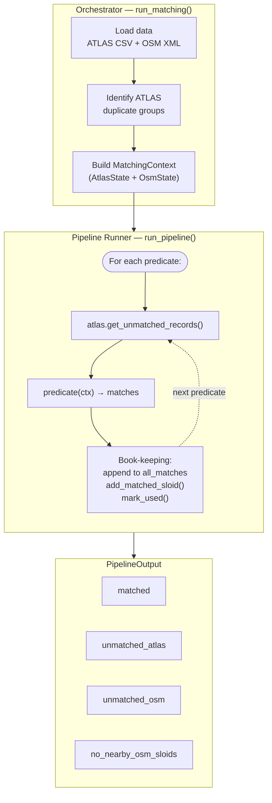
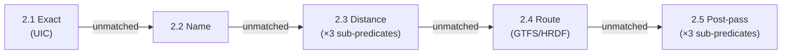
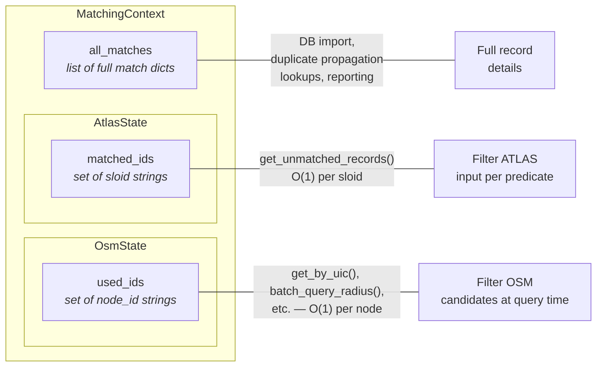

# Matching Process

The matching pipeline correlates ATLAS boarding platforms with OSM public transport nodes. It uses a **sequential, hit-first approach**: predicates run in priority order, and once an ATLAS entry or OSM node is claimed, later stages skip it.

## Architecture Overview



### Predicate sequence



## Matching Stages

Each stage is a plain Python function (a **predicate**) with a uniform interface:

```python
def predicate(ctx: MatchingContext) -> list[dict]
```

It receives the shared context, finds new matches among the remaining unmatched entries, and returns a list of match-record dicts. The stages run in this order:

| # | Predicate | Match types | Strategy |
|---|-----------|-------------|----------|
| **2.1** | [`exact_uic`](2.1%20Exact%20matching.md) | `exact` | UIC reference equality, refined by `local_ref` when ambiguous |
| **2.2** | [`name_match`](2.2%20Name%20matching.md) | `name` | `designationOfficial` against OSM name indexes |
| **2.3a** | [`group_proximity`](2.3%20Distance%20matching.md) | `distance_matching_1_*` | Conflict-free bipartite matching within UIC/name groups |
| **2.3b** | [`local_ref_distance`](2.3%20Distance%20matching.md) | `distance_matching_2` | Exact `local_ref == designation` within 50 m |
| **2.3c** | [`nearest_distance`](2.3%20Distance%20matching.md) | `distance_matching_3a/3b` | Single candidate or ratio test (d2/d1 >= 4) |
| **2.4** | [`route_match`](2.4%20Route%20Matching.md) | `route_unified_gtfs/hrdf` | GTFS/HRDF route token intersection |
| **2.5a** | [`postpass_unique_uic`](2.5%20Post-processing.md) | `exact_postpass` | Last-resort: only one unused OSM node left for a UIC |
| **2.5b** | [`duplicate_propagation`](2.5%20Post-processing.md) | `duplicate_propagation` | Copy a match to all unmatched ATLAS duplicates |
**Total matched pairs**: {{stat:summary.matched_pairs}} (~{{stat:summary.match_rate_percent}}% of ATLAS)

Each stage is documented in its own sub-page (links above). The rest of this document explains the **framework** that ties them together.

## Pipeline Framework

Three components work together: the **orchestrator** loads data and sets up context, the **runner** executes predicates in sequence with book-keeping, and the **state managers** track what's matched.

### Orchestrator (`orchestrator.py`)

`run_matching()` is the public entry point. It:

1. Locates and loads the ATLAS CSV and OSM XML files
2. Parses OSM XML into node dicts and pre-built indexes (UIC, name, directions)
3. Identifies ATLAS duplicate groups (entries sharing `number` + `designation`)
4. Constructs `AtlasState` and `OsmState`
5. Builds a `MatchingContext` and passes it to `run_pipeline()`
6. Returns `base_data`, `duplicate_sloid_map`, and `no_nearby_osm_sloids`

### Runner (`run_pipeline`)

The runner in `pipeline.py` chains predicates sequentially:

```python
for predicate in predicates:
    unmatched = ctx.atlas.get_unmatched_records()   # ① filter ATLAS
    matches = predicate(ctx)                         # ② run predicate

    for m in matches:                                # ③ book-keeping
        ctx.all_matches.append(m)
        ctx.atlas.add_matched_sloid(m['sloid'])
        ctx.osm.mark_used(m['osm_node_id'])
```

After all predicates complete, the runner builds a `PipelineOutput` containing:

| Field | Content |
|-------|---------|
| `matched` | All accumulated match records (`ctx.all_matches`) |
| `unmatched_atlas` | ATLAS entries still unmatched |
| `unmatched_osm` | OSM nodes never claimed |
| `no_nearby_osm_sloids` | Unmatched ATLAS entries with no OSM node within 50 m |
| `duplicate_sloid_map` | ATLAS duplicate groups (passed through) |

### Match records

All predicates create match records through `make_match()` (in `pipeline.py`), which delegates to `create_match_record()` (in `match_record.py`). This ensures every match has the same ~20-field structure regardless of which stage produced it — ATLAS fields, OSM fields, distance, match type, notes, and candidate pool size.

## State Management

The pipeline tracks state in three complementary stores. Each serves a distinct purpose — they are not redundant:



| Store | Type | Written by | Read by | Purpose |
|-------|------|-----------|---------|---------|
| `all_matches` | `list[dict]` | Runner (after each predicate) | `duplicate_propagation`, DB import, summary stats | Full match records with all fields |
| `matched_ids` | `set[str]` | Runner (`add_matched_sloid`) | `get_unmatched_records()` before each predicate | O(1) check: "is this ATLAS entry already matched?" |
| `used_ids` | `set[str]` | Runner + predicates internally (`mark_used`) | Every `OsmState` query method | O(1) check: "is this OSM node already claimed?" |

**Why not just one list?** `matched_ids` and `used_ids` are fast O(1) sets for filtering — deriving them from `all_matches` each time would be O(n). They also track different key spaces (SLOIDs vs OSM node IDs). `all_matches` carries the full record details needed downstream.

> [!NOTE]
> Predicates also call `mark_used()` internally (not just the runner). This is intentional: within a single predicate, multiple ATLAS entries compete for the same OSM nodes, so intra-predicate deduplication is needed. The runner's post-predicate `mark_used()` call is technically redundant but acts as a safety net — `set.add()` is idempotent.

### AtlasState

Manages the ATLAS dataset and tracks which SLOIDs have been matched:

| Method | Description |
|--------|-------------|
| `get_unmatched_records()` | Returns unmatched rows as `list[dict]` (filters by `matched_ids`) |
| `add_matched_sloid(sloid)` | Adds a SLOID to `matched_ids` |
| `get_all_rows_as_dict()` | All records keyed by SLOID |
| `duplicate_sloid_map` | `{sloid: [group_sloids]}` — ATLAS duplicate groups |

### OsmState

OSM data needs **multiple access patterns**, each optimized for a different stage. These are all pre-computed indexes over the same underlying `_all_nodes` dict:

| Index | Access pattern | Used by |
|-------|---------------|---------|
| `_uic_ref_dict` | O(1) lookup by UIC ref string | `exact_uic`, `postpass_unique_uic` |
| `_name_index` | O(1) lookup by name/uic_name/gtfs:name | `name_match` |
| KDTree (lazy) | Spatial radius queries in metres | `distance_matching`, `route_match` |
| `name_dirs` / `uic_dirs` | Per-node direction strings from relations | `route_match` |

All query methods (`get_by_uic`, `get_by_name`, `batch_query_radius`) automatically exclude nodes in `used_ids` and `railway=station` nodes (unless `include_stations=True`).

| Method | Returns | Notes |
|--------|---------|-------|
| `get_by_uic(uic)` | `list[dict]` | Excludes used + stations |
| `get_by_name(name)` | `list[dict]` | Excludes used + stations |
| `batch_query_radius(coords, max_dist)` | `[[(node, dist), ...], ...]` | Batched, uses `workers=-1` |
| `get_all_unmatched_grouped(key)` | `{tag_value: [nodes]}` | Used by `group_proximity` |
| `mark_used(node_id)` | — | Adds to `used_ids` |

## Matching Rules

### What is a "match"?

A match pairs one ATLAS platform (identified by `sloid`) with one OSM node (`osm_node_id`). The pipeline does not always produce 1:1 mappings:

- **Many ATLAS to one OSM** — allowed in high-confidence cases (e.g., a single OSM node for a UIC gets all ATLAS entries for that UIC)
- **One ATLAS to many OSM** — possible when an ATLAS platform maps to both a `public_transport=platform` and a `public_transport=stop_position` node

### Used-node rule

`used_ids` prevents later stages from picking an OSM node that an earlier stage already relied on — a guard against "double spending" across independent decisions. It does **not** mean an OSM node can only appear in one match record, because some stages intentionally produce many-to-one matches within the same predicate call.

### Station exclusion

| Predicate | Excludes stations? | Reason |
|-----------|--------------------|--------|
| `exact_uic`, `name_match` | Yes | Match platforms, not stations |
| `group_proximity`, `local_ref_distance`, `nearest_distance` | Yes | Same |
| `route_match` | **No** | Route tokens can match station-level nodes |
| Post-pass predicates | Yes | Same as default |

A "station" means `railway=station` or `public_transport=station`. Note that `aerialway=station` is **not** treated as a station.

### Key parameters

| Parameter | Value | Used by |
|-----------|-------|---------|
| `max_distance` | 50 m | All spatial predicates |
| `RATIO_TEST_FACTOR` | 4 | `nearest_distance` (d2/d1 threshold) |
| `RATIO_TEST_MIN_D2` | 10 m | `nearest_distance` (minimum 2nd-nearest distance) |

## Performance

Spatial queries use a **KDTree** (`scipy.spatial.cKDTree`) over 3D unit-sphere coordinates. The tree is built lazily on first use and filters `used_ids` at query time (not at build time), avoiding expensive rebuilds.

Predicates batch all unmatched ATLAS coordinates into a single numpy array and call `batch_query_radius()`, which delegates to SciPy's multithreaded C backend (`query_ball_point(points, workers=-1)`).

## Results Summary

| Metric | Value |
|--------|-------|
| **ATLAS platforms** | {{stat:summary.atlas_platforms}} |
| **Matched pairs** | {{stat:summary.matched_pairs}} |
| **Match rate** | {{stat:summary.match_rate_percent}}% |
| **Unmatched ATLAS** | {{stat:summary.unmatched_atlas}} |
| **Unmatched OSM** | {{stat:summary.unmatched_osm}} |

### No-nearby-OSM detection

After the pipeline completes, `compute_no_nearby_osm()` flags unmatched ATLAS entries that have no OSM node at all within 50 m. These are returned separately as `no_nearby_osm_sloids` for [problem detection](3.%20Problems.md).

## Code References

| Component | File | Key exports |
|-----------|------|-------------|
| Orchestrator | [orchestrator.py](../matching_and_import_db/orchestrator.py) | `run_matching()`, `DEFAULT_PIPELINE` |
| Pipeline framework | [pipeline.py](../matching_and_import_db/pipeline.py) | `MatchingContext`, `run_pipeline()`, `make_match()` |
| State management | [state.py](../matching_and_import_db/state.py) | `AtlasState`, `OsmState`, `OsmState.from_xml_file()` |
| Match records | [match_record.py](../matching_and_import_db/match_record.py) | `create_match_record()`, `extract_atlas_fields()` |
| Exact matching | [exact_matching.py](../matching_and_import_db/predicates/exact_matching.py) | `exact_uic()` |
| Name matching | [name_matching.py](../matching_and_import_db/predicates/name_matching.py) | `name_match()` |
| Distance matching | [distance_matching.py](../matching_and_import_db/predicates/distance_matching.py) | `group_proximity()`, `local_ref_distance()`, `nearest_distance()` |
| Route matching | [route_matching_unified.py](../matching_and_import_db/predicates/route_matching_unified.py) | `route_match()` |
| Post-processing | [postpass_matching.py](../matching_and_import_db/predicates/postpass_matching.py) | `postpass_unique_uic()`, `duplicate_propagation()` |
| Spatial index | [spatial_index.py](../matching_and_import_db/spatial_index.py) | `build_kdtree_from_nodes()`, `batch_to_xyz()` |
| Utilities | [utils.py](../matching_and_import_db/utils.py) | `haversine_distance()`, `is_osm_station()` |
