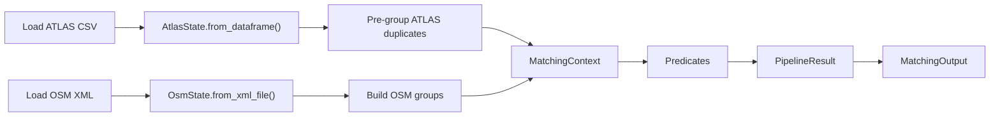
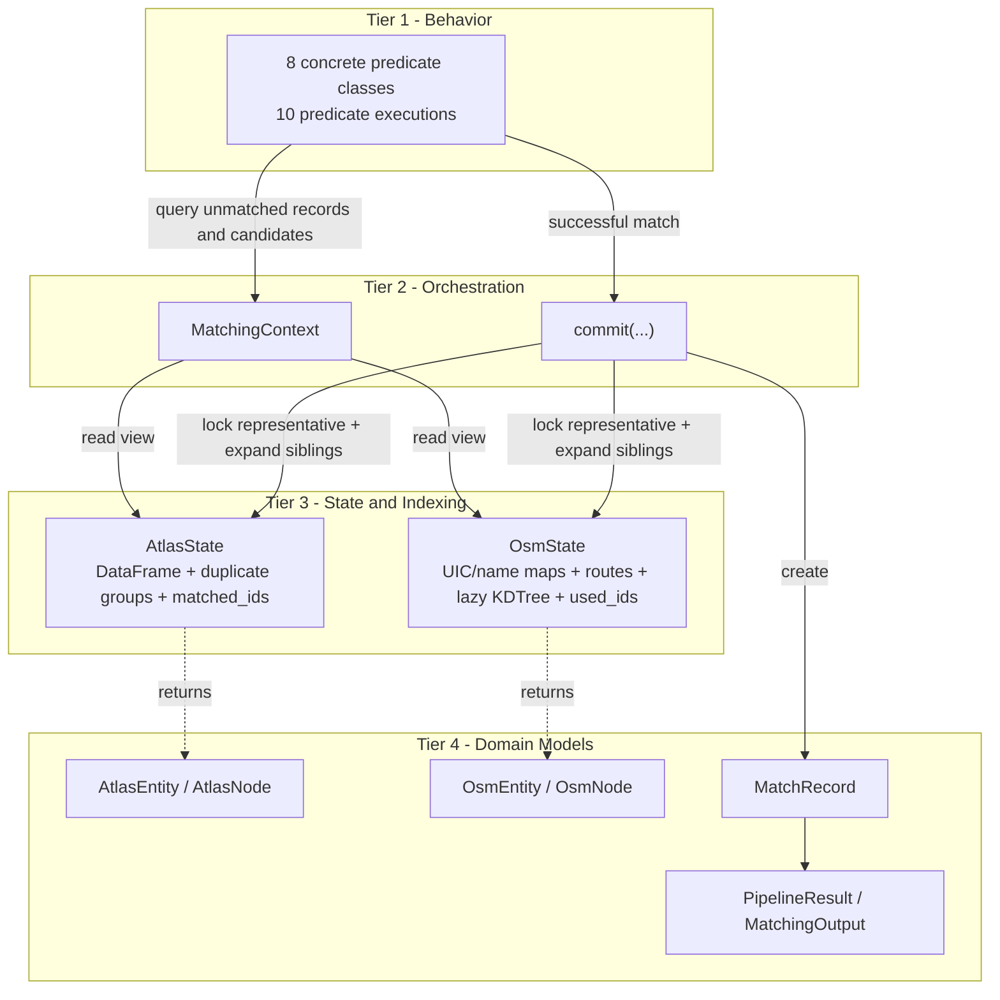
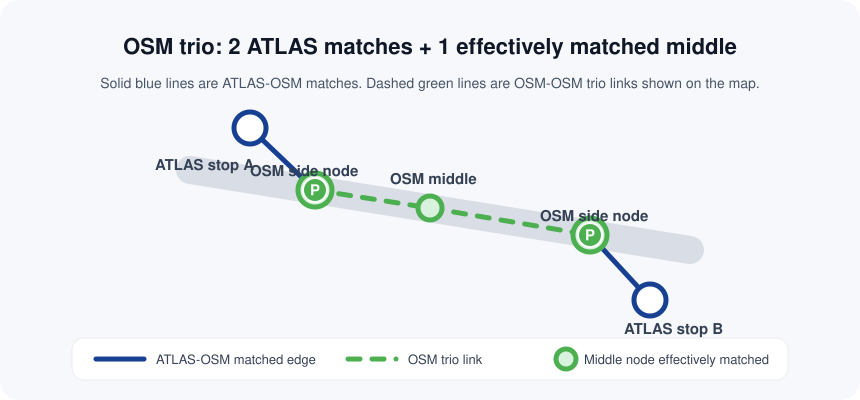
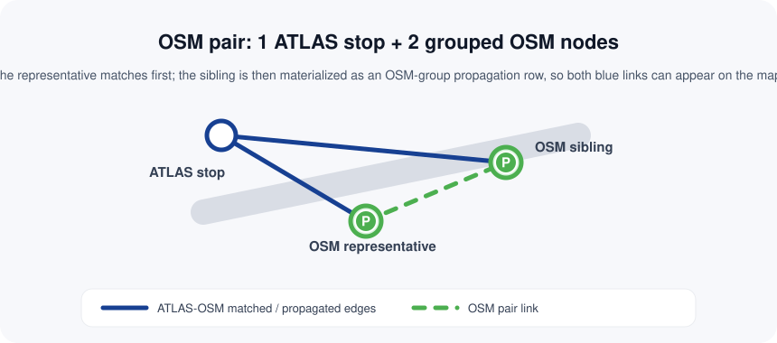
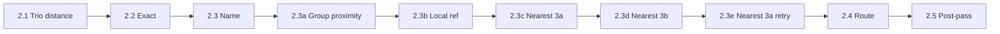
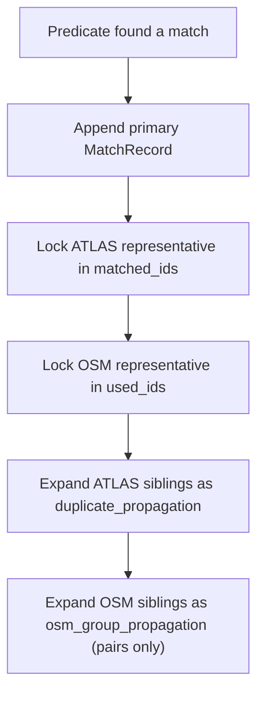

# Matching Process

The matching pipeline correlates ATLAS boarding platforms with OSM public transport nodes. It is **ATLAS-driven** and **sequential**: predicates run in a fixed priority order, and every successful `commit()` immediately locks the matched ATLAS and OSM representatives so later logic only sees what is still free.

This page is organized in the same order the code runs:

1. Load raw data into state managers
2. Pre-group duplicates and obvious OSM pair/trio groups
3. Run the 10 predicate executions in order
4. Record matches through `ctx.commit()`
5. Return `PipelineResult` / `MatchingOutput`

## End-to-End Flow



## Conceptual Abstractions

The runtime flow above shows execution order. The diagram below shows the conceptual layers the code is built around: predicates decide, the context orchestrates, the state layer answers queries and tracks locks, and domain models flow upward as the shared data abstraction.



## What Counts as a Match

A match is represented by a `MatchRecord`, which links one `AtlasNode` to one `OsmNode` plus metadata about how the link was made.

| Field | Description |
|-------|-------------|
| `atlas_node` | The matched ATLAS platform |
| `osm_node` | The matched OSM node |
| `match_type` | Which rule produced the link, for example `exact`, `name`, `distance_matching_3b` |
| `distance_m` | Haversine distance stored by the predicate |
| `notes` | Short explanation such as `gtfs_tokens` or `Exact local_ref match within max_distance` |
| `problems` | Quality flags populated later by problem evaluation |

Most links are 1 ATLAS → 1 OSM, but the pipeline intentionally allows these exceptions:

| Cardinality | Why it happens | Where it comes from |
|-------------|----------------|---------------------|
| N ATLAS → 1 OSM | One OSM node is the only candidate for a UIC | `ExactUicPredicate` single-OSM case |
| 1 ATLAS → N OSM | One ATLAS entry is matched to multiple OSM nodes sharing the same UIC | `ExactUicPredicate` single-ATLAS case |
| N ATLAS → 1 OSM | Duplicate ATLAS siblings are auto-expanded after the representative matches | `ctx.commit()` |
| 1 ATLAS → N OSM | OSM pair siblings are auto-expanded after the representative matches | `ctx.commit()` for pair groups only |

For `osm_trio`, the pipeline still creates only the two primary side-node `MatchRecord`s. The middle `stop_position` is not a `MatchRecord`; it becomes an `effectively_matched` database row later during import when both trio sides were matched.

## Phase 1: Build State Before Matching

The matcher does not work directly on raw DataFrame rows or raw XML tags. It first builds two state managers.

| State | Built from | Main job |
|-------|------------|----------|
| `AtlasState` | `stops_ATLAS.csv` | Convert ATLAS rows into `AtlasNode`s, track matched SLOIDs, load route evidence |
| `OsmState` | `osm_data.xml` | Parse OSM nodes and route relations, build attribute indexes, build spatial index on demand |

### `AtlasState`

`AtlasState.from_dataframe()` does three important things before the first predicate runs:

1. Converts ATLAS rows into immutable `AtlasNode` models on demand.
2. Detects duplicate groups where entries share the same `number` + `designation`.
3. Loads `data/processed/atlas_routes.csv` (and related normalized files) into `get_routes(sloid)` so route matching can stay file-I/O free.

#### ATLAS duplicate grouping

ATLAS duplicates are grouped **before** matching, with no distance heuristic.

1. `duplicate_sloid_map` groups rows sharing the same `(number, designation)`.
2. The first sorted SLOID becomes the representative.
3. The remaining SLOIDs become hidden siblings.
4. `get_unmatched_records()` returns one `AtlasEntity` wrapper for the representative instead of exposing all siblings individually.

When that representative is committed, siblings get their own `MatchRecord`s with `match_type='duplicate_propagation'`.

### `OsmState`

`OsmState.from_xml_file()` parses OSM nodes and route relations into several indexes over the same underlying node set.

| Index / Store | Purpose | Used by |
|---------------|---------|---------|
| `_uic_ref_dict` | Lookup by `uic_ref` | Exact and post-pass matching |
| `_name_index` | Lookup by `name`, `uic_name`, `gtfs:name` | Name matching |
| `_node_routes` | Per-node GTFS route memberships from route relations | Route matching |
| `name_dirs` / `uic_dirs` | Per-node direction strings | Route matching |
| Lazy KDTree | Radius queries in metres | Distance and route matching |

`OsmNode.is_station` returns `True` for `public_transport=station` or `railway=station`, but explicitly **not** for `public_transport=stop_position` and **not** for `aerialway=station`.

### OSM grouping before predicates

`OsmState.build_groups()` runs before matching so obvious OSM siblings behave like one logical entity during predicate execution.

Grouping now runs in two layers, in this order:

1. **Trios first** (`osm_trio`) for strict 3-node UIC cases.
2. **Pairs second** for all remaining reciprocal sibling pairs, with a perfect-count branch first.

The map uses one consistent visual convention for grouped OSM structures:

- Solid blue lines are ATLAS-OSM matches.
- Dashed green lines are OSM-OSM structural links inside a pair or trio.
- Trio middles are shown on the map once imported as `effectively_matched`, but they are still not pipeline `MatchRecord`s.

| Group type | Representative | Sibling(s) | Core rule |
|------------|----------------|------------|-----------|
| `osm_trio` | One non-middle side node | Side partner + identified middle | UIC-scoped trio: exactly 3 OSM nodes + exactly 1 stop_position + exactly 2 ATLAS rows for that UIC, with both side nodes within 15 m of the middle |
| `osm_pair_uic_equal_15m` | `public_transport=platform` | `public_transport=stop_position` | UIC-scoped perfect-count branch: `platform_count == stop_position_count == atlas_effective_count`; reciprocal nearest-neighbour within 15 m; no ratio gate |
| `osm_pair_uic` | `public_transport=platform` | `public_transport=stop_position` | Reciprocal nearest-neighbour pairing within 12 m, UIC-scoped |
| `osm_pair_name_equal_15m` | `public_transport=platform` | `public_transport=stop_position` | Name-scoped perfect-count branch (anchored to UIC): equal counts + reciprocal nearest-neighbour within 15 m; no ratio gate |
| `osm_pair_name` | `public_transport=platform` | `public_transport=stop_position` | Same spatial pairing, but name-scoped and anchored back to a UIC |
| `osm_pair_tram_equal_15m` | `railway=tram_stop` | `public_transport=stop_position` | Tram-scoped perfect-count branch: equal counts + reciprocal nearest-neighbour within 15 m; no ratio gate |
| `osm_pair_tram` | `railway=tram_stop` | `public_transport=stop_position` | Same pairing logic for tram stops |

#### Visual examples

The screenshots below are represented as simplified SVG schematics so the pair/trio semantics remain readable in the documentation PDF as well.

**OSM trio matched to 2 ATLAS stops**



The trio's two side nodes are the only true pipeline matches. The middle `stop_position` remains unmatched during predicate execution, then becomes `effectively_matched` during import so it can be rendered on the map with dashed green OSM-OSM links to both sides.

**OSM pair matched to 1 ATLAS stop**



For a pair, the representative node matches first and `ctx.commit()` propagates that result to the sibling as `osm_group_propagation`. On the map this reads as two blue ATLAS-OSM links plus one dashed green OSM-OSM pair link.

Important details:

1. Grouping uses reciprocal nearest-neighbour checks, not just raw proximity.
2. Trios are only registered when both side nodes are within `15 m` of the middle `stop_position`; otherwise those nodes stay available for the later pair grouping paths.
3. For perfect-count anchors (`left_count == right_count == atlas_effective_count`), grouping first tries reciprocal conflict-free pairing within `15 m` and bypasses ratio checks.
4. `atlas_effective_count` is computed per UIC by counting only ATLAS rows whose nearest same-UIC OSM node is within `30 m`.
5. The strict/relaxed fallback path still uses the original (unfiltered) `atlas_count`.
6. If the perfect-count branch does not apply or cannot produce a full 1:1 pairing, it tries a `1.5` ratio threshold and accepts those pairs only when grouped + ungrouped OSM entities exactly match the ATLAS count for that anchor.
7. If the strict complete-count check fails, it retries with `2.0` and accepts reciprocal pairs it finds as an incomplete group set.
8. In ratio-based paths, the ratio test compares the nearest candidate (which must be within `12 m`) against the true second-nearest candidate, even if that second candidate is beyond `12 m`. If no second candidate exists at all, the ratio test does not reject the pair.
9. The same perfect-count-first then strict-vs-incomplete policy applies to UIC, name, and tram pairing paths.

After grouping, lookup methods such as `get_by_uic()`, `get_by_name()`, and `batch_query_radius()` return `OsmEntity` wrappers for representatives while hiding siblings.

## Phase 2: Run the Predicate Pipeline

The runner executes predicates in this order:



Each predicate sees only the current unmatched view of the state. Once a representative is committed, later predicates skip it automatically.

| Step | Predicate | Match types | What it actually does |
|------|-----------|-------------|------------------------|
| `2.1` | [`TrioDistanceMatchingPredicate`](2.3%20Distance%20matching.md) | `distance_matching_trio` | For each trio UIC with exactly 2 unmatched ATLAS rows, match the two non-middle side nodes via minimum-total-distance 2x2 assignment; keep middle node unmatched |
| `2.2` | [`ExactUicPredicate`](2.1%20Exact%20matching.md) | `exact` | Matches `AtlasNode.uic_ref` to `OsmNode.uic_ref`; when both sides have multiples, refines by `designation == local_ref` |
| `2.3` | [`NameMatchPredicate`](2.2%20Name%20matching.md) | `name` | Matches `designationOfficial` through the OSM name index and optionally refines by `designation == local_ref` |
| `2.3a` | [`GroupProximityPredicate`](2.3%20Distance%20matching.md) | `distance_matching_1_uic_ref`, `distance_matching_1_uic_name`, `distance_matching_1_name` | Conflict-free maximum-cardinality assignment within grouped ATLAS and OSM candidates |
| `2.3b` | [`LocalRefDistancePredicate`](2.3%20Distance%20matching.md) | `distance_matching_2` | Exact `designation == local_ref` within 50 m |
| `2.3c` | [`NearestDistancePredicate`](2.3%20Distance%20matching.md) | `distance_matching_3a` | First single-candidate nearest-distance pass within 50 m |
| `2.3d` | [`NearestDistancePredicate`](2.3%20Distance%20matching.md) | `distance_matching_3b` | Ratio-test nearest-distance pass within 50 m |
| `2.3e` | [`NearestDistancePredicate`](2.3%20Distance%20matching.md) | `distance_matching_3a_second_pass` | Second single-candidate nearest-distance retry after ratio-pass locking |
| `2.4` | [`RouteMatchPredicate`](2.4%20Stop-stop%20matching%20using%20routes.md) | `route_gtfs_gtfs` | Still limited to 50 m, then tries GTFS route-id token overlap first and an exact direction-name fallback second |
| `2.5` | [`PostpassUniqueUicPredicate`](2.5%20Post-processing.md) | `exact_postpass` | Last pass for `1 ATLAS + 1 OSM` left for a UIC when the OSM node has no `local_ref` |

### Predicate contract

All predicates implement the same interface:

```python
class BasePredicate(ABC):
    @abstractmethod
    def run(self, ctx: MatchingContext) -> None:
        ...
```

They do not return match records. They query state and call `ctx.commit()` when they decide to match.

## Phase 3: Record Matches Through `ctx.commit()`

`MatchingContext.commit()` is the only mutation gateway in the pipeline.



For `osm_trio` groups, `ctx.commit()` intentionally skips OSM sibling propagation so the trio middle node does not become an `osm_group_propagation` match. During the database import phase, if both of its side nodes are successfully matched, the importer promotes the middle node directly to `effectively_matched` for fast querying and map rendering.

That immediate locking is why the pipeline is safe even inside a single predicate loop: later rows consult the updated state, not just the original snapshot.

This matters especially for the predicates that batch KDTree lookups up front:

1. `LocalRefDistancePredicate`
2. `NearestDistancePredicate`
3. `RouteMatchPredicate`

They all re-check `used_ids` against the live state before committing so they do not reuse a stale candidate computed earlier in the same run.

## Phase 4: Global Matching Rules

### Station filtering

| Predicate family | Stations excluded? | Notes |
|------------------|--------------------|-------|
| Exact, name, distance, post-pass | Partially | `get_by_uic()`, `get_by_name()`, and non-station KDTree queries exclude `public_transport=station` and `railway=station`, but `aerialway=station` remains eligible because `OsmNode.is_station` explicitly returns `False` for aerialway stations |
| Route matching | Partially | Uses `batch_query_radius(..., include_stations=False)`, so `public_transport=station` and `railway=station` are excluded, while `aerialway=station` remains eligible because `OsmNode.is_station` returns `False` for aerialway stations |

### Spatial constants

| Constant | Value | Used by |
|----------|-------|---------|
| `max_distance` | `50 m` | All spatial predicates, including route matching |
| `RATIO_TEST_FACTOR` | `4` | `NearestDistancePredicate` |
| `RATIO_TEST_MIN_D2` | `10 m` | `NearestDistancePredicate` |
| `GROUP_MAX_DISTANCE_M` | `12 m` | OSM pre-grouping |
| `GROUP_PERFECT_COUNT_MAX_DISTANCE_M` | `15 m` | OSM pre-grouping perfect-count branch |
| `ATLAS_NEARBY_OSM_MAX_DISTANCE_M` | `30 m` | Perfect-count ATLAS effective count |

### Distance storage

All predicates store the actual haversine distance they used, including exact UIC matches.

## Outputs

`run_pipeline()` returns a `PipelineResult`, and `run_matching()` wraps it into `MatchingOutput`.

| Type | Fields | Description |
|------|--------|-------------|
| `PipelineResult` | `matched`, `unmatched_atlas`, `unmatched_osm` | Pure pipeline output |
| `MatchingOutput` | `PipelineResult` fields plus `duplicate_sloid_map`, `osm_stop_units`, `all_osm_nodes` | Pipeline output plus pre-pipeline grouping state needed by the importer |

`unmatched_atlas` contains all unmatched nodes, including hidden duplicate siblings of unmatched representatives. `unmatched_osm` contains all unmatched OSM nodes, including group siblings and stations if they were never used.

### No-nearby-OSM detection

After matching, the importer separately flags unmatched ATLAS rows that have no OSM node at all within 50 m. That does **not** create additional matches; it feeds [problem detection](3.%20Problems.md).

## Domain Models

The pipeline uses three core domain models plus two entity wrappers.

| Type | Purpose |
|------|---------|
| `AtlasNode` | Immutable ATLAS platform model |
| `OsmNode` | Immutable OSM node model |
| `MatchRecord` | Mutable link object with match metadata |
| `AtlasEntity` | Wrapper that exposes one representative plus duplicate siblings |
| `OsmEntity` | Wrapper that exposes one representative plus grouped OSM siblings |

Key fields on `AtlasNode`:

| Field | Source |
|-------|--------|
| `sloid` | `sloid` |
| `uic_ref` | `number` |
| `designation` | `designation` |
| `designation_official` | `designationOfficial` |
| `business_org_abbr` | `servicePointBusinessOrganisationAbbreviationEn` |

Key fields on `OsmNode`:

| Field | Source |
|-------|--------|
| `node_id` | XML node id |
| `local_ref` | `local_ref`, falling back to `ref` |
| `name` | `name` |
| `uic_name` | `uic_name` |
| `uic_ref` | `uic_ref` |
| `network`, `operator` | Same-named OSM tags |
| `public_transport`, `railway`, `amenity`, `aerialway` | Same-named OSM tags |
| `tags` | Full tag dict |

## Performance Notes

Spatial matching uses a lazy `scipy.spatial.cKDTree` over 3D unit-sphere coordinates. The tree is cached and only rebuilt when the station-inclusion mode changes; matched nodes are filtered at query time rather than by rebuilding the tree after every commit.

The batched KDTree path is used by the local-ref, nearest-distance, and route predicates. `GroupProximityPredicate` does not use the KDTree; it builds a full pairwise distance matrix with NumPy broadcasting over each grouped candidate set.

## Results Summary

| Metric | Value |
|--------|-------|
| **ATLAS platforms** | {{stat:summary.atlas_platforms}} |
| **Matched pairs** | {{stat:summary.matched_pairs}} |
| **Match rate** | {{stat:summary.match_rate_percent}}% |
| **Unmatched ATLAS** | {{stat:summary.unmatched_atlas}} |
| **Unmatched OSM** | {{stat:summary.unmatched_osm}} |

## Code References

| Component | File |
|-----------|------|
| Domain models | [models.py](../matching_and_import_db/models.py) |
| Orchestrator | [orchestrator.py](../matching_and_import_db/orchestrator.py) |
| Pipeline framework | [pipeline.py](../matching_and_import_db/pipeline.py) |
| State management | [state.py](../matching_and_import_db/state.py) |
| Exact matching | [predicates/exact_matching.py](../matching_and_import_db/predicates/exact_matching.py) |
| Name matching | [predicates/name_matching.py](../matching_and_import_db/predicates/name_matching.py) |
| Distance matching | [predicates/distance_matching.py](../matching_and_import_db/predicates/distance_matching.py) |
| Route matching | [predicates/route_matching_gtfs.py](../matching_and_import_db/predicates/route_matching_gtfs.py) |
| Post-processing | [predicates/postpass_matching.py](../matching_and_import_db/predicates/postpass_matching.py) |
| Spatial index | [utils/spatial_index.py](../matching_and_import_db/utils/spatial_index.py) |
