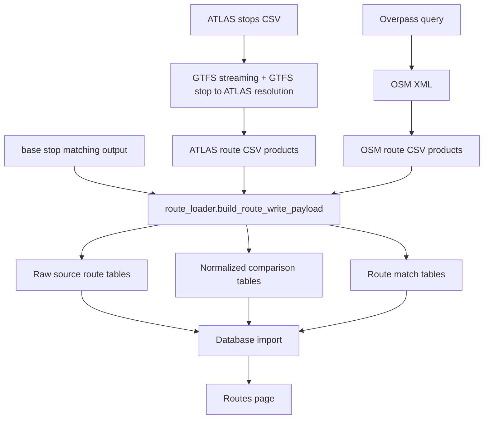

# Routes

The route subsystem connects the source-side route products generated from GTFS and OpenStreetMap to the normalized comparison tables used by the importer and the Routes page.

At a high level, the route pipeline has three stages:

1. Source-specific route artifacts are produced in `data/processed/`.
2. The importer normalizes those artifacts into shared `line_families`, `itineraries`, and `stop_calls` rows.
3. Route-level matching populates `line_family_matches` and `itinerary_matches`.

This chapter explains the route model itself. Source extraction details remain in the preprocessing chapter, and stop-to-stop route-assisted matching remains in the matching chapter.

## Route Layers

The implemented route pipeline has three conceptual layers:

| Layer | Purpose | Main Outputs |
|---|---|---|
| Source artifacts | Preserve GTFS-derived ATLAS route structure and OSM PTv2 route structure | `atlas_line_families.csv`, `atlas_itineraries.csv`, `atlas_itinerary_stop_calls.csv`, `osm_route_*.csv` |
| Normalized comparison | Convert both sides into a shared route model | `line_families`, `itineraries`, `stop_calls` |
| Matching | Link equivalent families and itineraries | `line_family_matches`, `itinerary_matches` |

## Main Inputs

- GTFS route-family and itinerary artifacts built by `matching_and_import_db/downloader/get_atlas_gtfs.py`
- OSM route-master and route-relation artifacts built by `matching_and_import_db/downloader/get_osm_data.py`
- base stop-matching output used by `matching_and_import_db/database/route_loader.py` to resolve physical stop identity across both sides

## Main Responsibilities

The route subsystem inside `matching_and_import_db/` is responsible for:

- reconstructing ATLAS-side line families and itineraries from GTFS
- retaining OSM route-master, route-relation, tag, member, and stop-member metadata
- resolving route stops onto shared physical stop identities where possible
- matching ATLAS and OSM line families
- pairing itineraries inside matched families

It also supports two different consumers:

- **stop matching runtime**: `AtlasState`, `OsmState`, `RouteState`, and `RouteMatchPredicate`
- **route import/runtime**: `database/route_loader.py` and the `/routes` page queries

## Subpages

- [2.1 Route Pipeline Data Flow](2.1%20Route%20Pipeline%20Data%20Flow.md)
- [2.2 Route-Route Matching](2.2%20Route-Route%20Matching.md)

## Related Documentation

- [1.2 GTFS ATLAS data](1.2%20GTFS%20ATLAS%20data.md)
- [1.3 OSM data](1.3%20OSM%20data.md)
- [3.3 Stop-stop matching using routes](3.3%20Stop-stop%20matching%20using%20routes.md)
- [5.1 Import Process](5.1%20Import%20Process.md)
- [6.6 Routes Pages](6.6%20Routes%20Pages.md)

# Route Pipeline Data Flow

This page explains how route data moves from source files to the imported route browser model.

The route pipeline has three layers:

1. **Source artifacts** generated by the downloader
2. **Normalized comparison tables** generated by the route loader
3. **Match tables** that link equivalent ATLAS and OSM route entities

## Source Layer

The downloader stage writes two source-specific route products.

### ATLAS side

The ATLAS stops CSV does not contain native line-family or itinerary entities, so the pipeline reconstructs them from GTFS.

The GTFS side uses four files:

| File | Role |
|---|---|
| `stops.txt` | stop IDs, names, coordinates, and stop metadata |
| `stop_times.txt` | ordered stop sequence per `trip_id` |
| `trips.txt` | assigns each `trip_id` to a `route_id` and `direction_id` |
| `routes.txt` | line-level metadata such as short name, long name, and route type |

Conceptually:

- `route_id` becomes the ATLAS line-family key
- raw trips are grouped into itinerary buckets inside each line family
- each emitted itinerary keeps one representative ordered stop sequence
- each stop call keeps the resolved physical stop identity when available

The resulting source tables are:

- `atlas_line_families.csv`
- `atlas_itineraries.csv`
- `atlas_itinerary_stop_calls.csv`

### OSM side

On the OSM PTv2 side, the route structure is entity-first:

1. stop and platform elements
2. `type=route` relations
3. optional `type=route_master` relations above them

The downloader preserves that hierarchy in:

- `osm_route_masters.csv`
- `osm_route_master_tags.csv`
- `osm_route_master_members.csv`
- `osm_route_relations.csv`
- `osm_route_relation_tags.csv`
- `osm_route_relation_members.csv`
- `osm_route_relation_stops.csv`

In this model, the OSM `type=route` relation is the itinerary or variant layer, while `type=route_master` is the family layer when present.

## Normalized Comparison Layer

`matching_and_import_db/database/route_loader.py` converts both source products into a shared comparison model.

The normalized tables are:

- `line_families`
- `itineraries`
- `stop_calls`

### `line_families`

This table stores one comparable family row per source-side family.

- ATLAS rows are created from `atlas_line_id`
- OSM rows are grouped by `route_master_id` when present
- if no route master exists, the loader falls back to normalized `gtfs_route_id`
- if that is still missing, it falls back again to synthetic keys based on `ref`, `operator`, `network`, or the relation itself

### `itineraries`

This table stores one comparable itinerary row per source-side itinerary.

- ATLAS itineraries come from `atlas_itineraries.csv`
- OSM itineraries come from `osm_route_relations.csv`
- both sides carry a `direction_id`, display label, and stop count when available

### `stop_calls`

This table stores ordered stop membership for each itinerary.

- ATLAS stop calls carry GTFS stop IDs, resolved SLOIDs, platform codes, and stop labels
- OSM stop calls carry resolved node IDs, member roles, canonical stop keys, and stop labels

The importer prefers a shared physical stop identity whenever it can resolve one. On the OSM side that resolution uses the base stop-matching output first, then single-candidate UIC fallbacks, then the raw OSM canonical key.

## Match Layer

After normalization, the route loader builds two match tables:

- `line_family_matches`
- `itinerary_matches`

The family match table links one ATLAS line family to one OSM family.
The itinerary match table links one ATLAS itinerary to one OSM itinerary inside an already matched family.

The pairing rules are documented in [2.2 Route-Route Matching](2.2%20Route-Route%20Matching.md).

## Relationship to Stop Matching

Route data is used in two different places in the system:

1. **Stop-level route matching** inside the matching pipeline, where route tokens help decide whether a nearby ATLAS and OSM stop are the same physical stop
2. **Route-level comparison** during import preparation, where whole line families and itineraries are normalized and paired

That distinction is important:

- [3.3 Stop-stop matching using routes](3.3%20Stop-stop%20matching%20using%20routes.md) is about stop matching
- this chapter is about the route model and route comparison tables

## Main Code Paths

| Module | Role |
|--------|------|
| `matching_and_import_db/downloader/get_atlas_gtfs.py` | Builds ATLAS-side GTFS route artifacts and GTFS identity caches |
| `matching_and_import_db/downloader/get_osm_data.py` | Builds OSM route-master and route-relation artifacts |
| `matching_and_import_db/database/route_loader.py` | Normalizes both sides and writes route match payloads |
| `matching_and_import_db/database/importer.py` | Persists the source tables, normalized tables, and route match tables |