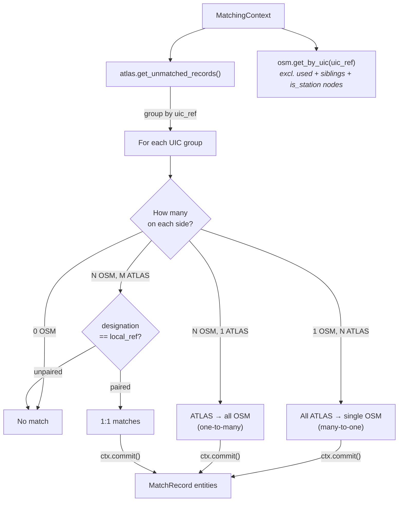

# Exact Matching

Exact matching is the **second predicate run** in the pipeline, producing the **highest-confidence non-distance matches** by aligning entries through their shared UIC reference numbers.

## Overview

The UIC (Union Internationale des Chemins de fer) reference is a standardized identifier used across European rail systems.

| Dataset | UIC Field | Domain Model Field | Example |
|---------|-----------|-------------------|---------|
| ATLAS | `number` | `AtlasNode.uic_ref` | 8503000 |
| OSM | `uic_ref` tag | `OsmNode.uic_ref` | 8503000 |

**Result**: {{stat:matching_stages.exact.count}} exact matches

## How It Works

`ExactUicPredicate` groups all unmatched `AtlasNode` entries by `uic_ref`, then queries `ctx.osm.get_by_uic()` for each UIC. Matches are recorded immediately via `ctx.commit()`.

> **Implementation note**: exact matches store the actual haversine distance between the ATLAS and OSM coordinates.

## Matching Scenarios

| Scenario | Example | Resolution |
|----------|---------|------------|
| **1 OSM → N ATLAS** | Single node, multiple platforms | All ATLAS entries match to one node |
| **N OSM → 1 ATLAS** | Multiple nodes, single platform | One platform matches all nodes |
| **N OSM ↔ M ATLAS** | Multiple both sides | Disambiguate by `designation` ↔ `local_ref` |

### Disambiguation

When both sides have multiple entries with the same UIC, the `designation` field (`AtlasNode.designation` — the ATLAS platform number) is matched against `local_ref` (`OsmNode.local_ref` — the OSM platform identifier), case-insensitively.

If no unambiguous pairing can be built, the remaining ATLAS entries are not matched in this stage. The predicate also checks `ctx.osm.is_used()` to avoid double-booking an OSM node within the many-to-many case.

| Field | Domain Model | Meaning | Example |
|-------|-------------|---------|---------|
| `designation` | `AtlasNode.designation` | Platform identifier (letter/number) | "A", "1", "Nord" |
| `designationOfficial` | `AtlasNode.designation_official` | Full stop name | "Zurich HB" |
| `local_ref` | `OsmNode.local_ref` | Platform identifier | "A", "1" |
| `uic_ref` | `OsmNode.uic_ref` | UIC reference number | "8503000" |

**Key distinction**: `designation` is not `designation_official`
- `designation`: Platform-level identifier (e.g., "Track 1")
- `designation_official`: Station/stop name (e.g., "Zurich HB")

This ensures we match individual platforms rather than entire station buildings.

## Code Reference

| Class | Description |
|-------|-------------|
| `ExactUicPredicate` | Predicate class; groups by UIC, handles all three scenarios including disambiguation |

All logic is in [predicates/exact_matching.py](../matching_and_import_db/predicates/exact_matching.py).
