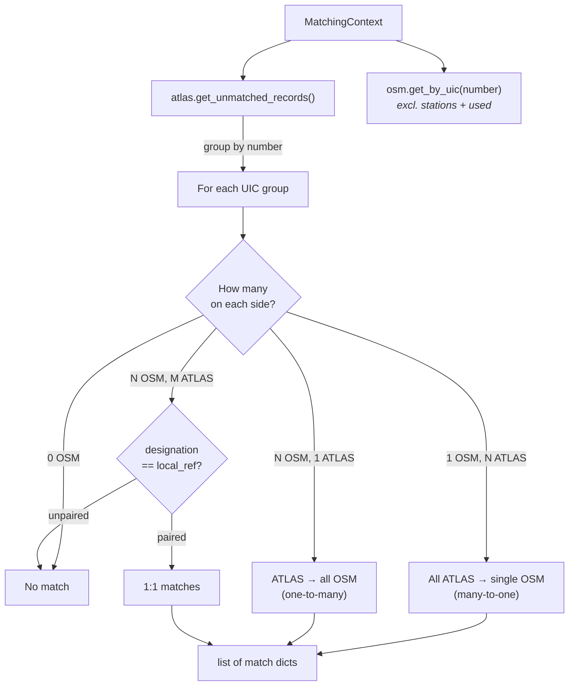

# Exact Matching

Exact matching is the **first predicate** in the pipeline, producing the **highest-confidence matches** by aligning entries through their shared UIC reference numbers.

## Overview

The UIC (Union Internationale des Chemins de fer) reference is a standardized identifier used across European rail systems.

| Dataset | UIC Field | Example |
|---------|-----------|---------|
| ATLAS | `number` | 8503000 |
| OSM | `uic_ref` | 8503000 |

**Result**: {{stat:matching_stages.exact.count}} exact matches

## Required Data

Exact matching relies on the following data from the `MatchingContext`:
- `uic_ref_dict`: pre-built index mapping `{uic_ref → [osm_node_entries]}`

## Matching Scenarios

| Scenario | Example | Resolution |
|----------|---------|------------|
| **1 OSM → N ATLAS** | Single node, multiple platforms | All ATLAS match to one node |
| **N OSM → 1 ATLAS** | Multiple nodes, single platform | One platform matches all nodes |
| **N OSM ↔ M ATLAS** | Multiple both sides | Disambiguate by `designation` ↔ `local_ref` |

### Disambiguation

When both sides have multiple entries with the same UIC, the `designation` field (ATLAS platform number) is matched against `local_ref` (OSM platform identifier), case-insensitively.

If no unambiguous pairing can be built, the remaining ATLAS entries are not matched in this stage.

| Field | Dataset | Meaning | Example |
|-------|---------|---------|---------|
| `designation` | ATLAS | Platform identifier (letter/number) | "A", "1", "Nord" |
| `designationOfficial` | ATLAS | Full stop name | "Zürich HB" |
| `local_ref` | OSM | Platform identifier | "A", "1" |
| `uic_ref` | OSM | UIC reference number | "8503000" |

**Key distinction**: `designation` ≠ `designationOfficial`
- `designation`: Platform-level identifier (e.g., "Track 1")
- `designationOfficial`: Station/stop name (e.g., "Zürich HB")

This ensures we match individual platforms rather than entire station buildings.

## Code Reference

| Function | Description |
|----------|-------------|
| `exact_uic(ctx)` | Predicate entry point; groups by UIC, handles all three scenarios including disambiguation |

All logic is in [exact_matching.py](../matching_and_import_db/exact_matching.py).
