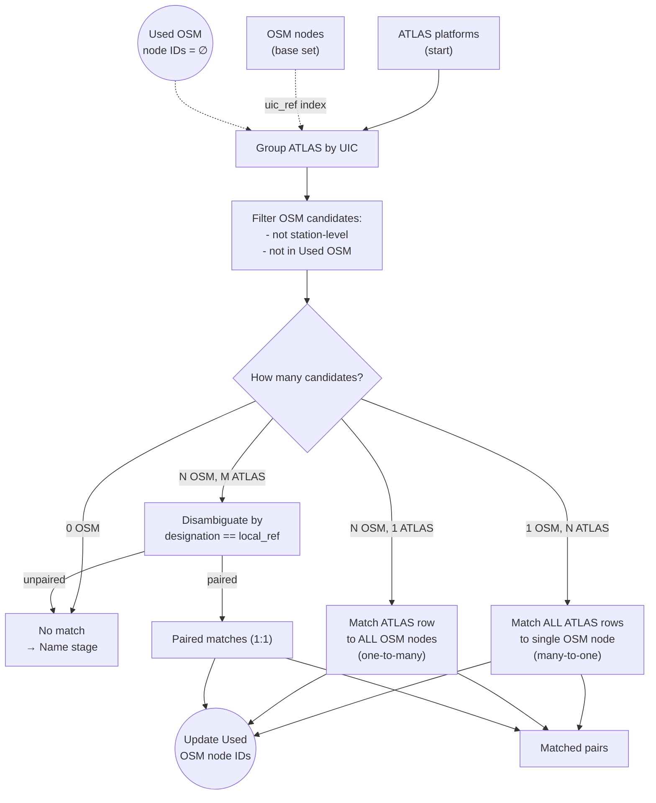

# Exact Matching

Exact matching is the **first stage** of the pipeline, producing the **highest-confidence matches** by aligning entries through their shared UIC reference numbers.



## Overview

The UIC (Union Internationale des Chemins de fer) reference is a standardized identifier used across European rail systems. When both datasets reference the same UIC, we have a **definitive match**.

| Dataset | UIC Field | Example |
|---------|-----------|---------|
| ATLAS | `number` | 8503000 |
| OSM | `uic_ref` | 8503000 |

**Result**: {{stat:matching_stages.exact.count}} exact matches

## Inputs / Outputs

**Input**
- ATLAS: `number` (UIC), `designation`, `designationOfficial`, coordinates
- OSM: `uic_ref`, `local_ref`, coordinates, tags
- State: `used_osm_node_ids` (OSM nodes already “claimed” by earlier decisions)

**Output**
- New match pairs (`sloid` ↔ `osm_node_id`)
- Unmatched ATLAS rows (forwarded to Name stage)
- Updated `used_osm_node_ids`

## Matching Scenarios

| Scenario | Example | Resolution |
|----------|---------|------------|
| **1 OSM → N ATLAS** | Single node, multiple platforms | All ATLAS match to one node |
| **N OSM → 1 ATLAS** | Multiple nodes, single platform | One platform matches all nodes |
| **N OSM ↔ M ATLAS** | Multiple both sides | Disambiguate by `designation` ↔ `local_ref` |

### Disambiguation

When both sides have multiple entries with the same UIC, the `designation` field (ATLAS platform number) is matched against `local_ref` (OSM platform identifier), case-insensitively.

If no unambiguous pairing can be built, the remaining ATLAS entries are not matched in this stage.

| Field | Dataset | Meaning | Example |
|-------|---------|---------|---------|
| `designation` | ATLAS | Platform identifier (letter/number) | "A", "1", "Nord" |
| `designationOfficial` | ATLAS | Full stop name | "Zürich HB" |
| `local_ref` | OSM | Platform identifier | "A", "1" |
| `uic_ref` | OSM | UIC reference number | "8503000" |

**Key distinction**: `designation` ≠ `designationOfficial`
- `designation`: Platform-level identifier (e.g., "Track 1")
- `designationOfficial`: Station/stop name (e.g., "Zürich HB")

## Station-Level Exclusion

Exact matching **excludes station-level OSM nodes** to maintain platform-level granularity:

```python
# Excluded node types (see matching_process.utils.is_osm_station)
# Examples:
# - railway=station
# - public_transport=station
# - amenity=bus_station
#
# Exact matching skips those nodes when building the candidate list.
```

This ensures we match individual platforms rather than entire station buildings.

## Code Reference

| Function | Description |
|----------|-------------|
| `exact_matching()` | Main entry point for exact matching stage; includes inline disambiguation logic for multiple-to-multiple cases |

All logic is in [exact_matching.py](../matching_process/exact_matching.py).
