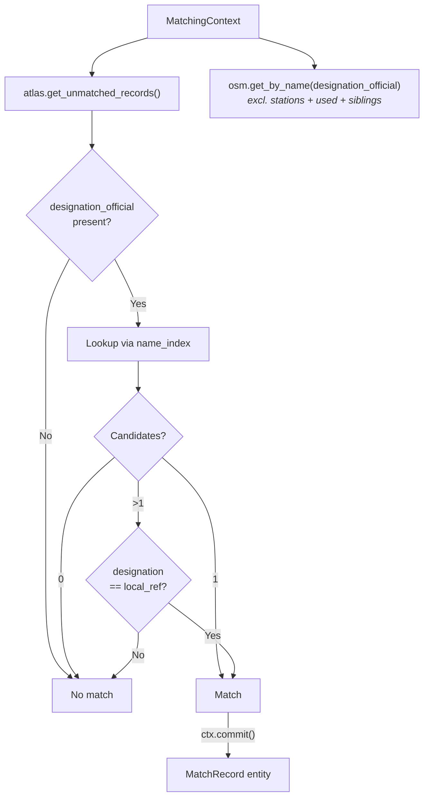

# Name Matching

Name matching is the **second predicate**, correlating ATLAS platforms with OSM nodes through their official stop names when matching via UIC references fails (e.g., UIC missing in OSM, or no reference in ATLAS).

**Result**: {{stat:matching_stages.name.count}} name-based matches

## How It Works

`NameMatchPredicate` iterates over all unmatched `AtlasNode` entries. For each entry with a non-empty `designation_official`, it queries `ctx.osm.get_by_name()` to find OSM nodes matching by `name`, `uic_name`, or `gtfs:name`. Matches are recorded immediately via `ctx.commit()`.

## Field Mapping

| Dataset | Name Field | Domain Model Field | Platform ID |
|---------|-----------|-------------------|-------------|
| ATLAS | `designationOfficial` | `AtlasNode.designation_official` | `AtlasNode.designation` |
| OSM | `name` / `uic_name` / `gtfs:name` | `OsmNode.name` / `OsmNode.uic_name` / `tags['gtfs:name']` | `OsmNode.local_ref` |

## Matching Logic

1. **Name lookup**: Search OSM nodes where `name`, `uic_name`, or `gtfs:name` equals `designation_official` (exact string match via `_name_index`)
2. **Single match**: Accept immediately
3. **Multiple matches**: Disambiguate by comparing `AtlasNode.designation` ↔ `OsmNode.local_ref` (case-insensitive)
4. **No matches**: Pass to distance predicates

## Why Few Matches?

- UIC captured most: Exact matching handles ~{{stat:matching_stages.exact.count}} entries
- Name variations: Spelling differences (e.g., "St." vs "Saint")

## Key Distinction

| Field | Domain Model | Purpose | Example |
|-------|-------------|---------|---------|
| `designationOfficial` | `AtlasNode.designation_official` | Stop name (for matching) | "Zurich HB" |
| `designation` | `AtlasNode.designation` | Platform ID (for disambiguation) | "1", "A", "Nord" |
| `local_ref` | `OsmNode.local_ref` | OSM platform ID | "1" |

## Code Reference

| Class | Description |
|-------|-------------|
| `NameMatchPredicate` | Predicate class; looks up name index, disambiguates by local_ref when multiple candidates |

All logic is in [predicates/name_matching.py](../matching_and_import_db/predicates/name_matching.py).
