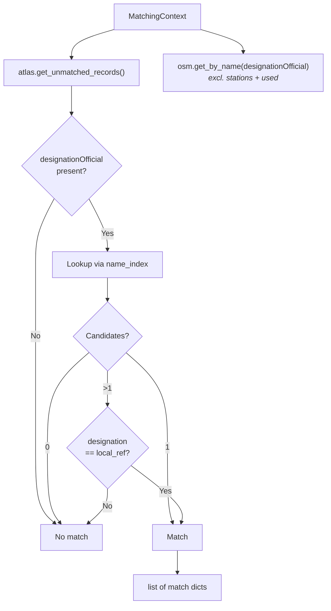

# Name Matching

Name matching is the **second predicate**, correlating ATLAS platforms with OSM nodes through their official stop names when matching via UIC references fails (e.g., UIC missing in OSM, or no reference in ATLAS).

**Result**: {{stat:matching_stages.name.count}} name-based matches

## Required Data

Name matching relies on the following data from the `MatchingContext`:
- `name_index`: pre-built index mapping OSM tags `name` / `uic_name` / `gtfs:name` → `[node_entries]`

## Field Mapping

| Dataset | Name Field | Platform ID |
|---------|-----------|-------------|
| ATLAS | `designationOfficial` | `designation` |
| OSM | `name` / `uic_name` / `gtfs:name` | `local_ref` |

## Matching Logic

1. **Name lookup**: Search OSM nodes where `name`, `uic_name`, or `gtfs:name` equals `designationOfficial` (exact string match via `name_index`)
2. **Single match**: Accept immediately
3. **Multiple matches**: Disambiguate by comparing `designation` ↔ `local_ref`
4. **No matches**: Pass to Distance predicates

## Why Few Matches?

- UIC captured most: Exact matching handles ~{{stat:matching_stages.exact.count}} entries
- Name variations: Spelling differences (e.g., "St." vs "Saint")

## Key Distinction

| Field | Purpose | Example |
|-------|---------|---------|
| `designationOfficial` | Stop name (for matching) | "Zürich HB" |
| `designation` | Platform ID (for disambiguation) | "1", "A", "Nord" |
| `local_ref` | OSM platform ID | "1" |

## Code Reference

| Function | Description |
|----------|-------------|
| `name_match(ctx)` | Predicate entry point; looks up name index, disambiguates by local_ref when multiple candidates |

All logic is in [name_matching.py](../matching_and_import_db/name_matching.py).
