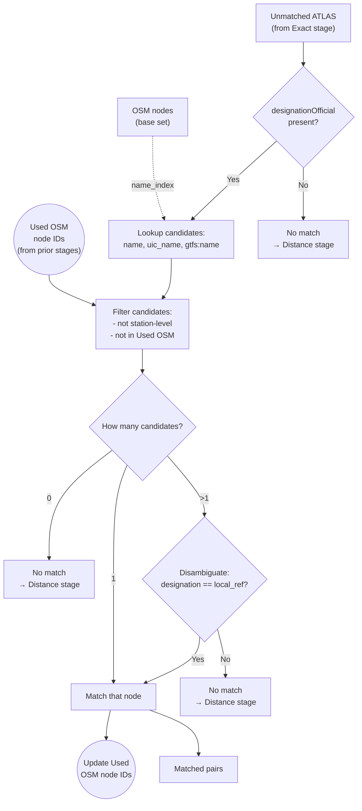

# Name Matching

Name matching is the **second stage**, correlating ATLAS platforms with OSM nodes through their official stop names when UIC references are missing.

**Result**: {{stat:matching_stages.name.count}} name-based matches

## Inputs / Outputs

**Input**
- ATLAS: `designationOfficial` (stop name), `designation` (platform id), coordinates
- OSM: name index entries from tags `name` / `uic_name` / `gtfs:name`, plus `local_ref`
- State: `used_osm_node_ids`

**Output**
- New match pairs
- Remaining unmatched ATLAS rows forwarded to Distance stage
- Updated `used_osm_node_ids`

## Field Mapping

| Dataset | Name Field | Platform ID |
|---------|-----------|-------------|
| ATLAS | `designationOfficial` | `designation` |
| OSM | `name` / `uic_name` / `gtfs:name` | `local_ref` |

## Matching Logic

1. **Name lookup**: Search OSM nodes where `name`, `uic_name`, or `gtfs:name` equals `designationOfficial` (exact string match via `name_index`)
2. **Single match**: Accept immediately
3. **Multiple matches**: Disambiguate by comparing `designation` ↔ `local_ref`
4. **No matches**: Pass to Distance stage

## Why Few Matches?

| Reason | Explanation |
|--------|-------------|
| UIC captured most | Exact matching handles ~21,000 entries |
| Distance is reliable | Many entries lack consistent naming |
| Name variations | Spelling differences (e.g., "St." vs "Saint") |

## Key Distinction

| Field | Purpose | Example |
|-------|---------|---------|
| `designationOfficial` | Stop name (for matching) | "Zürich HB" |
| `designation` | Platform ID (for disambiguation) | "1", "A", "Nord" |
| `local_ref` | OSM platform ID | "1" |
