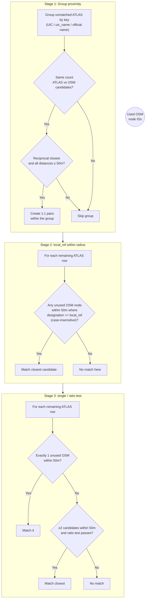

# Distance Matching

Distance matching is the **third stage** of the pipeline, producing the **largest number of matches** by leveraging spatial proximity with a 50-meter threshold.



## Overview

| Stage | Method | Matches |
|-------|--------|---------|
| 1 | Group proximity | 15,384 |
| 2 | Exact `local_ref` | 129 |
| 3a | Single candidate within 50m | 2,012 |
| 3b | Relative distance (ratio test) | 1,136 |

**Total**: 18,661 distance matches

## Stage Details

### Stage 1: Group-Based Proximity

Tries three grouping strategies in order:
1. **UIC reference**: `number` ↔ `uic_ref`
2. **UIC name**: `uic_name` shared field  
3. **Official name**: `designationOfficial` ↔ `name`

**Conditions**: Equal group sizes + reciprocal closest pairs + all within 50m

### Stage 2: Exact `local_ref`

Matches where `designation` (ATLAS) exactly equals `local_ref` (OSM) within 50m. When multiple candidates match, closest wins.

### Stage 3a: Single Candidate

If exactly **one** unused OSM node exists within 50m of an ATLAS platform → match.

### Stage 3b: Relative Distance

Uses ratio test: if the closest candidate is **significantly closer** than the second-closest, accept the match.

### Logic

```python
def match_single_candidate(atlas_entry, osm_nodes, used_ids):
    """
    Match if exactly one candidate within radius.
    """
    candidates = [
        node for node in osm_nodes
        if node['id'] not in used_ids
        and distance_to(atlas_entry, node) <= 50
    ]
    
    if len(candidates) == 1:
        return candidates[0]
    
    return None  # Zero or multiple candidates
```

This is a **high-confidence** match because there's no ambiguity in candidate selection.

---

## Stage 3b: Relative Distance

**Function**: `distance_matching_3b()`

When multiple candidates exist within 50m, this stage applies a **ratio test** to determine if the closest candidate is sufficiently closer than the second-closest. It produces **1,136 matches**.

### Ratio Test

The match succeeds if:
1. Second-closest distance (d₂) ≥ 10m
2. Ratio d₂/d₁ ≥ 4 (closest is at least 4× nearer than second-closest)

```python
def match_by_relative_distance(atlas_entry, candidates):
    """
    Match if closest candidate is significantly closer than alternatives.
    """
    if len(candidates) < 2:
        return None
    
    # Sort by distance
    sorted_candidates = sorted(
        candidates,
        key=lambda n: distance_to(atlas_entry, n)
    )
    
    d1 = distance_to(atlas_entry, sorted_candidates[0])  # Closest
    d2 = distance_to(atlas_entry, sorted_candidates[1])  # Second closest
    
    # Ratio test
    if d2 >= 10 and (d2 / d1) >= 4:
        return sorted_candidates[0]
    
    return None  # Ambiguous
```

### Example

| Candidate | Distance | Decision |
|-----------|----------|----------|
| OSM A | 5m | ✅ Matched (d₂/d₁ = 25/5 = 5 ≥ 4) |
| OSM B | 25m | — |
| OSM C | 40m | — |

---

## Stage 4: No Nearby Counterpart

**Function**: `no_nearby_counterpart()`

This stage does **not create matches**. Instead, it **flags** ATLAS entries that have no OSM nodes within the 50m isolation radius. These entries are marked as having no nearby OSM data.

The isolation radius is taken from `matching_process.problem_detection.get_isolation_radius()` (currently **50m**).

### Statistics

- **3,856 ATLAS entries** flagged with no nearby OSM
- These are forwarded to the Route Matching stage for potential matching via transit route data

---

## Spatial Index: KDTree

All distance calculations use a **KDTree** spatial index for efficient nearest-neighbor queries:

```python
from scipy.spatial import KDTree

# Build spatial index from OSM coordinates
osm_coords = [(node['lat'], node['lon']) for node in osm_nodes]
tree = KDTree(osm_coords)

# Query: find all OSM nodes within 50m of an ATLAS point
# Convert 50m to approximate degrees (~0.00045 at Swiss latitudes)
radius_deg = 50 / 111000
indices = tree.query_ball_point([atlas_lat, atlas_lon], radius_deg)
```

The spatial index is built once and reused across all distance matching stages, implemented in [spatial_index.py](../matching_process/spatial_index.py).

---

## Used-Node Prevention

A critical feature throughout all stages is the `used_osm_node_ids` set:

```python
# Prevents same OSM node from matching multiple ATLAS entries
used_osm_node_ids = set()

# Before any match attempt
if osm_id in used_osm_node_ids:
    continue

# After successful match
used_osm_node_ids.add(osm_id)
```

This ensures that (within distance matching) each ATLAS row matches to **at most one** unused OSM node.

Note: the overall pipeline is not strictly 1:1. Some other stages intentionally create many-to-one matches (e.g. exact UIC collapse or duplicate propagation).

---

## Code Reference

| Function | Description |
|----------|-------------|
| `distance_matching()` | Main entry point, orchestrates all stages |
| `distance_matching_1_*()` | Group-based proximity matching |
| `distance_matching_2()` | Exact `local_ref` matching |
| `distance_matching_3a()` | Single-candidate matching |
| `distance_matching_3b()` | Relative distance ratio test |
| `no_nearby_counterpart()` | Flags isolated ATLAS entries |
| `transform_for_distance_matching()` | Prepares data structures for matching |

All functions are in [distance_matching.py](../matching_process/distance_matching.py), with spatial utilities in [spatial_index.py](../matching_process/spatial_index.py).
