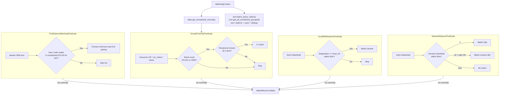

# Distance Matching

Distance matching uses spatial proximity to produce matches. It consists of **four separate predicate classes**, with a strict trio-first stage followed by progressively looser stages:



## Overview

| Predicate Class | match_type | Matches |
|-----------------|------------|---------|
| `TrioDistanceMatchingPredicate` | `distance_matching_trio` | Trio side-node distance matches where one middle node remains unmatched |
| `GroupProximityPredicate` | `distance_matching_1_*` | {{stat:matching_stages.distance.breakdown.stage1_group}} |
| `LocalRefDistancePredicate` | `distance_matching_2` | {{stat:matching_stages.distance.breakdown.stage2_local_ref}} |
| `NearestDistancePredicate` (single) | `distance_matching_3a` | {{stat:matching_stages.distance.breakdown.stage3a_single}} |
| `NearestDistancePredicate` (ratio) | `distance_matching_3b` | {{stat:matching_stages.distance.breakdown.stage3b_relative}} |

**Total**: {{stat:matching_stages.distance.count}} distance matches

## Predicates

All four are independent predicate classes in the pipeline. Each operates on `AtlasNode` and `OsmNode` domain entities and records matches via `ctx.commit()`. The runner refreshes unmatched records between each call.

## Predicate Details

### `TrioDistanceMatchingPredicate` - Trio Side Matching First

This stage runs before all other distance predicates.

For each pre-grouped trio (`osm_trio`):

1. Identify the two side nodes and the explicit middle node from trio metadata.
2. Read unmatched ATLAS rows for the trio UIC.
3. Continue only if exactly two ATLAS rows are available.
4. Evaluate both possible 2x2 assignments and choose the one with lower total haversine distance.
5. Keep the middle node intentionally unmatched in this stage.

All matches created here use `match_type = distance_matching_trio`.

If a trio does not satisfy the cardinality constraints at execution time, the predicate skips it and leaves later stages to decide.

### `GroupProximityPredicate` — Group-Based Bipartite Matching

Tries three grouping strategies in order:
1. **UIC reference**: `AtlasNode.uic_ref` ↔ `OsmNode.uic_ref`
2. **UIC name**: `AtlasNode.designation_official` ↔ `OsmNode.uic_name`
3. **Official name**: `AtlasNode.designation_official` ↔ `OsmNode.name`

For each group, calls the shared `bipartite_match()` helper:

**Conditions**: Equal group sizes + reciprocal closest pairs + all within 50m

The helper builds a full pairwise haversine distance matrix using **numpy broadcasting** (no Python loops), finds each `AtlasNode`'s closest `OsmNode` and vice versa via `np.argmin`, and checks that all assignments are reciprocal and conflict-free. If any conflict is detected, the entire group is skipped.

The current implementation does not perform a separate stop-position-only retry. It groups whatever unmatched, non-station OSM entities are available in `OsmState` for the active key and attempts a single conflict-free bipartite assignment.

### `LocalRefDistancePredicate` — Exact local_ref Within Radius

Matches where `AtlasNode.designation` exactly equals `OsmNode.local_ref`, case-insensitively, within 50m. Uses KDTree spatial index via `batch_query_radius()` to find nearby candidates. When multiple candidates match, the closest wins.

Before picking a winner, the current implementation now re-validates the batched candidate list against the live `used_ids` set. This is necessary because earlier rows in the same predicate run can consume an `OsmNode` after the original batch query was computed.

### `NearestDistancePredicate` — Single Candidate / Ratio Test

**local_ref contradiction filter**: Before evaluating candidates, any `OsmNode` whose `local_ref` contradicts the `AtlasNode.designation` is excluded (case-insensitive comparison). If either value is empty, no contradiction exists and the candidate passes through. This prevents false matches where a nearby OSM node clearly belongs to a different stop.

Two sub-cases:

**Case 3a — Single candidate**: If exactly **one** non-contradicting, unused, non-station `OsmNode` exists within 50m of an `AtlasNode` → match.

**Case 3b — Ratio test**: When multiple non-contradicting candidates exist within 50m, applies a ratio test to determine if the closest is sufficiently closer than the second-closest:

```
Match if:  d₂ ≥ 10m  AND  d₂ / d₁ ≥ 4
```

| Candidate | Distance | Decision |
|-----------|----------|----------|
| OSM A | 5m | Matched (d₂/d₁ = 25/5 = 5 ≥ 4) |
| OSM B | 25m | — |
| OSM C | 40m | — |

Constants: `RATIO_TEST_MIN_D2 = 10` metres, `RATIO_TEST_FACTOR = 4`.

## Commit-Safe Candidate Revalidation

`LocalRefDistancePredicate` and `NearestDistancePredicate` both use a batched KDTree query for performance, but they no longer trust that batch blindly until commit time.

The important sequence is:

1. `batch_query_radius()` returns candidate snapshots for all unmatched ATLAS rows.
2. The predicate loop processes those rows one by one.
3. `ctx.commit()` immediately marks the chosen OSM representative as used.
4. Later rows re-filter their old candidate snapshot against the current `used_ids` set before deciding whether they have 0, 1, or multiple candidates.

Without this revalidation step, a later row could incorrectly treat an already-consumed OSM representative as its only candidate and produce a bad `distance_matching_3a` match.

## Spatial Index: KDTree

All distance predicates use a **KDTree** spatial index for efficient nearest-neighbor queries, built on **unit-sphere coordinates** (3D xyz) rather than raw lat/lon.

The `LocalRefDistancePredicate` and `NearestDistancePredicate` use **batched queries**: all unmatched `AtlasNode` coordinates are collected into a list and passed to `OsmState.batch_query_radius()`, which calls `query_ball_point(points, workers=-1)` once — delegating the entire loop to SciPy's multithreaded C backend.

```python
# Batched query (used by LocalRefDistancePredicate, NearestDistancePredicate)
coords = [(e.lat, e.lon) for e in unmatched]
batch_candidates = ctx.osm.batch_query_radius(coords, ctx.max_distance)
```

The spatial index is built once from available (unused, non-station) nodes and reused across queries. `used_ids` and sibling nodes are filtered at query time, not at build time. Implementation is in [utils/spatial_index.py](../matching_and_import_db/utils/spatial_index.py) and [state.py](../matching_and_import_db/state.py).

## No-Nearby-OSM Detection

After all predicates complete, the importer flags unmatched ATLAS entries that have no OSM node at all within 50m. This does not create matches — it identifies entries for problem detection.

## Used-Node Prevention

**No single OSM representative** is matched more than once within the distance predicates — `ctx.commit()` immediately locks nodes via `mark_used()`, and later rows re-check that live state before committing. However, this does not imply a strict 1:1 relationship at the station level: since OSM often includes multiple nodes for a single stop (e.g. `platform` and `stop_position`), the distance matching process can validly match these distinct `OsmNode` entities to separate `AtlasNode` entries.

## Code Reference

| Class / Function | Description |
|------------------|-------------|
| `TrioDistanceMatchingPredicate` | Trio-first distance matching for side nodes with explicit middle-node exclusion |
| `GroupProximityPredicate` | Conflict-free bipartite proximity matching within UIC/name groups |
| `LocalRefDistancePredicate` | Exact `local_ref` matching within 50m radius (batched KDTree queries) |
| `NearestDistancePredicate` | Single-candidate or ratio-test proximity matching (batched KDTree queries) |
| `bipartite_match(atlas, osm, max_distance)` | Shared helper: vectorized numpy distance matrix + reciprocal nearest-neighbour check |

Distance predicates are in [predicates/distance_matching.py](../matching_and_import_db/predicates/distance_matching.py) plus [predicates/trio_distance_matching.py](../matching_and_import_db/predicates/trio_distance_matching.py), with spatial utilities in [utils/spatial_index.py](../matching_and_import_db/utils/spatial_index.py) and [state.py](../matching_and_import_db/state.py).
