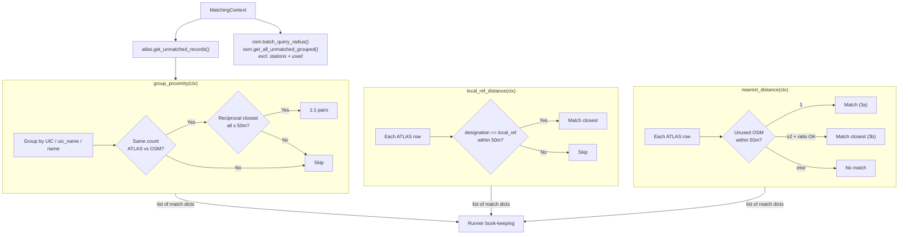

# Distance Matching

Distance matching uses spatial proximity to produce matches. It consists of **three separate predicates**, each progressively looser:



## Overview

| Predicate | match_type | Matches |
|-----------|------------|---------|
| `group_proximity` | `distance_matching_1_*` | {{stat:matching_stages.distance.breakdown.stage1_group}} |
| `local_ref_distance` | `distance_matching_2` | {{stat:matching_stages.distance.breakdown.stage2_local_ref}} |
| `nearest_distance` (single) | `distance_matching_3a` | {{stat:matching_stages.distance.breakdown.stage3a_single}} |
| `nearest_distance` (ratio) | `distance_matching_3b` | {{stat:matching_stages.distance.breakdown.stage3b_relative}} |

**Total**: {{stat:matching_stages.distance.count}} distance matches

## Predicates

All three are independent predicates in the pipeline. The runner refreshes `atlas_unmatched` and updates tracking sets between each call.

## Predicate Details

### `group_proximity` — Group-Based Bipartite Matching

Tries three grouping strategies in order:
1. **UIC reference**: `number` ↔ `uic_ref`
2. **UIC name**: `designationOfficial` ↔ `uic_name`
3. **Official name**: `designationOfficial` ↔ `name`

For each group, calls the shared `bipartite_match()` helper:

**Conditions**: Equal group sizes + reciprocal closest pairs + all within 50m

The helper builds a full pairwise haversine distance matrix using **numpy broadcasting** (no Python loops), finds each ATLAS entry's closest OSM node and vice versa via `np.argmin`, and checks that all assignments are reciprocal and conflict-free. If any conflict is detected, the entire group is skipped.

Each grouping key also has a **stop_position fallback**: if matching against all OSM node types fails, it retries with only `public_transport=stop_position` nodes.

### `local_ref_distance` — Exact local_ref Within Radius

Matches where `designation` (ATLAS) exactly equals `local_ref` (OSM), case-insensitively, within 50m. Uses KDTree spatial index to find nearby candidates. When multiple candidates match, the closest wins.

### `nearest_distance` — Single Candidate / Ratio Test

Two sub-cases:

**Case 3a — Single candidate**: If exactly **one** unused, non-station OSM node exists within 50m of an ATLAS platform → match.

**Case 3b — Ratio test**: When multiple candidates exist within 50m, applies a ratio test to determine if the closest is sufficiently closer than the second-closest:

```
Match if:  d₂ ≥ 10m  AND  d₂ / d₁ ≥ 4
```

| Candidate | Distance | Decision |
|-----------|----------|----------|
| OSM A | 5m | Matched (d₂/d₁ = 25/5 = 5 ≥ 4) |
| OSM B | 25m | — |
| OSM C | 40m | — |

Constants: `RATIO_TEST_MIN_D2 = 10` metres, `RATIO_TEST_FACTOR = 4`.

## Spatial Index: KDTree

All distance predicates use a **KDTree** spatial index for efficient nearest-neighbor queries, built on **unit-sphere coordinates** (3D xyz) rather than raw lat/lon.

The `local_ref_distance` and `nearest_distance` predicates use **batched queries**: all unmatched ATLAS coordinates are collected into a single numpy array and passed to `OsmState.batch_query_radius()`, which calls `query_ball_point(points, workers=-1)` once — delegating the entire loop to SciPy's multithreaded C backend.

```python
# Batched query (used by local_ref_distance, nearest_distance)
coords = [(float(e['wgs84North']), float(e['wgs84East'])) for e in unmatched]
batch_candidates = ctx.osm.batch_query_radius(coords, ctx.max_distance)
```

The spatial index is built once from available (unused, non-station) nodes and reused across queries. Implementation is in [spatial_index.py](../matching_and_import_db/spatial_index.py) and [state.py](../matching_and_import_db/state.py).

## No-Nearby-OSM Detection

After all predicates complete, the pipeline runner calls `compute_no_nearby_osm()` to **flag** unmatched ATLAS entries that have no OSM node at all within 50m. This does not create matches — it identifies entries for problem detection.

## Used-Node Prevention

**No single OSM node** is matched more than once within the distance predicates. However, this does not imply a strict 1:1 relationship at the station level: since OSM often includes multiple nodes for a single stop (e.g. `platform` and `stop_position`), the distance matching process can validly match these distinct OSM nodes to separate ATLAS entries.

## Code Reference

| Function | Description |
|----------|-------------|
| `group_proximity(ctx)` | Conflict-free bipartite proximity matching within UIC/name groups |
| `local_ref_distance(ctx)` | Exact `local_ref` matching within 50m radius (batched KDTree queries) |
| `nearest_distance(ctx)` | Single-candidate or ratio-test proximity matching (batched KDTree queries) |
| `bipartite_match(atlas, osm, max_distance)` | Shared helper: vectorized numpy distance matrix + reciprocal nearest-neighbour check |

All functions are in [distance_matching.py](../matching_and_import_db/distance_matching.py), with spatial utilities in [spatial_index.py](../matching_and_import_db/spatial_index.py) and [state.py](../matching_and_import_db/state.py).
